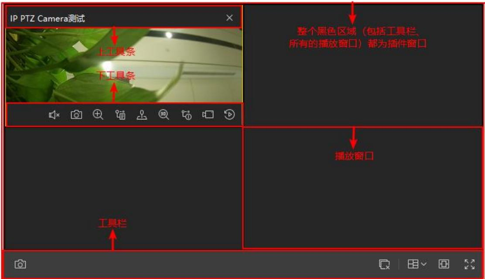
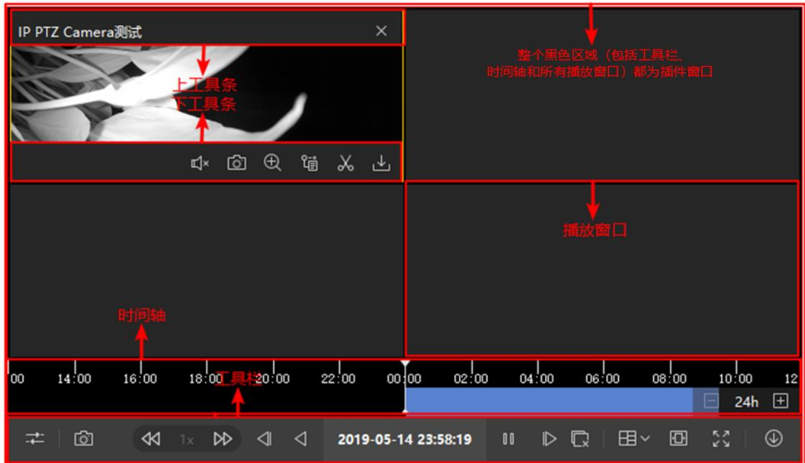
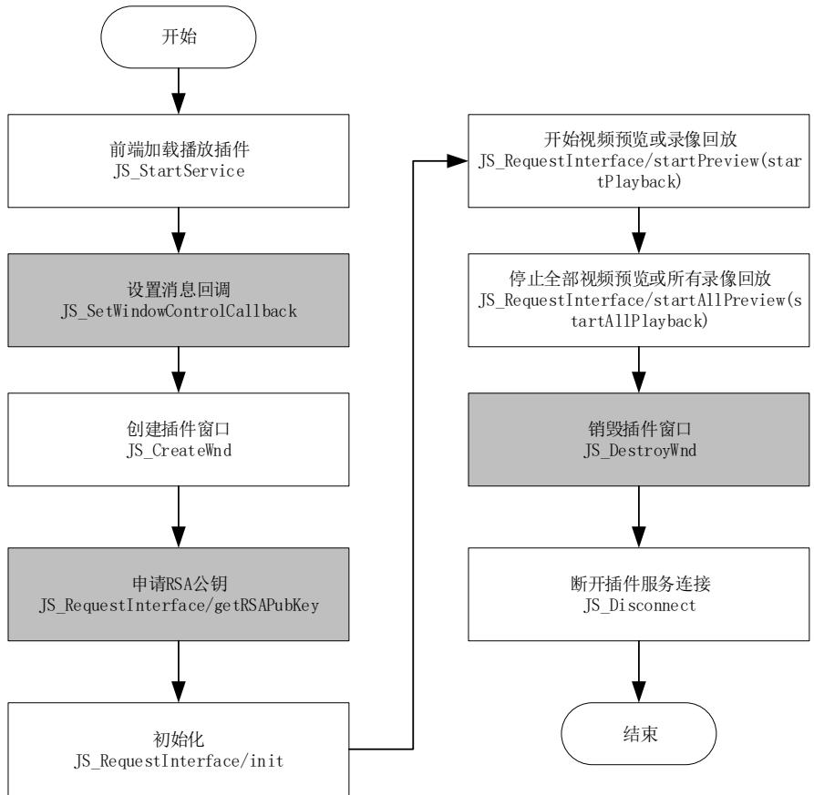

# 视频 WEB 插件开发指南

版权所有©杭州海康威视数字技术股份有限公司 2020

## 版权所有©杭州海康威视数字技术股份有限公司 2020。保留一切权利。

本文档的任何部分，包括文字、图片、图形等均归属于杭州海康威视数字技术股份有限公司或其关联公司（以下简称“海康威视”）。未经书面许可，任何单位或个人不得以任何方式摘录、复制、翻译、修改本手册的全部或部分。除非另有约定，海康威视不对本手册提供任何明示或默示的声明或保证。

## 责任声明

在法律允许的最大范围内，本文档是“按照现状”提供，可能存在瑕疵或错误。海康威视不对本文档提供任何形式的明示或默示保证，包括但不限于适销性、质量满意度、适合特定目的、不侵犯第三方权利等保证；亦不对使用或是分发本文档导致的任何特殊、附带、偶然或间接的损害进行赔偿，包括但不限于商业利润损失、系统故障、数据或文档丢失产生的损失。

## 目录

简介.......................  
1.1 前言 ... ... 5  
1.2 术语 ...... ....................................................................................................................... ..... 5  
1.3 运行环境 ........................................................................................................................................ ..... 3  
1.4 约束说明 ...... ............................................................................................................................ ...... 3  
2. 版本更新 ....... ................................................................................................................................. 3  
3. JS 接口说明 ........ ......................................................................................................... 4  
3.1 JS_STARTSERVICE 启动插件服务接口 . .... ......................................................................................... ....... 4  
3.2 JS_DISCONNECT 断开服务接口 . ................................................................... ..... 5  
3.3 JS_CREATEWND 创建插件窗口接口....... ............................................................................................. 5  
3.4 JS_RESIZE 调整插件窗口大小、位置接口.............................................................................................. 6  
3.5 JS_CUTTINGPARTWINDOW 扣除部分插件窗口接口 ........ ................................................................. ........ 6  
3.6 JS_REPAIRPARTWINDOW 扣除插件窗口还原接口 .... ..................................................................... ....... 7  
3.7 JS_HIDEWND 插件窗口隐藏接口 ..... ......................................................................... ........ 7  
3.8 JS_SHOWWND 插件窗口显示接口 ....... ........................................................................................... ...... 8  
3.9 JS_DESTROYWND 插件窗口销毁接口 ....................................................................................................... 9  
3.10 JS_WAKEUP 唤醒 WEBCONTROL.EXE 接口........ ............................................................................ ..... 9  
3.11 JS_SETDOCOFFSET 设置 IFRAME 偏移量接口 . ................................................................................. ...... 10  
3.12 JS_REQUESTINTERFACE 通用请求响应接口 .............................................................................................. 10  
3.12.1 申请 RSA 公钥.... ........................................................................... ..... 11  
3.12.2 初始化......... ............................................................................................................ 12  
3.12.3 反初始化...................................................................................................................................... 16  
3.12.4 根据监控点编号视频预览.... ................................................................................................... 16  
3.12.5 根据监控点编号录像回放.......................................................................................................... 18  
3.12.6 停止所有视频预览...... ........................................................................................................... 20  
3.12.7 停止所有录像回放...................................................................................................................... 20  
3.12.8 销毁播放实例.... ................................................................................................. ....... 21  
3.12.9 获取当前布局.... ...................................................................................................................... 21  
3.12.10 设置当前布局.......................................................................................................................... 22  
3.12.11 播放抓图...... .................................................................................... .... 23  
3.12.12 画面字符叠加.................................. ........................................................................... ........ 24  
3.12.13 根据监控点编号批量视频预览... ....................................................................................... 25  
3.12.14 根据监控点编号批量录像回放.. ...................................................................... ....... 26  
3.12.15 批量停止播放... ... 28  
3.12.16 设置接口认证信息参数...  
3.12.17 进入全屏............... ................................................................................................................ 30  
3.12.18 退出全屏.... .... 31  
3.12.19 获取版本号........  
3.12.20 设置时间轴级别... ............................................................ ......... 32  
3.13 JS_SETWINDOWCONTROLCALLBACK 设置消息回调接口 . ..... 33  
3.13.1 窗口选中消息.. . 33  
3.13.2 预览/回放播放消息. ... 34  
3.13.3 抓图结果消息.. ..... 35  
3.13.4 预览紧急录像/回放录像剪辑结果消息.. .... 36  
3.13.5 进入全屏/退出全屏消息.. .... 36  
3.13.6 切换布局消息.... ...... 37  
3.13.7 播放窗口双击事件消息. ..... 37  
3.13.8 时间轴级别变化消息.. ..... 38  
4. 视频 WEB 插件对接指南.. ....38  
4.1 开发流程 .. ... 38  
4.2 网页开发指南 .. ... 39  
4.2.1 引用 JS 文件... .... 39  
4.2.2 创建WebControl 实例.. ........ ...... 40  
4.2.3 启动插件...... ........................... ....... 40  
4.2.4 监听事件..... ....................... ..... 41  
4.2.5 申请 RSA 公钥....  
4.2.6 插件初始化..... ..... 42  
4.2.7 视频预览业务功能.. .... 43  
4.2.8 断开插件服务连接.. ... 44  
4.3 IFRAME 对接指南 . .... 44  
4.3.1 iframe demo 使用... .... 44  
4.3.2 iframe 对接步骤... ... 44  
5. 视频 WEB 插件 UI 集成控件列表. .....45  
6. 错误码定义 .... ....47  
7. 附录....... .......48  
7.1 如何获取 APPKEY 和 APPSECRET.. ... 48  
7.2 依赖 OPENAPI 接口汇总 . ... 48  
7.3 问题排查.. .. 48

## 简介

## 1.1 前言

非常感谢您使用我们公司的产品，我们将竭诚为您提供最好的服务。

本手册可能包含技术上不准确的地方或文字错误。

本手册的内容将做定期的更新，恕不另行通知,更新的内容将会在本手册的新版本中加入。

我们随时会改进或更新本手册中描述的产品或程序。

当您阅读该使用手册时，同时应该拿到本文档、以及以下文件：

表 1.1-1 文件清单
<table><tr><td rowspan=1 colspan=1>文件名称</td><td rowspan=1 colspan=1>描述</td></tr><tr><td rowspan=1 colspan=1>VideoWebPlugin.exe</td><td rowspan=1 colspan=1>视频WEB 插件安装包</td></tr><tr><td rowspan=1 colspan=1>demo_window_ integration.html</td><td rowspan=1 colspan=1>视频预览、回放全功能 Demo，可使用此 Demo 验证功能</td></tr><tr><td rowspan=1 colspan=1>demo_window_simple_preview.html</td><td rowspan=1 colspan=1>视频预览简化 Demo，可参照此 Demo 开发</td></tr><tr><td rowspan=1 colspan=1>demo_window_simple_playback.html</td><td rowspan=1 colspan=1>录像回放简化 Demo，可参照此 Demo 开发</td></tr><tr><td rowspan=1 colspan=1>demo_ for_ iframe.html</td><td rowspan=1 colspan=1>iframe 对接demo，依赖WEB 服务，请参照 iframe 对接指南</td></tr><tr><td rowspan=1 colspan=1>demo_embedded_for_iframe.html</td><td rowspan=1 colspan=1>iframe 对接嵌入html 文件，依赖WEB 服务，请参照iframe对接指南</td></tr><tr><td rowspan=1 colspan=1>webs.exe</td><td rowspan=1 colspan=1>WEB 服务程序，请参照iframe 对接指南</td></tr><tr><td rowspan=1 colspan=1>jsencrypt.min.js</td><td rowspan=1 colspan=1>用于RSA公钥加密的js库文件</td></tr><tr><td rowspan=1 colspan=1> jsWebControl-1.0.0.min.js</td><td rowspan=1 colspan=1>用于与视频WEB 插件交互的 js文件</td></tr></table>

## 1.2 术语

本文涉及相关术语如表 1.2-1 和图 1.2-1、图 1.2-2：

表 1.2-1 术语解释
<table><tr><td colspan="1" rowspan="1">名称</td><td colspan="1" rowspan="1">描述</td></tr><tr><td colspan="1" rowspan="1">视频WEB 插件</td><td colspan="1" rowspan="1">视频WEB 插件（以下简称VideoWebPlugin）用于跨浏览器开发WEB 视频应用，提供了实时视频播放、历史视频回放功能。安装VideoWebPlugin.exe后，系统会自动运行 WebControl.exe 的程序，并由 jsWebControl-1.0.0.min.js 与之交互完成视频的各项功能</td></tr><tr><td colspan="1" rowspan="1">DIV窗口</td><td colspan="1" rowspan="1">指前端提供的非弹出页面的DIV 标识的窗口</td></tr><tr><td colspan="1" rowspan="1">插件窗口</td><td colspan="1" rowspan="1">指视频WEB 插件提供的窗口，该窗口是DIV 窗口的子窗口，若DIV窗口尺寸发生变化，该窗口尺寸也随之变化。如图1.2-1，整个图中的窗口称为插件窗口</td></tr><tr><td colspan="1" rowspan="1">插件服务</td><td colspan="1" rowspan="1">指管理插件窗口与DIV窗口交互、前端与视频WEB 插件交付的服务，该服务由WebControl.exe 统一管理</td></tr><tr><td colspan="1" rowspan="1">播放窗口</td><td colspan="1" rowspan="1">播放视频的窗口，如图1.2-1和图1.2-2中的“播放窗口”</td></tr><tr><td colspan="1" rowspan="1">工具条</td><td colspan="1" rowspan="1">指播放窗口播放视频时，鼠标移动至播放窗口内弹出来的上下工具条，如图1.2-1和图1.2-2所示“上工具条”和“下工具条”</td></tr><tr><td colspan="1" rowspan="1">工具栏</td><td colspan="1" rowspan="1">指集合对所有播放窗口控制都起效（如“全部抓图”）、或对选中窗口控制起效（如录像回放中的“暂停”按钮）、或对整个插件窗口控制（如“进入全屏模式”按钮）按钮的窗口，如图1.2-1和图1.2-2所示“工具栏”</td></tr><tr><td colspan="1" rowspan="1">时间轴</td><td colspan="1" rowspan="1">指录像回放中展示当前选中播放窗口在查询录像时间段内的录像段，如图1.2-2所示“时间轴”</td></tr><tr><td colspan="1" rowspan="1">智能信息</td><td colspan="1" rowspan="1">指在视频编码设备上配置的一些事件后，显示在播放画面上的信息，如配置移动侦测事件后再画面上显示的线框</td></tr><tr><td colspan="1" rowspan="1">多平台接入（接入多平台）</td><td colspan="1" rowspan="1">指在基于插件开发的客户端上支持同时预览多个平台的实时视频或播放多个平台上的录像。此种情况下，在插件初始化中不能指定appkey、secret、ip和port，必须初始化完后通过接口来设置这些信息</td></tr><tr><td colspan="1" rowspan="1">父页面</td><td colspan="1" rowspan="1">相对子页面而言，在iframe 对接场景下，在该页面嵌入子页面，这个页面称为父页面</td></tr><tr><td colspan="1" rowspan="1">子页面</td><td colspan="1" rowspan="1">在iframe对接场景下，嵌入父页面的页面称为子页面</td></tr></table>

  
图 1.2-1 视频 WEB 插件（实时预览）UI 模块分类

  
图 1.2-2 视频 WEB 插件（录像回放）UI 模块分类

## 1.3 运行环境

Win7 32/64 位操作系统：32 位 IE10（兼容 64 位 IE10，64 位 IE10 环境下浏览器会默认启动 32位 IE）、32/64 位 IE11、32/64 位 Chrome45.0 及以上版本、32/64 位 Firefox52.0 及以上版本，

Win10 32/64 位操作系统：32/64 位 IE11、32/64 位 Chrome45.0 及以上版本、32/64 位 Firefox51.0及以上版本

## 1.4 约束说明

触摸屏Windows操作系统未经全面测试，不推荐使用

非企业版 Windows 操作系统未经测试，请使用企业版 Windows 操作系统

 语音对讲只支持海康 SDK 协议、ehome 协议、国标协议、ISUP 协议和直连萤石接入设备

iframe 对接存在插件窗口无法及时更新位置导致用户体验问题，并且被嵌入的页面需要禁用滚动条，请谨慎使用。

IE、Chrome、Firefox 浏览器对接时不建议启动多个插件服务，一般情况下一个 Tab 页只启动一个插件服务

低帧率（帧率低于 5FPS）情况下即时回放打开声音会出现声音慢出或少几秒情况

## 2. 版本更新

V1.5.2

<table><tr><td>1、初始化支持设置时间轴级别，详见3.12.3 初始化</td></tr><tr><td>2、新增设置时间轴级别接口，支持跨级别设置时间轴，详见3.12.20设置时间轴级别</td></tr><tr><td>3、新增时间轴级别变化消息，详见3.13.8时间轴级别变化消息；</td></tr></table>

V1.5.1

<table><tr><td>1、新增支持工具栏按钮自定义，详见3.12.2初始化；</td></tr><tr><td>2、新增支持判断点位是否为级联点位相关功能，详见 3.12.13 根据监控点编号视频预览和 3.12.14 根 据监控点编号录像回放；</td></tr><tr><td>3、新增支持播放窗口双击事件消息，详见 3.13.7 播放窗口双击事件消息；</td></tr></table>

V1.5.0

<table><tr><td rowspan=1 colspan=1>1、新增支持同时接入多个平台的实时预览、录像回放；</td></tr><tr><td rowspan=1 colspan=1>2、新增支持录像锁定相关功能；</td></tr><tr><td rowspan=1 colspan=1>3、亲新增支持紧急录像、录像剪辑展示已录像时长，支持布局切换消息回调；</td></tr><tr><td rowspan=1 colspan=1>4、新增云台控制状态下滚动滚轮调焦功能；</td></tr><tr><td rowspan=1 colspan=1>5、新增进入全屏、退出全屏请求功能；</td></tr><tr><td rowspan=1 colspan=1>6、支持 iframe对接，嵌入页面需禁用滚动条；</td></tr></table>

V1.4.1

<table><tr><td>1、新增一键静音等功能；</td></tr><tr><td>2、画面字符叠加支持自定义字号、字体是否加粗以及指定字符串对齐方式；</td></tr><tr><td>3、新增批量预览回放、批量停止功能；</td></tr></table>

V1.4.0

<table><tr><td>1、新增断流重连功能；</td></tr><tr><td>2、新增直连萤石预览回放功能；</td></tr><tr><td>3、新增直连萤石语音对讲功能；</td></tr><tr><td>4、解决已知缺陷问题；</td></tr></table>

## 3. JS 接口说明

## 3.1 JS_StartService 启动插件服务接口

接口定义

JS_StartService(szType, options)

功能说明

启动插件服务

使用条件

插件实例化成功后启动插件服务

入参

<table><tr><td rowspan=1 colspan=1>名称</td><td rowspan=1 colspan=1>描述</td><td rowspan=1 colspan=1>是否必填</td><td rowspan=1 colspan=1>备注</td></tr><tr><td rowspan=1 colspan=1>sZType</td><td rowspan=1 colspan=1>服务类型</td><td rowspan=1 colspan=1>是</td><td rowspan=1 colspan=1>请固定填充&quot;window&quot;</td></tr><tr><td rowspan=1 colspan=1>options</td><td rowspan=1 colspan=1>可选参数对象</td><td rowspan=1 colspan=1>否</td><td rowspan=1 colspan=1>请固定填充{dllPath: &quot;/VideoPluginConnect.ll&quot;}</td></tr></table>

返回值

Promise。接口成功说明服务启动成功，失败则说明服务启动失败

使用示例

```javascript
oWebControl.JS_StartService("window", { // oWebControl 为 WebControl 的对象
dllPath: "./VideoPluginConnect.dll"
}).then(function(){
```

```javascript
// 服务启动成功
},function(){
// 服务启动失败
});
 特殊使用场景说明
无
```

## 3.2 JS_Disconnect 断开服务接口

接口定义

功能说明

断开与插件服务的连接

使用条件

插件服务已启动，一般在前端 unload事件、路由离开页面时调用

入参

返回值

Promise。接口成功说明服务启动成功，失败则说明服务启动失败

使用示例

特殊使用场景说明

IE 浏览器中使用插件存在插件窗口销毁耗时导致浏览器页面消息后可能还会显示一会，可在调 JS_Disconnect前调 JS_HideWnd 接口先将插件窗口隐藏。

## 3.3 JS_CreateWnd 创建插件窗口接口

接口定义

JS_CreateWnd(szId, iWidth, iHeight, options)

功能说明

创建插件窗口，并且插件窗口始终置顶。若不想插件置顶，显示其它控件，详见 3.6和3.7中的接口描述。

使用条件

插件实例化成功后启动插件服务

入参

<table><tr><td colspan="1" rowspan="1">名称</td><td colspan="1" rowspan="1">描述</td><td colspan="1" rowspan="1">是否必填</td><td colspan="1" rowspan="1">备注</td></tr><tr><td colspan="1" rowspan="1">szId</td><td colspan="1" rowspan="1">元素ID</td><td colspan="1" rowspan="1">是</td><td colspan="1" rowspan="1">该元素ID 标识的的窗口作为插件的父窗口</td></tr><tr><td colspan="1" rowspan="1">iWidth</td><td colspan="1" rowspan="1">元素ID 标识窗口的宽度</td><td colspan="1" rowspan="1">是</td><td colspan="1" rowspan="1">使用元素ID 标识的窗口的宽度使插件窗口与DIV窗口重叠</td></tr><tr><td colspan="1" rowspan="1">iHeight</td><td colspan="1" rowspan="1">元素ID 标识窗口的高度</td><td colspan="1" rowspan="1">是</td><td colspan="1" rowspan="1">使用元素ID 标识的窗口的高度使插件窗口与DIV 窗口重叠</td></tr><tr><td>options</td><td>可选参数对象</td><td>否</td><td>详见示例。非iframe 对接场景无需填充此参数，iframe 对接 需填充此参数。iframe对接场景该参数使用请参照</td></tr></table>

Promise。接口成功说明创建插件窗口成功，失败则说明创建插件窗口失败

使用示例

```javascript
oWebControl.JS_CreateWnd("playWnd", 600, 400, {
cbSetDocTitle: function (uuid){ // uuid 为插件提供的 UUID
}
}).then(function(){ // oWebControl 为 WebControl 的对象
// 创建插件窗口成功
},function(){
// 创建插件窗口失败
});
 特殊使用场景说明
无
```

## 3.4 JS_Resize 调整插件窗口大小、位置接口

接口定义

JS_Resize(iWidth, iHeight)

功能说明

插件窗口无法感知DIV 窗口的大小、位置变化，通过此接口来调整插件窗口大小与位置

使用条件

创建插件顶层窗口后，前端 DIV窗口resize、页面 scroll事件触发时都需调此接口来调整插件窗

口大小与位置

入参

<table><tr><td rowspan=1 colspan=1>名称</td><td rowspan=1 colspan=1>描述</td><td rowspan=1 colspan=1>是否必填</td><td rowspan=1 colspan=1>备注</td></tr><tr><td rowspan=1 colspan=1>iWidth</td><td rowspan=1 colspan=1>DIV窗口宽度</td><td rowspan=1 colspan=1>是</td><td rowspan=1 colspan=1></td></tr><tr><td rowspan=1 colspan=1>iHeight</td><td rowspan=1 colspan=1>DIV窗口高度</td><td rowspan=1 colspan=1>是</td><td rowspan=1 colspan=1></td></tr></table>

返回值

无

使用示例

oWebControl.JS_Resize(700, 500); // oWebControl 为 WebControl 的对象

特殊使用场景说明

无

## 3.5 JS_CuttingPartWindow 扣除部分插件窗口接口

接口定义

JS_CuttingPartWindow(iLeft, iTop, iWidth, iHeight)

功能说明

扣除插件窗口部分窗口。

版权所有©杭州海康威视数字技术股份有限公司 2020

## 使用条件

插件窗口创建后，会始终置顶，因此当和其它组件一同使用时，会遮挡其它组件内容，该接口的作用是，当部分插件窗口不需要置顶时，我们会隐藏部分插件窗口。

入参
<table><tr><td rowspan=1 colspan=1>名称</td><td rowspan=1 colspan=1>描述</td><td rowspan=1 colspan=1>是否必填</td><td rowspan=1 colspan=1>备注</td></tr><tr><td rowspan=1 colspan=1>iLeft</td><td rowspan=1 colspan=1>距离插件窗口左边距</td><td rowspan=1 colspan=1>是</td><td rowspan=1 colspan=1></td></tr><tr><td rowspan=1 colspan=1>iTop</td><td rowspan=1 colspan=1>距离插件窗口上边距</td><td rowspan=1 colspan=1>是</td><td rowspan=1 colspan=1></td></tr><tr><td rowspan=1 colspan=1>iWidth</td><td rowspan=1 colspan=1>需要扣除的宽度</td><td rowspan=1 colspan=1>是</td><td rowspan=1 colspan=1></td></tr><tr><td rowspan=1 colspan=1>iHeight</td><td rowspan=1 colspan=1>需要扣除的高度</td><td rowspan=1 colspan=1>是</td><td rowspan=1 colspan=1></td></tr></table>

返回值

无

使用示例

oWebControl.JS_CuttingPartWindow(0, 0, 100, 100); // oWebControl 为 WebControl 的对象

特殊使用场景说明

无

## 3.6 JS_RepairPartWindow 扣除插件窗口还原接口

接口定义

JS_RepairPartWindow(iLeft, iTop, iWidth, iHeight)

功能说明

还原扣除部分窗口后的插件窗口

使用条件

和 3.5 中的接口配合使用，当需要完全显示插件窗口时，使用该接口显示已经隐藏的部分插件窗口。

入参
<table><tr><td rowspan=1 colspan=1>名称</td><td rowspan=1 colspan=1>描述</td><td rowspan=1 colspan=1>是否必填</td><td rowspan=1 colspan=1>备注</td></tr><tr><td rowspan=1 colspan=1>iLeft</td><td rowspan=1 colspan=1>扣除窗口的顶点距离插件窗口左边距</td><td rowspan=1 colspan=1>是</td><td rowspan=1 colspan=1></td></tr><tr><td rowspan=1 colspan=1>iTop</td><td rowspan=1 colspan=1>扣除窗口的顶点距离插件窗口上边距</td><td rowspan=1 colspan=1>是</td><td rowspan=1 colspan=1></td></tr><tr><td rowspan=1 colspan=1>iWidth</td><td rowspan=1 colspan=1>扣除窗口的宽度</td><td rowspan=1 colspan=1>是</td><td rowspan=1 colspan=1></td></tr><tr><td rowspan=1 colspan=1>iHeight</td><td rowspan=1 colspan=1>扣除窗口的高度</td><td rowspan=1 colspan=1>是</td><td rowspan=1 colspan=1></td></tr></table>

返回值

无

使用示例

oWebControl.JS_RepairPartWindow(0, 0, 100, 100); // oWebControl 为 WebControl 的对象

特殊使用场景说明

无

## 3.7 JS_HideWnd 插件窗口隐藏接口

接口定义

版权所有©杭州海康威视数字技术股份有限公司 2020

JS_HideWnd()

功能说明

隐藏插件窗口

使用条件

插件窗口创建成功

入参

无

返回值

无

使用示例

oWebControl.JS_HideWnd(); // oWebControl 为 WebControl 的对象

特殊使用场景说明

一个浏览器页面使用多个 DIV窗口加载了多个插件窗口时，插件窗口全屏后其它窗口会处于全屏窗口上，针对此场景如下处理：

 JS_SetWindowControlCallback 设置的消息回调中监听窗口全屏事件

 监听到窗口全屏事件时调JS_HideWnd插件窗口隐藏接口对除接收到全屏事件的插件窗口外的其它窗口隐藏

 监听到窗口退出全屏事件时调 JS_ShowWnd 插件窗口显示窗口对接收到退出全屏事件的插件窗口外的其它窗口显示

## 3.8 JS_ShowWnd 插件窗口显示接口

接口定义

JS_ShowWnd()

功能说明

显示插件窗口

使用条件

插件窗口隐藏后可调此接口来显示

入参

无

返回值

无

使用示例

oWebControl.JS_ShowWnd(); // oWebControl 为 WebControl 的对象

特殊使用场景说明

一个浏览器页面使用多个 DIV窗口加载了多个插件窗口时，插件窗口全屏后其它窗口会处于全屏窗口上，针对此场景如下处理：

 JS_SetWindowControlCallback 设置的消息回调中监听窗口全屏事件

 监听到窗口全屏事件时调JS_HideWnd插件窗口隐藏接口对除接收到全屏事件的插件窗口外的其它窗口隐藏

 监听到窗口退出全屏事件时调 JS_ShowWnd 插件窗口显示窗口对接收到退出全屏事件的插件窗口外的其它窗口显示

## 3.9 JS_DestroyWnd 插件窗口销毁接口

接口定义

功能说明

销毁插件窗口

使用条件

当不需要视频播放时，通过此接口来销毁插件窗口

入参

无

返回值

Promise。接口成功说明销毁插件窗口成功，失败则说明销毁插件窗口失败

使用示例

```javascript
oWebControl.JS_DestroyWnd().then(function(){ // oWebControl 为 WebControl 的对象
// 销毁插件窗口成功
},function(){
// 销毁插件窗口失败
```

特殊使用场景说明

浏览器页面需随时启用和禁用视频播放的场景，可通过 JS_DestroyWnd 销毁插件窗口来禁用视频播放，可通过JS_CreateWnd 来重新启用视频播放

## 3.10 JS_WakeUp 唤醒 WebControl.exe 接口

接口定义

JS_WakeUp(szProtocal)

功能说明

当 WebControl.exe 未启动时唤醒 WebControl.exe。若 WebControl.exe 已启动则忽略

使用条件

VideoWebPlugin.exe 已正确安装，若 Webcontrol.exe 进程异常退出或者 Webcontrol 进程连接失败后，可以使用该接口启动 Webcontrol 进程。Webcontrol 的静态方法，无需实例化，直接调用即可，

详见4.2.3启动插件

入参
<table><tr><td rowspan=1 colspan=1>名称</td><td rowspan=1 colspan=1>描述</td><td rowspan=1 colspan=1>是否必填</td><td rowspan=1 colspan=1>备注</td></tr><tr><td rowspan=1 colspan=1>szProtocal</td><td rowspan=1 colspan=1>唤醒协议</td><td rowspan=1 colspan=1>是</td><td rowspan=1 colspan=1>由 VideoWebPlugin.exe 安装时写入注册的唤醒协议，固定为&quot;VideoWebPlugin://&quot;</td></tr></table>

返回值

无

使用示例

WebControl.JS_WakeUp("VideoWebPlugin://") //详见 3.1 创建插件实例

特殊使用场景说明

无

## 3.11 JS_SetDocOffset 设置 iframe 偏移量接口

接口定义

功能说明

iframe对接时，通过此接口来设置DIV 窗口与文档的偏移量，使达到插件窗口与DIV 窗口贴合的效果

iframe 对接场景。

<table><tr><td rowspan=1 colspan=1>名称</td><td rowspan=1 colspan=1>描述</td><td rowspan=1 colspan=1>是否必填</td><td rowspan=1 colspan=1>备注</td></tr><tr><td rowspan=1 colspan=1>offset</td><td rowspan=1 colspan=1>当iframe嵌套时，需要传入该 iframe 相对最顶层窗口的位置</td><td rowspan=1 colspan=1>是</td><td rowspan=1 colspan=1>形式：{left: 100,top: 100}</td></tr></table>

返回值

WebControl.JS_SetDocOffset ({  
left: 100,  
top: 100  
}) //详见 3.1 创建插件实例

特殊使用场景说明

iframe 对接场景

## 3.12 JS_RequestInterface 通用请求响应接口

Js_RequestInterface 是通用请求接口，用于完成各种功能，功能参数由其 json 报文参数决定。json报文参数格式：

funcName: "funcName", // 功能标识，详见下表  
argument: "argument" // 功能标识的参数，如果无参数可不传

例如，对申请 RSA 公钥的请求 json 报文如下：

 通用请求接口返回 json 报文，只需要关注 responseMsg 信息，其格式如下：

版权所有©杭州海康威视数字技术股份有限公司2020

code: 0, // 错误码 0-成功 1-失败  
msg: "invalid param", // 错误描述，仅当 errorCode 非0 时才有错误描述  
data: "" // 返回的数据，如 RSA公钥

例如，对申请 RSA公钥请求的响应，报文如下：

```textproto
{
code: 0, // 错误码 0-成功 1-失败
data: "{
rsaPubKey: "MIBISFNUKEMGGNJSIGWMFIGGIMWUEIGOMWIUFIEMGKOMGJ" // RSA 公钥
}"
}
```

## 3.12.1申请 RSA 公钥

功能说明

申请 RSA 公钥，用于对敏感信息（如 appkey、secret）加密。

使用条件

创建插件实例之后，销毁插件实例之前。使用完后如还需加密传输，建议重新申请公钥。

功能标识：getRSAPubKey

输入参数

<table><tr><td rowspan=1 colspan=1>名称</td><td rowspan=1 colspan=1>类型</td><td rowspan=1 colspan=1>描述</td><td rowspan=1 colspan=1>是否必填</td><td rowspan=1 colspan=1>备注</td></tr><tr><td rowspan=1 colspan=1>funcName</td><td rowspan=1 colspan=1>string</td><td rowspan=1 colspan=1>功能标识</td><td rowspan=1 colspan=1>是</td><td rowspan=1 colspan=1>只能填写“getRSAPubKey&quot;</td></tr><tr><td rowspan=1 colspan=1>argument</td><td rowspan=1 colspan=1>string</td><td rowspan=1 colspan=1>功能参数</td><td rowspan=1 colspan=1>是</td><td rowspan=1 colspan=1>object 格式的字符串</td></tr><tr><td rowspan=1 colspan=1>+keyLength</td><td rowspan=1 colspan=1>int</td><td rowspan=1 colspan=1>秘钥长度，可选1024或2048</td><td rowspan=1 colspan=1>是</td><td rowspan=1 colspan=1>如指定非可选值，返回错误</td></tr></table>

{   
funcName: "getRSAPubKey",   
argument: "{   
keyLength: 1024   
}"   
}   
返回值

<table><tr><td rowspan=1 colspan=1>名称</td><td rowspan=1 colspan=1>类型</td><td rowspan=1 colspan=1>描述</td><td rowspan=1 colspan=1>是否必填</td><td rowspan=1 colspan=1>备注</td></tr><tr><td rowspan=1 colspan=1>code</td><td rowspan=1 colspan=1>int</td><td rowspan=1 colspan=1>错误码</td><td rowspan=1 colspan=1>是</td><td rowspan=1 colspan=1>0-成功-1-失败</td></tr><tr><td rowspan=1 colspan=1>msg</td><td rowspan=1 colspan=1>string</td><td rowspan=1 colspan=1>错误描述</td><td rowspan=1 colspan=1>否</td><td rowspan=1 colspan=1></td></tr><tr><td rowspan=1 colspan=1>data</td><td rowspan=1 colspan=1>string</td><td rowspan=1 colspan=1>RSA公钥</td><td rowspan=1 colspan=1>否</td><td rowspan=1 colspan=1>base64编码后的RSA公钥字符串。当code为-1时无此字段，使用时填充方式为RSA_PKCS1_PADDING</td></tr></table>

返回值举例

```javascript
code: 0, // 错误码 0-成功 1-失败
data: {
rsaPubKey: "MIBISFNUKEMGGNJSIGWMFIGGIMWUEIGOMWIUFIEMGKOMGJ" // 公钥
```

## 3.12.2初始化

## 功能说明

设置平台信息（APPKey、APPSecret、平台 IP 地址和平台端口），设置界面显示效果（显示预览还是回放界面，初始化布局）以及抓图存储路径。

## 使用条件

创建插件实例后除申请RSA 公钥功能外，调其它接口前应先初始化。

功能标识：init

## 输入参数

<table><tr><td colspan="1" rowspan="1">名称</td><td colspan="1" rowspan="1">类型</td><td colspan="1" rowspan="1">描述</td><td colspan="1" rowspan="1">是否必填</td><td colspan="1" rowspan="1">备注</td></tr><tr><td colspan="1" rowspan="1">funcName</td><td colspan="1" rowspan="1">string</td><td colspan="1" rowspan="1">功能标识</td><td colspan="1" rowspan="1">是</td><td colspan="1" rowspan="1">只能填写"init"</td></tr><tr><td colspan="1" rowspan="1">argument</td><td colspan="1" rowspan="1">string</td><td colspan="1" rowspan="1">功能参数</td><td colspan="1" rowspan="1">是</td><td colspan="1" rowspan="1">object 格式的字符串</td></tr><tr><td colspan="1" rowspan="1">+appkey</td><td colspan="1" rowspan="1">string</td><td colspan="1" rowspan="1">平台提供的APPKey</td><td colspan="1" rowspan="1">否</td><td colspan="1" rowspan="1">如何获取APPKey详见如何获取APPKey 和 APPSecret，指定此字段时只能接入一个平台，并且“secret”、“ip"、“port”字段必须指定，否则失败。不指定“appkey"、“secret"、“ip"、“port”，需通过“设置接口认证信息参数”接口设置这些信息</td></tr><tr><td colspan="1" rowspan="1">+secret</td><td colspan="1" rowspan="1">string</td><td colspan="1" rowspan="1">平台提供的 APPSecret</td><td colspan="1" rowspan="1">否</td><td colspan="1" rowspan="1">如何获取APPKey详见如何获取APPKey 和 APPSecret，指定此字段时只能接入一个平台，并且“appkey”、“ip”、“port”字段必须指定，否则失败。不指定“appkey”、“secret"、“ip"、“port”，需通过“设置接口认证信息参数”接口设置这些信息</td></tr><tr><td colspan="1" rowspan="1">+ip</td><td colspan="1" rowspan="1">string</td><td colspan="1" rowspan="1">平台（Nginx）IP地址</td><td colspan="1" rowspan="1">否</td><td colspan="1" rowspan="1">指定此字段时只能接入一个平台，并且“appkey"、“secret"、“port”字段必须指定，否则失败。不指定“appkey”、“secret"、“ip”、“port"，需通过“设置接口认证信息参数”接口设置这些信息</td></tr><tr><td colspan="1" rowspan="1">+enableHTTPS</td><td colspan="1" rowspan="1">int</td><td colspan="1" rowspan="1">是否启用HTTPS 协议与平台交互</td><td colspan="1" rowspan="1">否</td><td colspan="1" rowspan="1">如指定为非0值，则表示使用HTTPS协议与平台进行网络通信，如未指定该字段或指定为O，表示使用HTTP协议与平台进行网络通信。目前仅支持HTTPS，请填充非0值</td></tr><tr><td colspan="1" rowspan="1">+port</td><td colspan="1" rowspan="1">int</td><td colspan="1" rowspan="1">平台端口</td><td colspan="1" rowspan="1">否</td><td colspan="1" rowspan="1">目前只支持HTTPS 协议端口。一般情况下，HTTPS协议端口默认为443。使用时请根据实际环境指定。指定此</td></tr><tr><td colspan="1" rowspan="1"></td><td colspan="1" rowspan="1"></td><td colspan="1" rowspan="1"></td><td colspan="1" rowspan="1"></td><td colspan="1" rowspan="1">字段时只能接入一个平台，并且“appkey”、“secret"、“ip”字段必须指定，否则失败。不指定“appkey"、“secret"”、“ip”、“port"，需通过“设置接口认证信息参数”接口设置这些信息</td></tr><tr><td colspan="1" rowspan="1">+playMode</td><td colspan="1" rowspan="1">int</td><td colspan="1" rowspan="1">初始播放模式</td><td colspan="1" rowspan="1">否</td><td colspan="1" rowspan="1">0-预览1-回放，如未指定则使用默认值0，如指定非可选值，返回错误</td></tr><tr><td colspan="1" rowspan="1">+encryptedFields</td><td colspan="1" rowspan="1">string</td><td colspan="1" rowspan="1">加密字段</td><td colspan="1" rowspan="1">否</td><td colspan="1" rowspan="1">填充哪些是加密了的字段，多个间以“，”分割，当前支持对 appkey、secret、ip、snapDir、layout、videoDir 中的一个或多个加密，注意加密使用同一个公钥分别对各个字段的值加密</td></tr><tr><td colspan="1" rowspan="1">+snapDir</td><td colspan="1" rowspan="1">string</td><td colspan="1" rowspan="1">抓图存储路径</td><td colspan="1" rowspan="1">否</td><td colspan="1" rowspan="1">如未指定或指定值无效，使用默认值：{VideoPlugin 运行目录}/SnapShot，默认抓图类型为JPG，命名规则为{监控点名称}_{抓图时间戳}（如“测试监控点_1543390276324")</td></tr><tr><td colspan="1" rowspan="1">+layout</td><td colspan="1" rowspan="1">string</td><td colspan="1" rowspan="1">playMode 指定模式的布局</td><td colspan="1" rowspan="1">否</td><td colspan="1" rowspan="1">如未指定或指定值无效，使用默认值“2x2”布局，可选值有“1x1”、“2x2”、“3x3”、“4x4”、“5x5”、“1x2”、“1+2”、“1+5”、“1+7”、“1+8”、“1+9”、“1+12”、“1+16”、“4+9”、“1+1+12”、“3+4”、“1x4”、“4x6””</td></tr><tr><td colspan="1" rowspan="1">+videoDir</td><td colspan="1" rowspan="1">string</td><td colspan="1" rowspan="1">紧急录像或录像剪辑存储路径</td><td colspan="1" rowspan="1">否</td><td colspan="1" rowspan="1">如未指定或指定值无效，使用默认值：{VideoPlugin 运行目录}/Video，命名规则为{监控点名称}_{录像时间戳}.mp4（如“测试监控点_1543390276324.mp4"），请确保磁盘路径剩余控件大于1G，否则会影响工具条上的紧急录像或者录像剪辑功能</td></tr><tr><td colspan="1" rowspan="1">+showToolbar</td><td colspan="1" rowspan="1">int</td><td colspan="1" rowspan="1">是否显示工具栏</td><td colspan="1" rowspan="1">否</td><td colspan="1" rowspan="1">不指定或指定字段值为非 0，则默认显示，如指定字段值为0，则不显示</td></tr><tr><td colspan="1" rowspan="1">+showSmart</td><td colspan="1" rowspan="1">int</td><td colspan="1" rowspan="1">是否显示智能信息</td><td colspan="1" rowspan="1">否</td><td colspan="1" rowspan="1">不指定或指定字段值为非0，则默认显示，如指定字段值为0，则不显示</td></tr><tr><td colspan="1" rowspan="1">+buttonIDs</td><td colspan="1" rowspan="1">string</td><td colspan="1" rowspan="1">工具条按钮字符串，多个之间以“,”分割</td><td colspan="1" rowspan="1">否</td><td colspan="1" rowspan="1">工具条分为上下两个工具条，上工具条包括监控点名称控件，监控点类型控件和关闭按钮；预览下工具条按钮有声音、抓图、云台控制、3D放大、电子放大、语音对讲、显示监控点信息、主子码流切换、紧急录像、鹰眼和即时回放按钮；自定义按钮定义（括号内为对应10 进</td></tr><tr><td colspan="1" rowspan="1"></td><td colspan="1" rowspan="1"></td><td colspan="1" rowspan="1"></td><td colspan="1" rowspan="1"></td><td colspan="1" rowspan="1">制ID值）：0x0000(0)-监控点名称按钮0x0001(1)-监控点类型0x0010(16)-关闭按钮0x0100(256)-预览回放声0x0101(257)-预览回放抓图0x0102(258)-预览回放电子放大0x0103(259)-预览回放显示监控点信息0x0104(260)-小鹰眼0x0200(512)-预览云台控制0x0201(513)-预览3D放大0x0202(514)-预览语音对讲0x0203(515)-预览主子码流切换0x0204(516)-预览紧急录像0x205(517)-预览即时回放0x0300(768)-回放录像剪辑0x0301(769)-回放录像下载0x0302(770)-回放录像锁定下工具条按指定按钮字符串中按钮ID顺序来显示未指定该字段，则默认显示该模式下支持的所有工具条按钮；指定为空字符串时不显示工具条；指定重复、超出可选范围值、非法值将返回失败；指定功能不支持的按钮ID将不显示该按钮（如预览模式指定下载按钮），如去除不支持的按钮ID后无其它指定按钮ID 时，工具条不显示注：0x0201(513)-预览3D放大0x0202(514)-预览语对讲0x0302(770)-回放录像锁定三个按钮需要openapi 相关接口(参照7.2章节)支持，若无接口支持，不建议指定相关按钮。</td></tr><tr><td colspan="1" rowspan="1">+reconnectTimes</td><td colspan="1" rowspan="1">int</td><td colspan="1" rowspan="1">重连次数</td><td colspan="1" rowspan="1">否</td><td colspan="1" rowspan="1">0-无限重连&gt;0-重连次数&lt;0-不重连，不填默认无限重连</td></tr><tr><td colspan="1" rowspan="1">+reconnectDuration</td><td colspan="1" rowspan="1">int</td><td colspan="1" rowspan="1">重连间隔时间</td><td colspan="1" rowspan="1">否</td><td colspan="1" rowspan="1">取值不小于1秒，如小于1秒，按1秒计算。不填默认重连间隔时间5 秒</td></tr><tr><td colspan="1" rowspan="1">+language</td><td colspan="1" rowspan="1">string</td><td colspan="1" rowspan="1">配置多语言模式</td><td colspan="1" rowspan="1">否</td><td colspan="1" rowspan="1">由使用方保证该参数的有效性，不填默认为中文。目前支持“zh_CN”-中文“en_Us”-英文。</td></tr><tr><td colspan="1" rowspan="1">+ toolBarButtonIDs</td><td colspan="1" rowspan="1">string</td><td colspan="1" rowspan="1">工具栏按钮字符串，多个之间以“,”分割</td><td colspan="1" rowspan="1">否</td><td colspan="1" rowspan="1">工具栏上，预览回放通用按钮有：全部静音，全部抓图，全部关闭，切换布局，切换全屏，全部自适应，分隔</td></tr><tr><td colspan="1" rowspan="1"></td><td colspan="1" rowspan="1"></td><td colspan="1" rowspan="1"></td><td colspan="1" rowspan="1"></td><td colspan="1" rowspan="1">条；工具栏上仅和回放相关的按钮有：同步异步，速度控件，倒放切换按钮，单帧退，时间，正放切换按钮，单帧进，下载中心；对应的按钮定义为（括号内为对应10进制ID值)：0x800(2048)-同步异步0x801(2049)-全部静0x802(2050)全部抓图0x900(2304)速度控件0x901(2305)倒放切换按钮0x902(2306)单帧退0x903(2307)时间0x904(2308)正放切换按钮0x905(2309)单帧进0x1000(4096)全部关闭0x1001(4097)切换布局0x1002(4098)切换全屏0x1003(4099)全部适应0x1004(4100)下载中心0x1200(4608)分隔条0x1200(4609)分隔条2该字段仅控制工具栏上的按钮显示/隐藏，不支持自定义顺序，配合showToolbar字段使用。显示工具栏时，不传该字段则默认显示该模式下所有工具栏按钮；指定为空字符串时，显示工具栏，但无按钮；指定重复、非法值将返回失败。指定功能不支持的按钮ID将不显示该按钮（如预览模式指定下载中心按钮)。预览仅支持分隔条1，回放支持分隔条1和分隔条2</td></tr><tr><td colspan="1" rowspan="1">+ levelType</td><td colspan="1" rowspan="1">string</td><td colspan="1" rowspan="1">时间轴级别</td><td colspan="1" rowspan="1">否</td><td colspan="1" rowspan="1">如未指定或指定值为字符串但是参数无效，使用默认值24h。该字段取值范围”24h，12h，6h，1h，36m，24m，12m"，超出取值范围无效。</td></tr></table>

通用请求入参举例

```javascript
funcName: "init",
argument: "{
appkey: "afsgnhmj34567dgh", // API 网关提供的 appkey
secret: "vgkk3g0jaoj0igoigj", // API 网关提供的 secret
ip: "10.33.31.4", // API 网关 IP 地址
port: 9016, // API 网关端口
playMode: 0, //播放模式（决定显示预览还是回放界面），0-预览 1-录像播放
encryptedFields: "appkey,secret", //secret 和 appkey 已加密，对多个字段加密存在初始化耗时问题
snapDir: "D:\SnapDir", // 抓图存储路径
```

```csv
layout: "2x2" // 初始化 2x2 布局
showToolbar: 1, // 显示工具栏
showIntelligent: 1, // 显示智能信息
buttonIDs: "0,16,256,257,258"
toolBarButtonIDs: "2048,2049,2050,2304,2306,2305,2307,2308,2309,4096,4608,4097,4099,4098,4609,4100",
```

<table><tr><td rowspan=1 colspan=1>名称</td><td rowspan=1 colspan=1>类型</td><td rowspan=1 colspan=1>描述</td><td rowspan=1 colspan=1>是否必填</td><td rowspan=1 colspan=1>备注</td></tr><tr><td rowspan=1 colspan=1>code</td><td rowspan=1 colspan=1>int</td><td rowspan=1 colspan=1>错误码</td><td rowspan=1 colspan=1>是</td><td rowspan=1 colspan=1>0-成功-1-失败</td></tr><tr><td rowspan=1 colspan=1>msg</td><td rowspan=1 colspan=1>string</td><td rowspan=1 colspan=1>错误描述</td><td rowspan=1 colspan=1>否</td><td rowspan=1 colspan=1></td></tr></table>

返回值举例

{   
code: -1, // 错误码   
msg: "invalid param: missing field of secret" // 错误描述   
}

## 3.12.3反初始化

功能说明

插件反初始化。

使用条件

销毁插件前需要对插件进行反初始化，关闭网页或页面时视频 WEB 插件 V1.1.0 开始不用反初始化，视频WEB插件内部可捕获到网页或页面的关闭触发自动反初始化。

功能标识：uninit

输入参数

<table><tr><td rowspan=1 colspan=1>funcName</td><td rowspan=1 colspan=1>string</td><td rowspan=1 colspan=1>功能标识</td><td rowspan=1 colspan=1>是</td><td rowspan=1 colspan=1>只能填写&quot;uninit&quot;</td></tr></table>

通用请求入参举例

{   
funcName: "uninit"   
}

返回值

<table><tr><td rowspan=1 colspan=1>名称</td><td rowspan=1 colspan=1>类型</td><td rowspan=1 colspan=1>描述</td><td rowspan=1 colspan=1>是否必填</td><td rowspan=1 colspan=1>备注</td></tr><tr><td rowspan=1 colspan=1>code</td><td rowspan=1 colspan=1>int</td><td rowspan=1 colspan=1>错误码</td><td rowspan=1 colspan=1>是</td><td rowspan=1 colspan=1>0-成功-1-失败</td></tr><tr><td rowspan=1 colspan=1>msg</td><td rowspan=1 colspan=1>string</td><td rowspan=1 colspan=1>错误描述</td><td rowspan=1 colspan=1>否</td><td rowspan=1 colspan=1></td></tr></table>

返回值举例   
{   
code: 0 // 错误码   
}

## 3.12.4根据监控点编号视频预览

功能说明

版权所有©杭州海康威视数字技术股份有限公司2020

实时视频播放。

## 使用条件

初始化为预览模式后即可进行视频预览。注意，使用直连萤石预览功能时，在初始化时要选择启用 https，若使用 http，则不支持直连萤石预览。

功能标识：startPreview

输入参数
<table><tr><td rowspan=1 colspan=1>名称</td><td rowspan=1 colspan=1>类型</td><td rowspan=1 colspan=1>描述</td><td rowspan=1 colspan=1>是否必填</td><td rowspan=1 colspan=1>备注</td></tr><tr><td rowspan=1 colspan=1>funcName</td><td rowspan=1 colspan=1>string</td><td rowspan=1 colspan=1>功能标识</td><td rowspan=1 colspan=1>是</td><td rowspan=1 colspan=1>只能填写&quot;startPreview&quot;</td></tr><tr><td rowspan=1 colspan=1>argument</td><td rowspan=1 colspan=1>string</td><td rowspan=1 colspan=1>功能参数</td><td rowspan=1 colspan=1>是</td><td rowspan=1 colspan=1></td></tr><tr><td rowspan=1 colspan=1>+cameraIndexCode</td><td rowspan=1 colspan=1>string</td><td rowspan=1 colspan=1>监控点编号</td><td rowspan=1 colspan=1>是</td><td rowspan=1 colspan=1></td></tr><tr><td rowspan=1 colspan=1>+authUuid</td><td rowspan=1 colspan=1>string</td><td rowspan=1 colspan=1>设置接口认证信息参数接口中设置 authUuid</td><td rowspan=1 colspan=1>否</td><td rowspan=1 colspan=1>多平台接入时需要提供此字段用于区分具体的平台，来源于设置接口认证信息参数接口设置的 authUuid 参数。对于非多平台接入则忽略此参数</td></tr><tr><td rowspan=1 colspan=1>+streamMode</td><td rowspan=1 colspan=1>int</td><td rowspan=1 colspan=1>主子码流标识</td><td rowspan=1 colspan=1>否</td><td rowspan=1 colspan=1>0-主码流1-子码流，如未指定则使用默认值0，如指定非可选值，返回错误</td></tr><tr><td rowspan=1 colspan=1>+transMode</td><td rowspan=1 colspan=1>int</td><td rowspan=1 colspan=1>传输协议</td><td rowspan=1 colspan=1>否</td><td rowspan=1 colspan=1>0-UDP1-TCP，如未指定则使用默认值1，如指定非可选值则返回错误。国标协议（GB/T28181）2011版本只支持UDP传输协议，2016版本开始支持TCP协议，使用国标协议接入设备的视频预览时，建议传输协议参数使用UDP。直连萤石时该字段无效</td></tr><tr><td rowspan=1 colspan=1>+gpuMode</td><td rowspan=1 colspan=1>int</td><td rowspan=1 colspan=1>是否启用 GPU 硬解</td><td rowspan=1 colspan=1>否</td><td rowspan=1 colspan=1>0-不启用1-启用，如未指定则使用默认值0，如指定非可选值则返回错误，如无特殊需求建议不启用</td></tr><tr><td rowspan=1 colspan=1>+wndId</td><td rowspan=1 colspan=1>int</td><td rowspan=1 colspan=1>播放窗口序号</td><td rowspan=1 colspan=1>否</td><td rowspan=1 colspan=1>-1或未指定-空闲窗口预览（不管成功与失败，预览后会自动跳到下一个空闲窗口）0-选中窗口预览（预览后不会自动跳到下一个空闲窗口）大于0为由wndId 指定的窗口上播放（最大窗口数由获取当前布局查询得到，预览后不会跳到下一个空闲窗口），若超出当前布局的窗口序号，则返回失败</td></tr><tr><td rowspan=1 colspan=1>+ezvizDirect</td><td rowspan=1 colspan=1>int</td><td rowspan=1 colspan=1>是否直连萤石预览</td><td rowspan=1 colspan=1>否</td><td rowspan=1 colspan=1>未指定或为0-非直连其它值-直连。多平台接入时不支持直连萤石，如指定直连，则返回失败</td></tr><tr><td rowspan=1 colspan=1>+cascade</td><td rowspan=1 colspan=1>int</td><td rowspan=1 colspan=1>是否为级联监控点</td><td rowspan=1 colspan=1>否</td><td rowspan=1 colspan=1>未指定或为0-非级联设备其它值-级联设备。</td></tr></table>

通用请求入参举例

funcName: "startPreview",

argument: "{   
cameraIndexCode: "afsgnhmj34567dgh", // 监控点编号   
streamMode: 0, // 主子码流标识，0-主码流 1-子码流   
transMode: 1, // 传输协议，0-UDP 1-TCP   
gpuMode: 0 // 是否开启 GPU 硬解，不建议开启，0-不开启 1-开启

<table><tr><td rowspan=1 colspan=1>名称</td><td rowspan=1 colspan=1>类型</td><td rowspan=1 colspan=1>描述</td><td rowspan=1 colspan=1>是否必填</td><td rowspan=1 colspan=1>备注</td></tr><tr><td rowspan=1 colspan=1>code</td><td rowspan=1 colspan=1>int</td><td rowspan=1 colspan=1>错误码</td><td rowspan=1 colspan=1>是</td><td rowspan=1 colspan=1>0-成功-1-失败</td></tr><tr><td rowspan=1 colspan=1>msg</td><td rowspan=1 colspan=1>string</td><td rowspan=1 colspan=1>错误描述</td><td rowspan=1 colspan=1>否</td><td rowspan=1 colspan=1></td></tr></table>

{  
code: 0, // 错误码 0-成功 1-失败  
msg: "missing field of cameraIndexCode" // 错误描述，仅当 errorCode非 0 时才有错误描述  
}

## 3.12.5根据监控点编号录像回放

功能说明

查询录像并播放。

使用条件

初始化为回放模式后即可进行录像回放。注意。萤石回放（包括直连，非直连方式）不支持倍速、录像下载、录像锁定等功能。

功能标识：startPlayback

输入参数

<table><tr><td colspan="1" rowspan="1">名称</td><td colspan="1" rowspan="1">类型</td><td colspan="1" rowspan="1">描述</td><td colspan="1" rowspan="1">是否必填</td><td colspan="1" rowspan="1">备注</td></tr><tr><td colspan="1" rowspan="1">funcName</td><td colspan="1" rowspan="1">string</td><td colspan="1" rowspan="1">功能标识</td><td colspan="1" rowspan="1">是</td><td colspan="1" rowspan="1">只能填写"startPlayback"</td></tr><tr><td colspan="1" rowspan="1">argument</td><td colspan="1" rowspan="1">string</td><td colspan="1" rowspan="1">功能参数</td><td colspan="1" rowspan="1">是</td><td colspan="1" rowspan="1"></td></tr><tr><td colspan="1" rowspan="1">+cameraIndexCode</td><td colspan="1" rowspan="1">string</td><td colspan="1" rowspan="1">监控点编号</td><td colspan="1" rowspan="1">是</td><td colspan="1" rowspan="1"></td></tr><tr><td colspan="1" rowspan="1">+authUuid</td><td colspan="1" rowspan="1">string</td><td colspan="1" rowspan="1">设置接口认证信息参数接口中设置 authUuid</td><td colspan="1" rowspan="1">否</td><td colspan="1" rowspan="1">多平台接入时需要提供此字段用于区分具体的平台，来源于设置接口认证信息参数接口设置的authUuid参数。对于非多平台接入则忽略此参数</td></tr><tr><td colspan="1" rowspan="1">+startTimeStamp</td><td colspan="1" rowspan="1">string</td><td colspan="1" rowspan="1">回放开始时间戳</td><td colspan="1" rowspan="1">是</td><td colspan="1" rowspan="1">单位：秒，开始播放时间，开始时间必须小于结束时间</td></tr><tr><td colspan="1" rowspan="1">+endTimeStamp</td><td colspan="1" rowspan="1">string</td><td colspan="1" rowspan="1">回放结束时间戳</td><td colspan="1" rowspan="1">是</td><td colspan="1" rowspan="1">单位：秒，播放结束时间，开始时间必须小于结束时间</td></tr><tr><td colspan="1" rowspan="1">+playTimeStamp</td><td colspan="1" rowspan="1">string</td><td colspan="1" rowspan="1">播放时间戳</td><td colspan="1" rowspan="1">否</td><td colspan="1" rowspan="1">单位：秒，如果指定了播放时间戳，则从此时间开始播放，否则从开始播放时间播放，如果大于或等于endTimeStamp，则失败</td></tr><tr><td colspan="1" rowspan="1">+recordLocation</td><td colspan="1" rowspan="1">int</td><td colspan="1" rowspan="1">录像存储位置</td><td colspan="1" rowspan="1">否</td><td colspan="1" rowspan="1">0-中心存储1-设备存储，如未指定则</td></tr><tr><td colspan="1" rowspan="1"></td><td colspan="1" rowspan="1"></td><td colspan="1" rowspan="1"></td><td colspan="1" rowspan="1"></td><td colspan="1" rowspan="1">使用默认值0，如指定了非可选值则返回错误。对于直连萤石回放，此参数无效</td></tr><tr><td colspan="1" rowspan="1">+transMode</td><td colspan="1" rowspan="1">int</td><td colspan="1" rowspan="1">传输协议</td><td colspan="1" rowspan="1">否</td><td colspan="1" rowspan="1">0-UDP1-TCP，如未指定则使用默认值1，如指定了非可选值则返回错误。ehome协议接入的设备的录像取流只支持 TCP传输协议，传输协议参数请使用TCP。直连萤石时该字段无效</td></tr><tr><td colspan="1" rowspan="1">+gpuMode</td><td colspan="1" rowspan="1">int</td><td colspan="1" rowspan="1">是否启用GPU硬解</td><td colspan="1" rowspan="1">否</td><td colspan="1" rowspan="1">0-不启用1-启用，如未指定则使用默认值0，如指定非可选值则返回错误，如无特殊需求建议不启用</td></tr><tr><td colspan="1" rowspan="1">+wndId</td><td colspan="1" rowspan="1">int</td><td colspan="1" rowspan="1">播放窗口序号</td><td colspan="1" rowspan="1">否</td><td colspan="1" rowspan="1">-1或未指定-选中窗口回放（回放后不会跳到下一个空闲窗口）0-空闲窗口回放（不管成功与失败，回放后自动跳到下一个空闲窗口）大于0为由wndId指定的窗口上播放（最大窗口数由获取当前布局查询得到，回放后不会跳到下一个空闲窗口），若超出当前布局的窗口序号，则返回失败</td></tr><tr><td colspan="1" rowspan="1">+ezvizDirect</td><td colspan="1" rowspan="1">int</td><td colspan="1" rowspan="1">是否直连萤石回放</td><td colspan="1" rowspan="1">否</td><td colspan="1" rowspan="1">未指定或为0-非直连其它值-直连。多平台接入时不支持指定直连萤石回放，如指定直连，则返回失败</td></tr><tr><td colspan="1" rowspan="1">+cascade</td><td colspan="1" rowspan="1">int</td><td colspan="1" rowspan="1">是否为级联监控点</td><td colspan="1" rowspan="1">否</td><td colspan="1" rowspan="1">未指定或为0-非级联设备其它值-级联设备。</td></tr></table>

通用请求入参举例

```javascript
funcName: "startPlayback",
argument: "{
cameraIndexCode: "afsgnhmj34567dgh", // 监控点编号
startTimeStamp: "10237898985", // 录像查询开始时间戳，单位：秒
endTimeStamp: "10237899985", // 录像查询结束时间戳，单位：秒
recordLocation: 0, // 录像存储类型 0-中心存储 1-设备存储
transMode: 1, // 传输协议 ，0-UDP 1-TCP
gpuMode: 0 // 是否开启 GPU 硬解，0-不开启 1-开启
}"
```

返回值

<table><tr><td rowspan=1 colspan=1>名称</td><td rowspan=1 colspan=1>类型</td><td rowspan=1 colspan=1>描述</td><td rowspan=1 colspan=1>是否必填</td><td rowspan=1 colspan=1>备注</td></tr><tr><td rowspan=1 colspan=1>code</td><td rowspan=1 colspan=1>int</td><td rowspan=1 colspan=1>错误码</td><td rowspan=1 colspan=1>是</td><td rowspan=1 colspan=1>0-成功-1-失败</td></tr><tr><td rowspan=1 colspan=1>msg</td><td rowspan=1 colspan=1>string</td><td rowspan=1 colspan=1>错误描述</td><td rowspan=1 colspan=1>否</td><td rowspan=1 colspan=1></td></tr></table>

返回值举例

版权所有©杭州海康威视数字技术股份有限公司2020

{   
code: 0 // 错误码 0-成功 1-失败   
}

## 3.12.6停止所有视频预览

功能说明

停止所有实时视频。

使用条件

初始化为预览模式后即可停止所有视频预览。

功能标识：stopAllPreview

输入参数

无

入参举例

<table><tr><td rowspan=1 colspan=1>funcName</td><td rowspan=1 colspan=1>string</td><td rowspan=1 colspan=1>功能标识</td><td rowspan=1 colspan=1>是</td><td rowspan=1 colspan=1>只能填写&quot;stopAllPreview&quot;&quot;</td></tr></table>

Js_RequestInterface 通用请求入参举例

```yaml
funcName: "stopAllPreview"
```

返回值

<table><tr><td rowspan=1 colspan=1>名称</td><td rowspan=1 colspan=1>类型</td><td rowspan=1 colspan=1>描述</td><td rowspan=1 colspan=1>是否必填</td><td rowspan=1 colspan=1>备注</td></tr><tr><td rowspan=1 colspan=1>code</td><td rowspan=1 colspan=1>int</td><td rowspan=1 colspan=1>错误码</td><td rowspan=1 colspan=1>是</td><td rowspan=1 colspan=1>0-成功-1-失败</td></tr><tr><td rowspan=1 colspan=1>msg</td><td rowspan=1 colspan=1>string</td><td rowspan=1 colspan=1>错误描述</td><td rowspan=1 colspan=1>否</td><td rowspan=1 colspan=1></td></tr></table>

返回值举例

{   
code: 0 // 错误码   
}

## 3.12.7停止所有录像回放

功能说明

停止所有录像回放。

使用条件

初始化为回放模式后即可停止所有录像回放。

功能标识：stopAllPlayback

输入参数

无

入参举例

<table><tr><td rowspan=1 colspan=1>funcName</td><td rowspan=1 colspan=1>string</td><td rowspan=1 colspan=1>功能标识</td><td rowspan=1 colspan=1>是</td><td rowspan=1 colspan=1>只能填写&quot;stopAllPlayback&quot;</td></tr></table>

Js_RequestInterface 通用请求入参举例

返回值

<table><tr><td rowspan=1 colspan=1>名称</td><td rowspan=1 colspan=1>类型</td><td rowspan=1 colspan=1>描述</td><td rowspan=1 colspan=1>是否必填</td><td rowspan=1 colspan=1>备注</td></tr><tr><td rowspan=1 colspan=1>code</td><td rowspan=1 colspan=1>int</td><td rowspan=1 colspan=1>错误码</td><td rowspan=1 colspan=1>是</td><td rowspan=1 colspan=1>0-成功-1-失败</td></tr><tr><td rowspan=1 colspan=1>msg</td><td rowspan=1 colspan=1>string</td><td rowspan=1 colspan=1>错误描述</td><td rowspan=1 colspan=1>否</td><td rowspan=1 colspan=1></td></tr></table>

返回值举例

{   
code: 0 // 错误码   
}

## 3.12.8销毁播放实例

功能说明

销毁播放实例（不建议使用，使用JS_Disconnect断开与插件服务的连接时，插件内部会销毁实例）。

使用条件

在关闭网页时需要销毁播放实例，从V1.1.0开始，关闭网页时可不需销毁，视频web插件内部会自动销毁实例。

功能标识：destroyWnd

输入参数

无

入参举例
<table><tr><td rowspan=1 colspan=1>funcName</td><td rowspan=1 colspan=1>string</td><td rowspan=1 colspan=1>功能标识</td><td rowspan=1 colspan=1>是</td><td rowspan=1 colspan=1>只能填写&quot;destroyWnd&quot;</td></tr></table>

Js_RequestInterface 通用请求入参举例

```yaml
funcName: "destroyWnd"
```

返回值

<table><tr><td rowspan=1 colspan=1>名称</td><td rowspan=1 colspan=1>类型</td><td rowspan=1 colspan=1>描述</td><td rowspan=1 colspan=1>是否必填</td><td rowspan=1 colspan=1>备注</td></tr><tr><td rowspan=1 colspan=1>code</td><td rowspan=1 colspan=1>int</td><td rowspan=1 colspan=1>错误码</td><td rowspan=1 colspan=1>是</td><td rowspan=1 colspan=1>0-成功-1-失败</td></tr><tr><td rowspan=1 colspan=1>msg</td><td rowspan=1 colspan=1>string</td><td rowspan=1 colspan=1>错误描述</td><td rowspan=1 colspan=1>否</td><td rowspan=1 colspan=1></td></tr></table>

返回值举例

{   
code: 0 // 错误码   
}

## 3.12.9获取当前布局

功能说明

获取当前布局。

使用条件

初始化后即可获取布局。

功能标识：getLayout

输入参数

版权所有©杭州海康威视数字技术股份有限公司2020

<table><tr><td rowspan=1 colspan=1>funcName</td><td rowspan=1 colspan=1>string</td><td rowspan=1 colspan=1>功能标识</td><td rowspan=1 colspan=1>是</td><td rowspan=1 colspan=1>只能填写&quot;getLayout&quot;</td></tr></table>

通用请求入参举例

返回值

<table><tr><td rowspan=1 colspan=1>名称</td><td rowspan=1 colspan=1>类型</td><td rowspan=1 colspan=1>描述</td><td rowspan=1 colspan=1>是否必填</td><td rowspan=1 colspan=1>备注</td></tr><tr><td rowspan=1 colspan=1>code</td><td rowspan=1 colspan=1>int</td><td rowspan=1 colspan=1>错误码</td><td rowspan=1 colspan=1>是</td><td rowspan=1 colspan=1>0-成功-1-失败</td></tr><tr><td rowspan=1 colspan=1>msg</td><td rowspan=1 colspan=1>string</td><td rowspan=1 colspan=1>错误描述</td><td rowspan=1 colspan=1>否</td><td rowspan=1 colspan=1></td></tr><tr><td rowspan=1 colspan=1>data</td><td rowspan=1 colspan=1>string</td><td rowspan=1 colspan=1>json 报文字符串</td><td rowspan=1 colspan=1>否</td><td rowspan=1 colspan=1>当 code为0时该值才有意义</td></tr></table>

返回值举例

{  
code: 0, // 错误码  
data: "{  
layout: "2x2", // 布局样式，支持的布局详见初始化功能标识中 layout 字段  
wndNum: 4 // 当前布局的窗口数  
}"  
}

## 3.12.10 设置当前布局

功能说明

获取当前布局。

使用条件

初始化后即可设置布局。

功能标识：setLayout

输入参数

<table><tr><td rowspan=1 colspan=1>名称</td><td rowspan=1 colspan=1>类型</td><td rowspan=1 colspan=1>描述</td><td rowspan=1 colspan=1>是否必填</td><td rowspan=1 colspan=1>备注</td></tr><tr><td rowspan=1 colspan=1>funcName</td><td rowspan=1 colspan=1>string</td><td rowspan=1 colspan=1>功能标识</td><td rowspan=1 colspan=1>是</td><td rowspan=1 colspan=1>只能填写&quot;setLayout&#x27;&quot;”</td></tr><tr><td rowspan=1 colspan=1>argument</td><td rowspan=1 colspan=1>string</td><td rowspan=1 colspan=1>功能参数</td><td rowspan=1 colspan=1>是</td><td rowspan=1 colspan=1></td></tr><tr><td rowspan=1 colspan=1>+layout</td><td rowspan=1 colspan=1>string</td><td rowspan=1 colspan=1>布局参数</td><td rowspan=1 colspan=1>否</td><td rowspan=1 colspan=1>如未指定或指定值无效，使用默认值“2x2”布局，布局可选值有“1x1”、“2x2”、“3x3”、“4x4”、“5x5”、“1x2”“1+2”、“1+5”、“1+7”、“1+8”、“1+9”、“1+12”、“1+16”、“4+9”、“1+1+12”、“3+4”、“1x4”、“4x6””</td></tr></table>

通用请求入参举例

```json
{
funcName: " setLayout",
argument: "{
layout: "2x2" // 窗口布局
}"
}
```

返回值

<table><tr><td rowspan=1 colspan=1>名称</td><td rowspan=1 colspan=1>类型</td><td rowspan=1 colspan=1>描述</td><td rowspan=1 colspan=1>是否必填</td><td rowspan=1 colspan=1>备注</td></tr><tr><td rowspan=1 colspan=1>code</td><td rowspan=1 colspan=1>int</td><td rowspan=1 colspan=1>错误码</td><td rowspan=1 colspan=1>是</td><td rowspan=1 colspan=1>0-成功-1-失败</td></tr><tr><td rowspan=1 colspan=1>msg</td><td rowspan=1 colspan=1>string</td><td rowspan=1 colspan=1>错误描述</td><td rowspan=1 colspan=1>否</td><td rowspan=1 colspan=1></td></tr></table>

返回值举例

{   
code: 0 // 错误码   
}

## 3.12.11 播放抓图

功能说明

预览或回放抓图，图片存储在初始化中指定的文件夹（未指定时使用内置默认文件夹）。抓图后统一弹框提示。

使用条件

预览、回放成功后。

功能标识：snapShot

输入参数

<table><tr><td rowspan=1 colspan=1>名称</td><td rowspan=1 colspan=1>类型</td><td rowspan=1 colspan=1>描述</td><td rowspan=1 colspan=1>是否必填</td><td rowspan=1 colspan=1>备注</td></tr><tr><td rowspan=1 colspan=1>funcName</td><td rowspan=1 colspan=1>string</td><td rowspan=1 colspan=1>功能标识</td><td rowspan=1 colspan=1>是</td><td rowspan=1 colspan=1>只能填写&quot;snapShot&quot;</td></tr><tr><td rowspan=1 colspan=1>argument</td><td rowspan=1 colspan=1>string</td><td rowspan=1 colspan=1>功能参数</td><td rowspan=1 colspan=1>是</td><td rowspan=1 colspan=1>object 格式的字符串</td></tr><tr><td rowspan=1 colspan=1>+name</td><td rowspan=1 colspan=1>string</td><td rowspan=1 colspan=1>图片绝对路径名称，如&quot;D:\test.jpg&quot;</td><td rowspan=1 colspan=1>否</td><td rowspan=1 colspan=1>如未指定或无效，使用初始化中的抓图路径和抓图命名规则，详见初始化。后缀支持jpg和 bmp，如指定其它后缀，则返回错误。仅包含正确的保存路径，不包含图片名称时，使用该路径保存图片，但图片名称使用默认命名规则。</td></tr><tr><td rowspan=1 colspan=1>+wndId</td><td rowspan=1 colspan=1>int</td><td rowspan=1 colspan=1>播放窗口序号（有效值为0~获取当前布局中返回的窗口数）</td><td rowspan=1 colspan=1>否</td><td rowspan=1 colspan=1>0 或未指定-选中窗口抓图1~获取当前布局中返回的窗口数-由wndId指定的窗口抓图（如返回的窗口数为4，则wndId填充1~4表示在窗口序号从1开始的由wndId指定的窗口中抓图)</td></tr></table>

通用请求入参举例

{   
funcName: "snapShot",   
argument: "{   
name: "D:\test.jpg" // 窗口布局   
}"

返回值

<table><tr><td rowspan=1 colspan=1>名称</td><td rowspan=1 colspan=1>类型</td><td rowspan=1 colspan=1>描述</td><td rowspan=1 colspan=1>是否必填</td><td rowspan=1 colspan=1>备注</td></tr><tr><td rowspan=1 colspan=1>code</td><td rowspan=1 colspan=1>int</td><td rowspan=1 colspan=1>错误码</td><td rowspan=1 colspan=1>是</td><td rowspan=1 colspan=1>0-成功-1-失败</td></tr><tr><td rowspan=1 colspan=1>msg</td><td rowspan=1 colspan=1>string</td><td rowspan=1 colspan=1>错误描述</td><td rowspan=1 colspan=1>否</td><td rowspan=1 colspan=1></td></tr></table>

返回值举例   
{   
code: 0 // 错误码 0-成功 1-失败   
}

## 3.12.12 画面字符叠加

功能说明

预览回放画面叠加字符串。

使用条件

预览、回放成功后。

功能标识：drawOSD

输入参数

<table><tr><td rowspan=1 colspan=1>名称</td><td rowspan=1 colspan=1>类型</td><td rowspan=1 colspan=1>描述</td><td rowspan=1 colspan=1>是否必填</td><td rowspan=1 colspan=1>备注</td></tr><tr><td rowspan=1 colspan=1>funcName</td><td rowspan=1 colspan=1>string</td><td rowspan=1 colspan=1>功能标识</td><td rowspan=1 colspan=1>是</td><td rowspan=1 colspan=1>只能填写&quot;drawOSD&quot;</td></tr><tr><td rowspan=1 colspan=1>argument</td><td rowspan=1 colspan=1>string</td><td rowspan=1 colspan=1>功能参数</td><td rowspan=1 colspan=1>是</td><td rowspan=1 colspan=1>object 格式的字符串</td></tr><tr><td rowspan=1 colspan=1>+text</td><td rowspan=1 colspan=1>string</td><td rowspan=1 colspan=1>待叠加字符</td><td rowspan=1 colspan=1>是</td><td rowspan=1 colspan=1>支持“n”换行，不超过512个字符</td></tr><tr><td rowspan=1 colspan=1>+x</td><td rowspan=1 colspan=1>int</td><td rowspan=1 colspan=1>相对播放窗口左上角的横坐标起点</td><td rowspan=1 colspan=1>是</td><td rowspan=1 colspan=1></td></tr><tr><td rowspan=1 colspan=1>+y</td><td rowspan=1 colspan=1>int</td><td rowspan=1 colspan=1>相对播放窗口左上角的纵坐标起点</td><td rowspan=1 colspan=1>是</td><td rowspan=1 colspan=1></td></tr><tr><td rowspan=1 colspan=1>+color</td><td rowspan=1 colspan=1>long</td><td rowspan=1 colspan=1>字体颜色</td><td rowspan=1 colspan=1>否</td><td rowspan=1 colspan=1>不指定默认为白色</td></tr><tr><td rowspan=1 colspan=1>+wndId</td><td rowspan=1 colspan=1>int</td><td rowspan=1 colspan=1>窗口id</td><td rowspan=1 colspan=1>否</td><td rowspan=1 colspan=1>0或未指定-选中窗口字符叠加大于0为wndId 指定的窗口字符叠加</td></tr><tr><td rowspan=1 colspan=1>+bold</td><td rowspan=1 colspan=1>int</td><td rowspan=1 colspan=1>是否加粗</td><td rowspan=1 colspan=1>否</td><td rowspan=1 colspan=1>不指定或为0-不加粗1-加粗，其它值-失败，默认不加粗</td></tr><tr><td rowspan=1 colspan=1>+alignType</td><td rowspan=1 colspan=1>int</td><td rowspan=1 colspan=1>多行字符串时的对齐方式</td><td rowspan=1 colspan=1>否</td><td rowspan=1 colspan=1>0或未指定-左对齐1-居中对齐2-居右对齐，其它值-失败</td></tr><tr><td rowspan=1 colspan=1>+fontSize</td><td rowspan=1 colspan=1>int</td><td rowspan=1 colspan=1>字号</td><td rowspan=1 colspan=1>否</td><td rowspan=1 colspan=1>不小于0的字号，如果小于等于0或不指定则表示使用默认值12。最大值不超过100，超过100按100计算</td></tr></table>

通用请求入参举例

```textproto
{
funcName: "drawOSD",
argument: "{
text: "温度：50\n 湿度：38", // 窗口布局
x: 5,
y: 5
}"
}
```

返回值

<table><tr><td colspan="2" rowspan="1">名称</td><td colspan="1" rowspan="1">类型</td><td colspan="1" rowspan="1">描述</td><td colspan="1" rowspan="1">是否必填</td><td colspan="1" rowspan="1">备注</td></tr><tr><td colspan="2" rowspan="1">code</td><td colspan="1" rowspan="1">int</td><td colspan="1" rowspan="1">错误码</td><td colspan="1" rowspan="1">是</td><td colspan="1" rowspan="1">0-成功-1-失败</td></tr><tr><td colspan="2">msg</td><td>string</td><td>错误描述</td><td>否</td><td></td></tr><tr><td colspan="5">返回值举例 □</td><td></td></tr><tr><td colspan="5">{</td><td></td></tr><tr><td colspan="2">code: 0</td><td>//错误码0-成功1-失败</td><td></td><td></td><td></td></tr><tr><td colspan="2">}</td><td colspan="2"></td><td></td><td></td></tr></table>

## 3.12.13 根据监控点编号批量视频预览

功能说明

根据指定的监控点在指定的窗口播放。

使用条件

初始化为预览模式。

功能标识：startMultiPreviewByCameraIndexCode

输入参数

<table><tr><td rowspan=1 colspan=1>名称</td><td rowspan=1 colspan=1>类型</td><td rowspan=1 colspan=1>描述</td><td rowspan=1 colspan=1>是否必填</td><td rowspan=1 colspan=1>备注</td></tr><tr><td rowspan=1 colspan=1>funcName</td><td rowspan=1 colspan=1>string</td><td rowspan=1 colspan=1>功能标识</td><td rowspan=1 colspan=1>是</td><td rowspan=1 colspan=1>只          能          填          写&quot;startMultiPreviewByCameraIndexCode&quot;</td></tr><tr><td rowspan=1 colspan=1>argument</td><td rowspan=1 colspan=1>string</td><td rowspan=1 colspan=1>功能参数</td><td rowspan=1 colspan=1>是</td><td rowspan=1 colspan=1>object 格式的字符串</td></tr><tr><td rowspan=1 colspan=1>+list</td><td rowspan=1 colspan=1>objectl]</td><td rowspan=1 colspan=1>预览参数集合</td><td rowspan=1 colspan=1>是</td><td rowspan=1 colspan=1></td></tr><tr><td rowspan=1 colspan=1>++cameraIndexCode</td><td rowspan=1 colspan=1>string</td><td rowspan=1 colspan=1>监控点编号</td><td rowspan=1 colspan=1>是</td><td rowspan=1 colspan=1></td></tr><tr><td rowspan=1 colspan=1>++authUuid</td><td rowspan=1 colspan=1>string</td><td rowspan=1 colspan=1>设置接口认证信息参数接口中设置authUuid</td><td rowspan=1 colspan=1>否</td><td rowspan=1 colspan=1>多平台接入时需要提供此字段用于区分具体的平台，来源于设置接口认证信息参数接口设置的 authUuid 参数。对于非多平台接入则忽略此参数</td></tr><tr><td rowspan=1 colspan=1>++streamMode</td><td rowspan=1 colspan=1>int</td><td rowspan=1 colspan=1>主子码流标识</td><td rowspan=1 colspan=1>否</td><td rowspan=1 colspan=1>0-主码流1-子码流，如未指定则使用默认值0，如指定非可选值，返回错误</td></tr><tr><td rowspan=1 colspan=1>++transMode</td><td rowspan=1 colspan=1>int</td><td rowspan=1 colspan=1>传输协议</td><td rowspan=1 colspan=1>否</td><td rowspan=1 colspan=1>0-UDP1-TCP，如未指定则使用默认值1，如指定非可选值则返回错误。国标协议（GB/T28181）2011版本只支持UDP传输协议，2016 版本开始支持TCP协议，使用国标协议接入设备的视频预览时，建议传输协议参数使用UDP。直连萤石时该字段无效</td></tr><tr><td rowspan=1 colspan=1>++gpuMode</td><td rowspan=1 colspan=1>int</td><td rowspan=1 colspan=1>是否启用GPU 硬解</td><td rowspan=1 colspan=1>否</td><td rowspan=1 colspan=1>0-不启用1-启用，如未指定则使用默认值0，如指定非可选值则返回错误，如无特殊需求建议不启用</td></tr><tr><td rowspan=1 colspan=1>++wndId</td><td rowspan=1 colspan=1>int</td><td rowspan=1 colspan=1>播放窗口序号</td><td rowspan=1 colspan=1>是</td><td rowspan=1 colspan=1>取值范围1~最大窗口数（最大窗口数由获取当前布局查询得到，预览后不会跳到下一个空闲窗口），由wndId指定的窗口上播放，若超出当前布局的窗口序号，则返回失败</td></tr><tr><td rowspan=1 colspan=1>++ezvizDirect</td><td rowspan=1 colspan=1>int</td><td rowspan=1 colspan=1>是否直连萤石预览</td><td rowspan=1 colspan=1>否</td><td rowspan=1 colspan=1>未指定或为0-非直连其它值-直连。多平台接入时不支持直连萤石，如指定直连，</td></tr></table>

<table><tr><td rowspan=1 colspan=1>则返回失败</td></tr></table>

以上为单个请求的参数，示例详见入参举例。

通用请求入参举例

```swift
{
funcName: "startMultiPreviewByCameraIndexCode",
argument: {
list: [
{
cameraIndexCode: "c633ef048fe141e1ac6dbeb36aaf21d3",
ezvizDirect: 0,
gpuMode: 0,
streamMode: 0,
transMode: 1,
wndId: 1
},
{
cameraIndexCode: "c633ef048fe141e1ac6dbeb36aaf21d3",
ezvizDirect: 0,
gpuMode: 0,
streamMode: 0,
transMode: 1,
wndId: 2
}
]
}
}
```

返回值

<table><tr><td rowspan=1 colspan=1>名称</td><td rowspan=1 colspan=1>类型</td><td rowspan=1 colspan=1>描述</td><td rowspan=1 colspan=1>是否必填</td><td rowspan=1 colspan=1>备注</td></tr><tr><td rowspan=1 colspan=1>code</td><td rowspan=1 colspan=1>int</td><td rowspan=1 colspan=1>错误码</td><td rowspan=1 colspan=1>是</td><td rowspan=1 colspan=1>0-成功-1-失败</td></tr><tr><td rowspan=1 colspan=1>msg</td><td rowspan=1 colspan=1>string</td><td rowspan=1 colspan=1>错误描述</td><td rowspan=1 colspan=1>否</td><td rowspan=1 colspan=1></td></tr></table>

返回值举例   
{   
code: 0, // 错误码   
}

## 3.12.14 根据监控点编号批量录像回放

功能说明

根据指定的监控点编号在指定的窗口上回放。

使用条件

初始化为回放模式。

功能标识：startMultiPlaybackByCameraIndexCode

输入参数

<table><tr><td rowspan=1 colspan=1>名称</td><td rowspan=1 colspan=1>类型</td><td rowspan=1 colspan=1>描述</td><td rowspan=1 colspan=1>是否必填</td><td rowspan=1 colspan=1>备注</td></tr><tr><td rowspan=1 colspan=1>funcName</td><td rowspan=1 colspan=1>string</td><td rowspan=1 colspan=1>功能标识</td><td rowspan=1 colspan=1>是</td><td rowspan=1 colspan=1>只          能         填          写&quot;startMultiPlaybackByCameraIndexCode&quot;</td></tr><tr><td rowspan=1 colspan=1>argument</td><td rowspan=1 colspan=1>string</td><td rowspan=1 colspan=1>功能参数</td><td rowspan=1 colspan=1>是</td><td rowspan=1 colspan=1>object 格式的字符串</td></tr><tr><td rowspan=1 colspan=1>+list</td><td rowspan=1 colspan=1>object[]</td><td rowspan=1 colspan=1>监控点编号录像回放参数集合</td><td rowspan=1 colspan=1>是</td><td rowspan=1 colspan=1></td></tr><tr><td rowspan=1 colspan=1>++cameraIndexCode</td><td rowspan=1 colspan=1>string</td><td rowspan=1 colspan=1>监控点编号</td><td rowspan=1 colspan=1>是</td><td rowspan=1 colspan=1></td></tr><tr><td rowspan=1 colspan=1>++authUuid</td><td rowspan=1 colspan=1>string</td><td rowspan=1 colspan=1>设置接口认证信息参数接口中设置authUuid</td><td rowspan=1 colspan=1>否</td><td rowspan=1 colspan=1>多平台接入时需要提供此字段用于区分具体的平台，来源于设置接口认证信息参数接口设置的 authUuid 参数。对于非多平台接入则忽略此参数</td></tr><tr><td rowspan=1 colspan=1>++startTimeStamp</td><td rowspan=1 colspan=1>string</td><td rowspan=1 colspan=1>回放开始时间戳</td><td rowspan=1 colspan=1>是</td><td rowspan=1 colspan=1>单位：秒，开始播放时间，开始时间必须小于结束时间</td></tr><tr><td rowspan=1 colspan=1>++endTimeStamp</td><td rowspan=1 colspan=1>string</td><td rowspan=1 colspan=1>回放结束时间戳</td><td rowspan=1 colspan=1>是</td><td rowspan=1 colspan=1>单位：秒，播放结束时间，开始时间必须小于结束时间</td></tr><tr><td rowspan=1 colspan=1>++playTimeStamp</td><td rowspan=1 colspan=1>string</td><td rowspan=1 colspan=1>播放时间戳</td><td rowspan=1 colspan=1>否</td><td rowspan=1 colspan=1>单位：秒，如果指定了播放时间戳，则从此时间开始播放，否则从开始播放时间播放</td></tr><tr><td rowspan=1 colspan=1>++recordLocation</td><td rowspan=1 colspan=1>int</td><td rowspan=1 colspan=1>录像存储位置</td><td rowspan=1 colspan=1>否</td><td rowspan=1 colspan=1>0-中心存储1-设备存储，如未指定则使用默认值0，如指定了非可选值则返回错误</td></tr><tr><td rowspan=1 colspan=1>++transMode</td><td rowspan=1 colspan=1>int</td><td rowspan=1 colspan=1>传输协议</td><td rowspan=1 colspan=1>否</td><td rowspan=1 colspan=1>0-UDP1-TCP，如未指定则使用默认值1，如指定了非可选值则返回错误。ehome协议接入的设备的录像取流只支持TCP 传输协议，传输协议参数请使用TCP。直连萤石时该字段无效</td></tr><tr><td rowspan=1 colspan=1>++gpuMode</td><td rowspan=1 colspan=1>int</td><td rowspan=1 colspan=1>是否启用GPU 硬解</td><td rowspan=1 colspan=1>否</td><td rowspan=1 colspan=1>0-不启用1-启用，如未指定则使用默认值0，如指定非可选值则返回错误，如无特殊需求建议不启用</td></tr><tr><td rowspan=1 colspan=1>++wndId</td><td rowspan=1 colspan=1>int</td><td rowspan=1 colspan=1>播放窗口序号</td><td rowspan=1 colspan=1>是</td><td rowspan=1 colspan=1>取值范围1~最大窗口数（最大窗口数由获取当前布局查询得到，回放后不会跳到下一个空闲窗口），由wndId指定的窗口上播放，若超出当前布局的窗口序号，则返回失败</td></tr><tr><td rowspan=1 colspan=1>++ezvizDirect</td><td rowspan=1 colspan=1>int</td><td rowspan=1 colspan=1>是否直连萤石回放</td><td rowspan=1 colspan=1>否</td><td rowspan=1 colspan=1>未指定或为0-非直连其它值-直连。多平台接入时不支持直连萤石，如指定直连，则返回失败</td></tr></table>

以上为单个请求的参数，示例详见入参举例。

通用请求入参举例

```javascript
{
funcName: "startMultiPlaybackByCameraIndexCode",
argument:
{
list:[{
```

cameraIndexCode: "58e90452772a4d9da7c7ba4cef26dbf0", // 监控点编号  
startTimeStamp: "10237898985", // 录像查询开始时间戳，单位：秒  
endTimeStamp: "10237899985", // 录像查询结束时间戳，单位：秒  
recordLocation: 0, // 录像存储类型 0-中心存储 1-设备存储  
transMode: 1, // 传输协议 ，0-UDP 1-TCP  
wndId: 1, // 窗口序号  
gpuMode: 0 // 是否开启 GPU 硬解，0-不开启 1-开启  
}]

<table><tr><td rowspan=1 colspan=1>名称</td><td rowspan=1 colspan=1>类型</td><td rowspan=1 colspan=1>描述</td><td rowspan=1 colspan=1>是否必填</td><td rowspan=1 colspan=1>备注</td></tr><tr><td rowspan=1 colspan=1>code</td><td rowspan=1 colspan=1>int</td><td rowspan=1 colspan=1>错误码</td><td rowspan=1 colspan=1>是</td><td rowspan=1 colspan=1>0-成功-1-失败</td></tr><tr><td rowspan=1 colspan=1>msg</td><td rowspan=1 colspan=1>string</td><td rowspan=1 colspan=1>错误描述</td><td rowspan=1 colspan=1>否</td><td rowspan=1 colspan=1></td></tr></table>

返回值举例   
{   
code: 0 // 错误码 0-成功   
}

## 3.12.15 批量停止播放

功能说明

对指定窗口停止播放。

使用条件

预览回放后即可使用。

功能标识：stopMultiPlay

输入参数

<table><tr><td rowspan=1 colspan=1>名称</td><td rowspan=1 colspan=1>类型</td><td rowspan=1 colspan=1>描述</td><td rowspan=1 colspan=1>是否必填</td><td rowspan=1 colspan=1>备注</td></tr><tr><td rowspan=1 colspan=1>funcName</td><td rowspan=1 colspan=1>string</td><td rowspan=1 colspan=1>功能标识</td><td rowspan=1 colspan=1>是</td><td rowspan=1 colspan=1>只能填写&quot;stopMultiPlay&quot;</td></tr><tr><td rowspan=1 colspan=1>argument</td><td rowspan=1 colspan=1>string</td><td rowspan=1 colspan=1>功能参数</td><td rowspan=1 colspan=1>是</td><td rowspan=1 colspan=1>object 格式的字符串</td></tr><tr><td rowspan=1 colspan=1>+list</td><td rowspan=1 colspan=1>object[]</td><td rowspan=1 colspan=1>窗口序号集合</td><td rowspan=1 colspan=1>是</td><td rowspan=1 colspan=1></td></tr><tr><td rowspan=1 colspan=1>++wndId</td><td rowspan=1 colspan=1>int</td><td rowspan=1 colspan=1>播放窗口序号</td><td rowspan=1 colspan=1>是</td><td rowspan=1 colspan=1>取值范围1~最大窗口数（最大窗口数由获取当前布局查询得到），由wndId指定的窗口上停止播放，若超出当前布局的窗口序号，则返回失败</td></tr></table>

以上为单个请求的参数，示例详见入参举例。

通用请求入参举例

{   
funcName: "stopMultiPlay",   
argument:   
{   
list:[{   
wndId: 1

},   
{   
wndId: 2 // 窗口序号   
}]   
}   
}

<table><tr><td rowspan=1 colspan=1>名称</td><td rowspan=1 colspan=1>类型</td><td rowspan=1 colspan=1>描述</td><td rowspan=1 colspan=1>是否必填</td><td rowspan=1 colspan=1>备注</td></tr><tr><td rowspan=1 colspan=1>code</td><td rowspan=1 colspan=1>int</td><td rowspan=1 colspan=1>错误码</td><td rowspan=1 colspan=1>是</td><td rowspan=1 colspan=1>0-成功-1-失败</td></tr><tr><td rowspan=1 colspan=1>msg</td><td rowspan=1 colspan=1>string</td><td rowspan=1 colspan=1>错误描述</td><td rowspan=1 colspan=1>否</td><td rowspan=1 colspan=1></td></tr></table>

{   
code: 0, // 错误码   
}

## 3.12.16 设置接口认证信息参数

功能说明

设置平台APPKey、APPSecret等信息。用于同时对接多个平台的场景，此时初始化中不能指定appkey、secret、ip、port 这些信息。

使用条件

初始化后使用。注：若已设置认证信息成功，在反初始化前，再次设置认证信息，且使用已有的 authUuid，则会失败报错。

功能标识：setAuthInfo

输入参数

<table><tr><td colspan="1" rowspan="1">名称</td><td colspan="1" rowspan="1">类型</td><td colspan="1" rowspan="1">描述</td><td colspan="1" rowspan="1">是否必填</td><td colspan="1" rowspan="1">备注</td></tr><tr><td colspan="1" rowspan="1">funcName</td><td colspan="1" rowspan="1">string</td><td colspan="1" rowspan="1">功能标识</td><td colspan="1" rowspan="1">是</td><td colspan="1" rowspan="1">只能填写“setAuthInfo"</td></tr><tr><td colspan="1" rowspan="1">argument</td><td colspan="1" rowspan="1">string</td><td colspan="1" rowspan="1"></td><td colspan="1" rowspan="1">是</td><td colspan="1" rowspan="1">object 格式的字符串</td></tr><tr><td colspan="1" rowspan="1">+list</td><td colspan="1" rowspan="1">object[]</td><td colspan="1" rowspan="1">认证参数集合</td><td colspan="1" rowspan="1">是</td><td colspan="1" rowspan="1"></td></tr><tr><td colspan="1" rowspan="1">++appkey</td><td colspan="1" rowspan="1">string</td><td colspan="1" rowspan="1">平台提供的APPKey</td><td colspan="1" rowspan="1">是</td><td colspan="1" rowspan="1">如何获取APPKey详见如何获取APPKey 和 APPSecret</td></tr><tr><td colspan="1" rowspan="1">++secret</td><td colspan="1" rowspan="1">string</td><td colspan="1" rowspan="1">平台提供的 APPSecret</td><td colspan="1" rowspan="1">是</td><td colspan="1" rowspan="1">如何获取APPKey详见如何获取APPKey 和 APPSecret</td></tr><tr><td colspan="1" rowspan="1">++ip</td><td colspan="1" rowspan="1">string</td><td colspan="1" rowspan="1">平台（Nginx）IP地址</td><td colspan="1" rowspan="1">是</td><td colspan="1" rowspan="1"></td></tr><tr><td colspan="1" rowspan="1">++port</td><td colspan="1" rowspan="1">int</td><td colspan="1" rowspan="1">平台端口</td><td colspan="1" rowspan="1">是</td><td colspan="1" rowspan="1">HTTPS 协议的端口号，一般情况下是443，需要根据具体环境来指定</td></tr><tr><td colspan="1" rowspan="1">++authUuid</td><td colspan="1" rowspan="1">string</td><td colspan="1" rowspan="1">接口认证UUID，标识appkey、secret、ip与 port</td><td colspan="1" rowspan="1">是</td><td colspan="1" rowspan="1">使用方自行生成，保证每组appkey、secret、ip、port的UUID不一样即可。此UUID用于预览回放标识一组认证参数</td></tr><tr><td colspan="1" rowspan="1">++encryptedFields</td><td colspan="1" rowspan="1">string</td><td colspan="1" rowspan="1">加密字段</td><td colspan="1" rowspan="1">否</td><td colspan="1" rowspan="1">填充需要加密的字段，多个字段间以“,”分割，当前仅支持对 appkey、secret、ip 加密，其它字段暂不支持加密，注</td></tr><tr><td></td><td></td><td></td><td></td><td>意加密使用同一个公钥分别对各个字 段的值加密；当该字段中包含非法字 段时，不报错，内部也不进行处理</td></tr></table>

通用请求入参举例

{   
funcName: "setAuthInfo",   
argument: {   
list: [   
{   
appkey: "2SDKMLIS4DG567MNF",   
secret: "DFHGRDL24567UISN",   
ip: "10.10.10.10",   
port: 443,   
authUuid: "1",   
encryptedFields: "appkey,secret"   
},   
{   
appkey: "2SDKMLISSDGD4DG567MNF",   
secret: "DFHSFGGHGGRDL24567UISN",   
ip: "10.10.10.110",   
port: 443,   
authUuid: "2",   
encryptedFields: "appkey,secret"   
}   
]   
}   
}

<table><tr><td rowspan=1 colspan=1>名称</td><td rowspan=1 colspan=1>类型</td><td rowspan=1 colspan=1>描述</td><td rowspan=1 colspan=1>是否必填</td><td rowspan=1 colspan=1>备注</td></tr><tr><td rowspan=1 colspan=1>code</td><td rowspan=1 colspan=1>int</td><td rowspan=1 colspan=1>错误码</td><td rowspan=1 colspan=1>是</td><td rowspan=1 colspan=1>0-成功-1-失败</td></tr><tr><td rowspan=1 colspan=1>msg</td><td rowspan=1 colspan=1>string</td><td rowspan=1 colspan=1>错误描述</td><td rowspan=1 colspan=1>否</td><td rowspan=1 colspan=1></td></tr></table>

 返回值举例   
{   
code: 0, // 错误码   
}

## 3.12.17 进入全屏

功能说明

插件进入全屏。

使用条件

已初始化。

功能标识：setFullScreen

输入参数

<table><tr><td rowspan=1 colspan=1>funcName</td><td rowspan=1 colspan=1>string</td><td rowspan=1 colspan=1>功能标识</td><td rowspan=1 colspan=1>是</td><td rowspan=1 colspan=1>只能填写&quot;setFullScreen&quot;</td></tr></table>

通用请求入参举例

```yaml
funcName: "setFullScreen"
```

返回值

<table><tr><td rowspan=1 colspan=1>名称</td><td rowspan=1 colspan=1>类型</td><td rowspan=1 colspan=1>描述</td><td rowspan=1 colspan=1>是否必填</td><td rowspan=1 colspan=1>备注</td></tr><tr><td rowspan=1 colspan=1>code</td><td rowspan=1 colspan=1>int</td><td rowspan=1 colspan=1>错误码</td><td rowspan=1 colspan=1>是</td><td rowspan=1 colspan=1>0-成功-1-失败</td></tr><tr><td rowspan=1 colspan=1>msg</td><td rowspan=1 colspan=1>string</td><td rowspan=1 colspan=1>错误描述</td><td rowspan=1 colspan=1>否</td><td rowspan=1 colspan=1></td></tr></table>

返回值举例

## 3.12.18 退出全屏

功能说明

插件进入全屏后，退出全屏。

使用条件

已初始化，且已进入全屏状态。

功能标识：exitFullScreen

输入参数

<table><tr><td rowspan=1 colspan=1>funcName</td><td rowspan=1 colspan=1>string</td><td rowspan=1 colspan=1>功能标识</td><td rowspan=1 colspan=1>是</td><td rowspan=1 colspan=1>只能填写&quot;exitFullScreen&quot;</td></tr></table>

通用请求入参举例

```yaml
funcName: "exitFullScreen "
```

返回值

<table><tr><td rowspan=1 colspan=1>名称</td><td rowspan=1 colspan=1>类型</td><td rowspan=1 colspan=1>描述</td><td rowspan=1 colspan=1>是否必填</td><td rowspan=1 colspan=1>备注</td></tr><tr><td rowspan=1 colspan=1>code</td><td rowspan=1 colspan=1>int</td><td rowspan=1 colspan=1>错误码</td><td rowspan=1 colspan=1>是</td><td rowspan=1 colspan=1>0-成功-1-失败</td></tr><tr><td rowspan=1 colspan=1>msg</td><td rowspan=1 colspan=1>string</td><td rowspan=1 colspan=1>错误描述</td><td rowspan=1 colspan=1>否</td><td rowspan=1 colspan=1></td></tr></table>

返回值举例

## 3.12.19 获取版本号

功能说明

获取插件版本号。

使用条件

已创建插件实例（JS_CreateWnd成功）。

版权所有©杭州海康威视数字技术股份有限公司2020

功能标识：getVersion

输入参数

<table><tr><td rowspan=1 colspan=1>funcName</td><td rowspan=1 colspan=1>string</td><td rowspan=1 colspan=1>功能标识</td><td rowspan=1 colspan=1>是</td><td rowspan=1 colspan=1>只能填写&quot;getVersion&quot;</td></tr></table>

通用请求入参举例

```yaml
funcName: "getVersion"
```

返回值

<table><tr><td rowspan=1 colspan=1>名称</td><td rowspan=1 colspan=1>类型</td><td rowspan=1 colspan=1>描述</td><td rowspan=1 colspan=1>是否必填</td><td rowspan=1 colspan=1>备注</td></tr><tr><td rowspan=1 colspan=1>code</td><td rowspan=1 colspan=1>int</td><td rowspan=1 colspan=1>错误码</td><td rowspan=1 colspan=1>是</td><td rowspan=1 colspan=1>0-成功，始终为0</td></tr><tr><td rowspan=1 colspan=1>msg</td><td rowspan=1 colspan=1>string</td><td rowspan=1 colspan=1>错误描述</td><td rowspan=1 colspan=1>否</td><td rowspan=1 colspan=1></td></tr><tr><td rowspan=1 colspan=1>data</td><td rowspan=1 colspan=1>string</td><td rowspan=1 colspan=1>版本号</td><td rowspan=1 colspan=1>是</td><td rowspan=1 colspan=1>版本号命名规则：Vx.y.Z，如V1.5.0</td></tr></table>

返回值举例

{   
code: 0, // 错误码   
data: "V1.5.0" // 版本号   
}

## 3.12.20 设置时间轴级别

功能说明

设置时间轴级别，支持跨级别修改。

使用条件

初始化为回放模式。

功能标识：setTimeBarLevel

输入参数

<table><tr><td rowspan=1 colspan=1>名称</td><td rowspan=1 colspan=1>类型</td><td rowspan=1 colspan=1>描述</td><td rowspan=1 colspan=1>是否必填</td><td rowspan=1 colspan=1>备注</td></tr><tr><td rowspan=1 colspan=1>funcName</td><td rowspan=1 colspan=1>string</td><td rowspan=1 colspan=1>功能标识</td><td rowspan=1 colspan=1>是</td><td rowspan=1 colspan=1>只能填写&quot;setTimeBarLevel&quot;</td></tr><tr><td rowspan=1 colspan=1>argument</td><td rowspan=1 colspan=1>string</td><td rowspan=1 colspan=1>功能参数</td><td rowspan=1 colspan=1>是</td><td rowspan=1 colspan=1>object 格式的字符串</td></tr><tr><td rowspan=1 colspan=1>+ levelType</td><td rowspan=1 colspan=1>string</td><td rowspan=1 colspan=1>时间轴级别</td><td rowspan=1 colspan=1>否</td><td rowspan=1 colspan=1>如未指定或指定值为字符串但是参数无效，使用默认值24h。该字段取值范围&quot;24h,12h,6h,1h,36m,24m,12m&quot;,超出该取值范围无效。</td></tr></table>

通用请求入参举例

```json
{
"funcName": " setTimeBarLevel ",
"argument": {
levelType: "6"
}
}
```

返回值

<table><tr><td rowspan=1 colspan=1>名称</td><td rowspan=1 colspan=1>类型</td><td rowspan=1 colspan=1>描述</td><td rowspan=1 colspan=1>是否必填</td><td rowspan=1 colspan=1>备注</td></tr><tr><td rowspan=1 colspan=1>code</td><td rowspan=1 colspan=1>int</td><td rowspan=1 colspan=1>错误码</td><td rowspan=1 colspan=1>是</td><td rowspan=1 colspan=1>0-成功-1-失败</td></tr></table>

版权所有©杭州海康威视数字技术股份有限公司2020

<table><tr><td>msg</td><td>string</td><td>错误描述</td><td>否</td><td></td></tr></table>

返回值举例  
{  
"code": 0 // 错误码 0-成功  
}

## 3.13 JS_SetWindowControlCallback 设置消息回调接口

JS_SetWindowControlCallback 用于设置视频 web 插件消息回调，所有视频插件的消息都通过设置的回调通知前端，前端调用示例如下：

// 设置消息回调，oWebControl 是 jsWebControl-1.0.0.min.js 中 WebControl 的一个实例

```javascript
oWebControl.JS_SetWindowControlCallback({
cbIntegrationCallBack: function(oData){ // oData 是封装的视频 web 插件回调消息的消息体
console.log(JSON.stringify(oData)); // 打印消息体至控制台
```

回调的消息体为 json报文，数据格式如下：

```javascript
uuid: "xxx-xxx-xxx-xxx", // 消息体唯一标识
sequence: "", // 序号
cmd: "window.integrationCallBack", // 命令
responseMsg: {
// 此处为视频 web 插件消息 json 报文字符串
```

其中 responseMsg 对应的 value 是视频 web 插件返回的 json 封装的消息，只需解析 responseMsg 即可。目前支持的视频 web插件消息有窗口选中消息、预览或回放播放消息、抓图结果消息和预览紧急录像或回放录像剪辑结果消息。这四类消息遵循统一的消息格式，如下：

{  
type: 1, // 消息类型，取值详见 3.12.\*  
msg:  
{  
wndId: 1, // 窗口序号，从 1 开始  
result: 0x0100, // 0x0100-正在播放 0x0200-空闲  
cameraIndexcode: "58e90452772a4d9da7c7ba4cef26dbf0", // 监控点编号  
expand: "" // 扩展字段  
}  
}

## 3.13.1窗口选中消息

type 取值：1

消息参数

版权所有©杭州海康威视数字技术股份有限公司2020

<table><tr><td rowspan=1 colspan=1>名称</td><td rowspan=1 colspan=1>类型</td><td rowspan=1 colspan=1>描述</td><td rowspan=1 colspan=1>是否必填</td><td rowspan=1 colspan=1>备注</td></tr><tr><td rowspan=1 colspan=1>wndId</td><td rowspan=1 colspan=1>int</td><td rowspan=1 colspan=1>窗口序号</td><td rowspan=1 colspan=1>是</td><td rowspan=1 colspan=1>窗口序号从1开始</td></tr><tr><td rowspan=1 colspan=1>result</td><td rowspan=1 colspan=1>int</td><td rowspan=1 colspan=1>窗口中的播放状态</td><td rowspan=1 colspan=1>是</td><td rowspan=1 colspan=1>0x0100(256)-正在播放0x0200(512)-空闲。</td></tr><tr><td rowspan=1 colspan=1>cameraIndexCode</td><td rowspan=1 colspan=1>string</td><td rowspan=1 colspan=1>监控点编号</td><td rowspan=1 colspan=1>是</td><td rowspan=1 colspan=1>result为空闲状态时cameraIndexCode为空字符串，否则表示监控点编号。</td></tr><tr><td rowspan=1 colspan=1>+authUuid</td><td rowspan=1 colspan=1>string</td><td rowspan=1 colspan=1>接口认证 UUID</td><td rowspan=1 colspan=1>否</td><td rowspan=1 colspan=1>多平台接入时若窗口非空闲则回调此字段用于区分具体的平台，来源于设置接口认证信息参数接口设置的 authUuid参数。对于非多平台接入或窗口空闲，则无此字段</td></tr><tr><td rowspan=1 colspan=1>expand</td><td rowspan=1 colspan=1>string</td><td rowspan=1 colspan=1>扩展参数</td><td rowspan=1 colspan=1>否</td><td rowspan=1 colspan=1>窗口选中消息无扩展参数</td></tr></table>

消息回调中 pRspJsonMsg 举例

type: 1, // 选中窗口消息  
msg:  
{  
wndId: 1, // 窗口序号  
result: 0x0100, // 0x0100-正在播放 0x0200-空闲  
cameraIndexCode: "58e90452772a4d9da7c7ba4cef26dbf0" // 监控点编号  
}  
}

备注

窗口接收到鼠标按下消息就认为是窗口选中消息，有以下几种情况会触发该事件：

1) 鼠标左键按下（鼠标左键点击播放窗口以及点击非选中播放窗口上、下工具条按钮都会触发该事件）

2) 鼠标右键按下

3) 鼠标左键双击

## 3.13.2预览/回放播放消息

type 取值：2

消息参数

<table><tr><td colspan="1" rowspan="1">名称</td><td colspan="1" rowspan="1">类型</td><td colspan="1" rowspan="1">描述</td><td colspan="1" rowspan="1">是否必填</td><td colspan="1" rowspan="1">备注</td></tr><tr><td colspan="1" rowspan="1">wndId</td><td colspan="1" rowspan="1">int</td><td colspan="1" rowspan="1">窗口序号</td><td colspan="1" rowspan="1">是</td><td colspan="1" rowspan="1">窗口序号从1开始</td></tr><tr><td colspan="1" rowspan="1">result</td><td colspan="1" rowspan="1">int</td><td colspan="1" rowspan="1">窗口中的播放状态</td><td colspan="1" rowspan="1">是</td><td colspan="1" rowspan="1">0x0300(768)-开始播放0x0301(769)-播放失败（指发起请求失败）0x0302(770)-播放异常（指取流或解码过程中的异常），0x0330(816)-播放结束</td></tr><tr><td colspan="1" rowspan="1">cameraIndexCode</td><td colspan="1" rowspan="1">string</td><td colspan="1" rowspan="1">监控点编号</td><td colspan="1" rowspan="1">是</td><td colspan="1" rowspan="1">四种状态下返回监控点编号</td></tr><tr><td colspan="1" rowspan="1">+authUuid</td><td colspan="1" rowspan="1">string</td><td colspan="1" rowspan="1">接口认证 UUID</td><td colspan="1" rowspan="1">否</td><td colspan="1" rowspan="1">多平台接入时回调此字段用于区分具体的平台，来源于设置接口认证信息参数接口设置的 authUuid参数。对于非多平台接入，则无此字段</td></tr><tr><td colspan="1" rowspan="1">expand</td><td colspan="1" rowspan="1">string</td><td colspan="1" rowspan="1">扩展参数</td><td colspan="1" rowspan="1">否</td><td colspan="1" rowspan="1">预览/回放播放消</td></tr></table>

消息回调中 pRspJsonMsg 举例

```yaml
{
type: 2, 播放消息
msg:
{
wndId: 1, // 窗口序号
result: 0x0300, // 0x0300-开始播放 0x0301-播放失败 0x0302-播放异常，0x0330-播放结束
cameraIndexCode: "58e90452772a4d9da7c7ba4cef26dbf0" // 监控点编号
}
}
备注
无
```

## 3.13.3抓图结果消息

type 取值：3

消息参数

<table><tr><td rowspan=1 colspan=1>名称</td><td rowspan=1 colspan=1>类型</td><td rowspan=1 colspan=1>描述</td><td rowspan=1 colspan=1>是否必填</td><td rowspan=1 colspan=1>备注</td></tr><tr><td rowspan=1 colspan=1>wndId</td><td rowspan=1 colspan=1>int</td><td rowspan=1 colspan=1>窗口序号</td><td rowspan=1 colspan=1>是</td><td rowspan=1 colspan=1>窗口序号从1开始</td></tr><tr><td rowspan=1 colspan=1>result</td><td rowspan=1 colspan=1>int</td><td rowspan=1 colspan=1>窗口中的抓图状态</td><td rowspan=1 colspan=1>是</td><td rowspan=1 colspan=1>0-成功-1-失败。</td></tr><tr><td rowspan=1 colspan=1>cameraIndexCode</td><td rowspan=1 colspan=1>string</td><td rowspan=1 colspan=1>监控点编号</td><td rowspan=1 colspan=1>是</td><td rowspan=1 colspan=1>不管成功失败，都会返回监控点编号</td></tr><tr><td rowspan=1 colspan=1>+authUuid</td><td rowspan=1 colspan=1>string</td><td rowspan=1 colspan=1>接口认证UUID</td><td rowspan=1 colspan=1>否</td><td rowspan=1 colspan=1>多平台接入时回调此字段用于区分具体的平台，来源于设置接口认证信息参数接口设置的 authUuid 参数。对于非多平台接入，则无此字段</td></tr><tr><td rowspan=1 colspan=1>picData</td><td rowspan=1 colspan=1>string</td><td rowspan=1 colspan=1>base64 编码后的图片数据</td><td rowspan=1 colspan=1>否</td><td rowspan=1 colspan=1>当抓 jpg图时通过此字段给出图片base64编码数据</td></tr><tr><td rowspan=1 colspan=1>operType</td><td rowspan=1 colspan=1>int</td><td rowspan=1 colspan=1>抓图触发方式</td><td rowspan=1 colspan=1>是</td><td rowspan=1 colspan=1>0-插件UI按钮触发1-接口触发</td></tr><tr><td rowspan=1 colspan=1>expand</td><td rowspan=1 colspan=1>string</td><td rowspan=1 colspan=1>扩展参数</td><td rowspan=1 colspan=1>否</td><td rowspan=1 colspan=1>result 取值为0时，为图片绝对路径文件名称</td></tr></table>

消息回调中 pRspJsonMsg 举例

{  
type: 3, // 抓图结果消息  
msg:  
{  
wndId: 1, // 窗口序号  
result: 0, // 0-成功 -1-失败  
operType: 0, // 抓图触发方式  
picData: "DSDJKRKLKSJFKKMLKHKMEFGKMG", // base64 后的 jpg 图片数据  
cameraIndexCode: "58e90452772a4d9da7c7ba4cef26dbf0", // 监控点编号  
expand: "D:\\test1.jpg" // 图片文件  
}

}   
 备注   
无

## 3.13.4预览紧急录像/回放录像剪辑结果消息

type 取值：4

消息参数

<table><tr><td rowspan=1 colspan=1>名称</td><td rowspan=1 colspan=1>类型</td><td rowspan=1 colspan=1>描述</td><td rowspan=1 colspan=1>是否必填</td><td rowspan=1 colspan=1>备注</td></tr><tr><td rowspan=1 colspan=1>wndId</td><td rowspan=1 colspan=1>int</td><td rowspan=1 colspan=1>窗口序号</td><td rowspan=1 colspan=1>是</td><td rowspan=1 colspan=1>窗口序号从1开始</td></tr><tr><td rowspan=1 colspan=1>result</td><td rowspan=1 colspan=1>int</td><td rowspan=1 colspan=1>窗口中的录像结果</td><td rowspan=1 colspan=1>是</td><td rowspan=1 colspan=1>0-成功-1-失败。</td></tr><tr><td rowspan=1 colspan=1>cameraIndexCode</td><td rowspan=1 colspan=1>string</td><td rowspan=1 colspan=1>监控点编号</td><td rowspan=1 colspan=1>是</td><td rowspan=1 colspan=1>不管成功失败都返回监控点编号</td></tr><tr><td rowspan=1 colspan=1>+authUuid</td><td rowspan=1 colspan=1>string</td><td rowspan=1 colspan=1>接口认证 UUID</td><td rowspan=1 colspan=1>否</td><td rowspan=1 colspan=1>多平台接入时回调此字段用于区分具体的平台，来源于设置接口认证信息参数接口设置的 authUuid 参数。对于非多平台接入，则无此字段</td></tr><tr><td rowspan=1 colspan=1>expand</td><td rowspan=1 colspan=1>string</td><td rowspan=1 colspan=1>扩展参数</td><td rowspan=1 colspan=1>否</td><td rowspan=1 colspan=1>result 取值为0时，为录像存储绝对路径文件名称，如有多个则以“,”分割</td></tr></table>

消息回调中 pRspJsonMsg 举例

{   
type: 4, // 录像结果消息   
msg:   
{   
wndId: 1, // 窗口序号   
result: 0, // 0-成功 -1-失败   
cameraIndexCode: "58e90452772a4d9da7c7ba4cef26dbf0", // 监控点编号   
expand: "D:\\video.mp4,D:\\video-1.mp4" // 录像绝对路径文件名称   
}   
}   
备注   
无

## 3.13.5进入全屏/退出全屏消息

type 取值：5

消息参数

<table><tr><td rowspan=1 colspan=1>名称</td><td rowspan=1 colspan=1>类型</td><td rowspan=1 colspan=1>描述</td><td rowspan=1 colspan=1>是否必填</td><td rowspan=1 colspan=1>备注</td></tr><tr><td rowspan=1 colspan=1>result</td><td rowspan=1 colspan=1>int</td><td rowspan=1 colspan=1>窗口中的录像结果</td><td rowspan=1 colspan=1>是</td><td rowspan=1 colspan=1>0x0400(1024)-进入全屏0x0401(1025)-退出全屏。</td></tr></table>

消息回调中 pRspJsonMsg 举例

{   
type: 5,   
msg:

// 录像结果消息

{   
result: 0x400   
}   
}   
 备注   
无

// 0x0400-全屏 0x0401-退出全屏

## 3.13.6切换布局消息

type 取值：6

消息参数

<table><tr><td rowspan=1 colspan=1>名称</td><td rowspan=1 colspan=1>类型</td><td rowspan=1 colspan=1>描述</td><td rowspan=1 colspan=1>是否必填</td><td rowspan=1 colspan=1>备注</td></tr><tr><td rowspan=1 colspan=1>type</td><td rowspan=1 colspan=1>int</td><td rowspan=1 colspan=1>消息类型</td><td rowspan=1 colspan=1>是</td><td rowspan=1 colspan=1>消息类型</td></tr><tr><td rowspan=1 colspan=1>msg</td><td rowspan=1 colspan=1>object</td><td rowspan=1 colspan=1>具体消息信息</td><td rowspan=1 colspan=1>是</td><td rowspan=1 colspan=1></td></tr><tr><td rowspan=1 colspan=1>+layout</td><td rowspan=1 colspan=1>string</td><td rowspan=1 colspan=1>切换后的布局名称</td><td rowspan=1 colspan=1>是</td><td rowspan=1 colspan=1></td></tr><tr><td rowspan=1 colspan=1>+wndNum</td><td rowspan=1 colspan=1>int</td><td rowspan=1 colspan=1>layout 布局下窗口数</td><td rowspan=1 colspan=1>是</td><td rowspan=1 colspan=1></td></tr></table>

消息回调中 pRspJsonMsg 举例

{   
"type": 6,   
"msg":   
{   
"layout": "2x2", // 布局名称   
"wndNum": 4   
}   
}   
 备注

通过监听此消息，前端可保持当前布局信息，在批量预览、回放时根据布局信息中的窗口数限定预览回放的窗口序号。

## 3.13.7播放窗口双击事件消息

type 取值：7

消息参数

<table><tr><td colspan="1" rowspan="1">名称</td><td colspan="1" rowspan="1">类型</td><td colspan="1" rowspan="1">描述</td><td colspan="1" rowspan="1">是否必填</td><td colspan="1" rowspan="1">备注</td></tr><tr><td colspan="1" rowspan="1">type</td><td colspan="1" rowspan="1">int</td><td colspan="1" rowspan="1">消息类型</td><td colspan="1" rowspan="1">是</td><td colspan="1" rowspan="1">消息类型</td></tr><tr><td colspan="1" rowspan="1">msg</td><td colspan="1" rowspan="1">object</td><td colspan="1" rowspan="1">具体消息信息</td><td colspan="1" rowspan="1">是</td><td colspan="1" rowspan="1"></td></tr><tr><td colspan="1" rowspan="1">+wndId</td><td colspan="1" rowspan="1">int</td><td colspan="1" rowspan="1">窗口序号</td><td colspan="1" rowspan="1">是</td><td colspan="1" rowspan="1">窗口序号从1开始</td></tr><tr><td colspan="1" rowspan="1">+wndAction</td><td colspan="1" rowspan="1">int</td><td colspan="1" rowspan="1">窗口大小变化状态</td><td colspan="1" rowspan="1">是</td><td colspan="1" rowspan="1">0-还原1-放大</td></tr><tr><td colspan="1" rowspan="1">+result</td><td colspan="1" rowspan="1">int</td><td colspan="1" rowspan="1">窗口中的播放状态</td><td colspan="1" rowspan="1">是</td><td colspan="1" rowspan="1">0x0100(256)-正在播放0x0200(512)-空闲</td></tr><tr><td colspan="1" rowspan="1">+cameraIndexCode</td><td colspan="1" rowspan="1">string</td><td colspan="1" rowspan="1">监控点编号</td><td colspan="1" rowspan="1">否</td><td colspan="1" rowspan="1">result为空闲状态时cameraIndexCode为空字符串，否则表示监控点编号。</td></tr><tr><td colspan="1" rowspan="1">+authUuid</td><td colspan="1" rowspan="1">string</td><td colspan="1" rowspan="1">接口认证UUUID</td><td colspan="1" rowspan="1">否</td><td colspan="1" rowspan="1">多平台接入时若窗口非空闲则回调此</td></tr><tr><td></td><td></td><td></td><td>窗口空闲，则无此字段</td><td>字段用于区分具体的平台，来源于设 置接口认证信息参数接口设置的 authUuid参数。对于非多平台接入或</td></tr></table>

消息回调中 pRspJsonMsg 举例

{   
"type": 7, // 播放窗口双击事件消息   
"msg":   
{   
" wndId ": 2, // 窗口 id   
" wndAction ": 1,   
" result ": 512   
}   
}   
 备注

通过监听此消息，前端可获取双击窗口时，窗口大小发生变化的状态信息，通过此消息用户可以通过 3.12.17 和 3.12.18中的接口实现双击窗口进入/退出全屏的功能。

## 3.13.8时间轴级别变化消息

type 取值：8

消息参数

<table><tr><td rowspan=1 colspan=1>名称</td><td rowspan=1 colspan=1>类型</td><td rowspan=1 colspan=1>描述</td><td rowspan=1 colspan=1>是否必填</td><td rowspan=1 colspan=1>备注</td></tr><tr><td rowspan=1 colspan=1>type</td><td rowspan=1 colspan=1>int</td><td rowspan=1 colspan=1>消息类型</td><td rowspan=1 colspan=1>是</td><td rowspan=1 colspan=1>消息类型</td></tr><tr><td rowspan=1 colspan=1>msg</td><td rowspan=1 colspan=1>object</td><td rowspan=1 colspan=1>具体消息信息</td><td rowspan=1 colspan=1>是</td><td rowspan=1 colspan=1></td></tr><tr><td rowspan=1 colspan=1>+timeBarLevel</td><td rowspan=1 colspan=1>String</td><td rowspan=1 colspan=1>时间轴级别</td><td rowspan=1 colspan=1>是</td><td rowspan=1 colspan=1>取值范围“24h，12h，6h，1h，36m,24m,12m&quot;</td></tr></table>

消息回调中 pRspJsonMsg 举例

{   
"type": 8, // 播放窗口双击事件消息   
"msg":   
{   
" timeBarLevel ": “6h”   
}   
}   
 备注

当时间轴级别发生变化时，回调该消息，该消息仅在回放模式下有效；用户通过监听该消息可实现自己的业务逻辑。

## 4. 视频 WEB 插件对接指南

## 4.1开发流程

版权所有©杭州海康威视数字技术股份有限公司2020

安装 VideoWebPlugin.exe 插件包（请直接安装，请勿自行解压并运行解压后的可执行文件，安装于系统盘的“Program Files (x86)\VideoWebPlugin”目录中）

视频 WEB 应用开发

对于 WEB 开发，开发流程图如图 4.1-1。

  
图 4.1-1 VideoWebPlugin 基本对接流程图

图 3.1-1中灰色部分为可选步骤。其中申请RSA 公钥可选。申请RSA 公钥是为了加密初始化中的一些敏感参数，对安全性要求高的用户可以考虑对敏感参数加密。但需要注意的是，使用RSA 公钥加密机制必然会导致初始化耗时。一般情况下不需要调 JS_DestroyWnd 来销毁插件窗口（JS_Disconnect中会自行销毁），但一些特殊的场景如浏览器页面上需随时启用和禁用视频播放时，需调 JS_DestroyWnd 来禁用视频播放，需要调 JS_CreateWnd 来启用视频播放。JS_DestroyWnd 和JS_Disconnect 中会反初始化插件，这里无需调 JS_RequestInterface/uninit 反初始化。

## 4.2网页开发指南

以视频预览为例（详细实例代码详见 demo_window_simple_preview.html）。

## 4.2.1 引用 JS 文件

```html
<script src="jquery-1.12.4.min.js"></script>
<script src="jsencrypt.min.js"></script> // 用于 RSA 公钥加密
<script src="jsWebControl-1.0.0.min.js"></script> // 用于前端与插件交互
```

## 4.2.2 创建 WebControl 实例

要使用视频WEB插件，首先需要创建WebControl实例，示例代码如下：

```javascript
var oWebControl = new WebControl({ // 创建 WebControl 实例
szPluginContainer: "playWnd", // 指定 DIV 窗口标识
iServicePortStart: 15900, // 指定起止端口号，建议使用该值
iServicePortEnd: 15909,
// 用于 IE10 使用 ActiveX 的 clsid
szClassId:"23BF3B0A-2C56-4D97-9C03-0CB103AA8F11",
cbConnectSuccess: function () {
// 创建 WebControl 实例成功
},
cbConnectError: function () {
// 创建 WebControl 实例失败
},
cbConnectClose: function (bNormalClose) {
// 插件使用过程中发生的断开与插件服务连接的回调
// bNormalClose = false 时表示异常断开
// bNormalClose = true 时表示正常断开
}
});
```

## 4.2.3 启动插件

创建 WebControl 实例后即可在其创建成功回调中启动服务，在启动服务成功回调中设置消息回调并创建插件窗口。在创建 WebControl 实例失败回调中可尝试唤醒 WebControl.exe，也可以再次尝试创建WebControl实例。示例代码如下：

```javascript
oWebControl = new WebControl({ // 创建 WebControl 实例
szPluginContainer: "playWnd", // 指定 DIV 窗口标识
iServicePortStart: 15900, // 指定起止端口号，建议使用该值
iServicePortEnd: 15909,
// 用于 IE10 使用 ActiveX 的 clsid
szClassId:"23BF3B0A-2C56-4D97-9C03-0CB103AA8F11",
cbConnectSuccess: function () { // 创建 WebControl 实例成功
// 实例创建成功后启动服务
oWebControl.JS_StartService("window", {
dllPath: "./VideoPluginConnect.dll"//
}).then(function () { // 启动插件服务成功
```

```javascript
// 设置消息回调
oWebControl.JS_SetWindowControlCallback({
cbIntegrationCallBack: cbIntegrationCallBack
});
//JS_CreateWnd 创建视频播放窗口，宽高可设定
oWebControl.JS_CreateWnd("playWnd", 1000, 600).then(function () {
init(); // 创建播放实例成功后初始化
});
}, function () { // 启动插件服务失败
});
},
cbConnectError: function () { // 创建 WebControl 实例失败
oWebControl = null;
$("#playWnd").html("插件未启动，正在尝试启动，请稍候...");
// 程序未启动时执行 error 函数，采用 wakeup 来启动程序
WebControl.JS_WakeUp("VideoWebPlugin://");
initCount ++;
if (initCount < 3) {
setTimeout(function () {
initPlugin();
}, 3000)
} else {
$("#playWnd").html("插件启动失败，请检查插件是否安装！");
}
},
cbConnectClose: function (bNormalClose) {
// 异常断开：bNormalClose = false
// JS_Disconnect 正常断开：bNormalClose = true
console.log("cbConnectClose");
oWebControl = null;
}
});
```

其中 iServicePortStart 和 iServicePortEnd 指定起止端口，建议使用该值。

如果 VideoWebPlugin.exe 安装后，若 WebControl.exe 未启动或进程被结束，创建 WebControl 实例时cbConnectError 会被执行，在此可以使用 WebControl.JS_WakeUp("VideoWebPlugin://")来启动程序。上述代码片段中，如果创建 WebControl 实例失败，则尝试 3 次。initPlugin 函数封装了上述整个代码片段。

## 4.2.4 监听事件

浏览器滚动条滚动或尺寸变化时，插件窗口需要跟着变化，需要监听滚动条滚动事件和浏览器版权所有©杭州海康威视数字技术股份有限公司2020 41 / 49

的 resize 事件，在事件中重新绘制插件窗口，并设置插件窗口超出浏览器部分隐藏或显示。代码示例如下（代码详见demo）：

```javascript
$(window).resize(callback) { // 窗口 resize
if (oWebControl != null){
oWebControl.JS_Resize(1000, 600); // 重绘插件窗口
setWndCover(); // 设置超出浏览器的部分插件窗口隐藏或显示，具体代码详见 demo
}
});
```

```javascript
$(window).scroll(callback) { // 滚动条滚动事件
if (oWebControl != null){
oWebControl.JS_Resize(1000, 600); // 重绘插件窗口
setWndCover(); // 设置超出浏览器的部分插件窗口隐藏或显示，具体代码详见 demo
}
});
```

## 4.2.5 申请 RSA 公钥

对敏感信息如secret需加密，插件提供RSA公钥加密机制保证敏感信息安全性，代码片段如下：

```javascript
function getPubKey (callback) { // 申请 RSA 公钥
oWebControl.JS_RequestInterface({
funcName: "getRSAPubKey",
argument: JSON.stringify({
keyLength: 1024 // 指定秘钥长度为 1024bit
})
}).then(function (oData) {
if (oData.responseMsg.data) {
pubKey = oData.responseMsg.data; // 记录 RSA 公钥
callback()
}
});
}
function setEncrypt (value) { //RSA 公钥加密
var encrypt = new JSEncrypt();
encrypt.setPublicKey(pubKey);
return encrypt.encrypt(value);
}
```

## 4.2.6 插件初始化

要显示视频预览或回放的窗口，需要对插件进行初始化，示例代码片段如下：

var appkey = "21349144"; //平台提供的 appkey，必填  
版权所有©杭州海康威视数字技术股份有限公司2020

```javascript
// "DuyWn2H7Qb7jB9rPArth"为平台提供的 secret，必填
var secret = setEncrypt("DuyWn2H7Qb7jB9rPArth"); // 对 secret 进行 RSA 公钥加密
var ip = "10.19.132.75"; //平台 IP 地址，必填
var playMode = 0; // 初始播放模式：0-预览，1-回放，必填
var port = 443; //平台端口，若启用 HTTPS 协议，默认 443，必填
var snapDir = "D:\\SnapDir"; // 抓图存储路径，选填
var videoDir = "D:\\VideoDir"; // 紧急录像或录像剪辑存储路径，选填
var layout = "1x1"; // playMode 指定模式的布局，选填
var enableHTTPS = 1; //是否启用 HTTPS 协议与平台交互，是为 1，否为 0，选填
var encryptedFields = 'secret'; //加密字段，形如'字段 1,...,字段 n'，选填
oWebControl.JS_RequestInterface({
funcName: "init",
argument: JSON.stringify({
appkey: appkey,
secret: secret,
ip: ip,
playMode: playMode,
port: port,
snapDir: snapDir,
videoDir: videoDir,
layout: layout,
enableHTTPS: enableHTTPS,
encryptedFields: encryptedFields
})
});
```

## 4.2.7 视频预览业务功能

视频预览业务功能包括视频预览，停止全部预览、抓图等功能。以视频预览为例，示例如下：

```javascript
var cameraIndexCode = $("#cameraIndexCode").val(); // 监控点编号，json 中必填
var streamMode = 0; / /主子码流标识：0-主码流，1-子码流，json 中选填
var transMode = 1; // 传输协议：0-UDP，1-TCP，json 中选填
var gpuMode = 0; // 是否启用 GPU 硬解，0-不启用，1-启用，json 中选填
var wndId = -1; // 播放窗口序号（在 2x2 以上布局下可指定播放窗口），json 中选填
cameraIndexCode = cameraIndexCode.replace(/(^\s*)/g, "");
cameraIndexCode = cameraIndexCode.replace(/(\s*$)/g, "");
oWebControl.JS_RequestInterface({
funcName: "startPreview",
argument: JSON.stringify({
```

```javascript
cameraIndexCode:cameraIndexCode,
streamMode: streamMode,
transMode: transMode,
gpuMode: gpuMode,
wndId:wndId
})
});
```

## 4.2.8 断开插件服务连接

前端 unload事件或路由离开页面时需断开与插件服务的连接，示例代码如下：

```javascript
if (oWebControl != null){
oWebControl.JS_HideWnd();// 先让窗口隐藏，规避插件窗口滞后于浏览器消失问题
oWebControl.JS_Disconnect().then(function(){
// 断开与插件服务连接成功
},
function() {
// 断开与插件服务连接失败
});
}
```

## 4.3 iframe 对接指南

目前iframe对接存在插件窗口无法及时更新位置导致用户体验问题，以及内嵌页面不支持滚动条问题，比较适合页面无滚动、页面大小不经常改变的场景。请结合业务考虑是否适合使用 iframe 对接。iframe 对接 demo 请参考 demo_for_iframe.html 与demo_embedded_for_iframe.html 文件。

## 4.3.1 iframe demo 使用

1、运行demo 目录的 webs 服务程序；

2、 浏览器中输入 http://127.0.0.1/demo_for_iframe.html

## 4.3.2 iframe 对接步骤

对于父页面，对接步骤如下（请结合 demo_for_iframe.html，搜索“步骤”关键字）：

1、 demo_for_iframe.html 中 iframe 标签指定待嵌入页面，并禁用滚动条。详情请参考demo_for_iframe.html 中步骤 1。

2、 子页面的 onload 事件中向嵌入的页面通过消息的形式设置一些子页面的初始值。详情请参考 demo_for_iframe.html 中步骤 2。

3、 监听子页面的消息。详情请参考 demo_for_iframe.html 中步骤 3。

4、监听本页面的 resize 事件，在事件响应中更新子页面一些值，使子页面触发插件窗口位置更新。详情请参考 demo_for_iframe.html 中步骤 4。

5、监听本页面的 scroll 事件，在事件响应中更新子页面一些值，使子页面触发插件窗口位置更新。详情请参考 demo_for_iframe.html 中步骤 5。

对于子页面，对接步骤如下（请结合 demo_embedded_for_iframe，搜索“步骤”关键字）：

1、 监听父页面的消息，并对消息作出响应。详情请参考 demo_embedded_for_iframe 中步骤 1。

2、 创建插件窗口（JS_CreateWnd）时指定 cbSetDocTitle 回调，并在回调中通知父页面更新其标题为回调给出的 uuid）。详情请参考 demo_embedded_for_iframe 中步骤 2。

3、创 建 插 件 成 功 后 通 知 父 页 面 将 其 标 题 更 新 回 去 。 详 情 请 参 考demo_embedded_for_iframe 中步骤 3。

4、 创建插件成功后通知父页面更新滚动条偏移量（为兼容嵌入子页面时父页面滚动条已有偏移量情况下插件窗口与 DIV 窗口无法贴合问题，父页面收到此消息需要将滚动条偏移量通知给子页面，子页面监听到此消息后更新插件窗口位置）。详情请参考demo_embedded_for_iframe 中步骤 4。

## 5. 视频 WEB 插件 UI 集成控件列表

视频WEB 插件UI集成的控件包括实时预览、录像回放上工具条和下工具条中的控件以及工具栏中的控件，各个控件的详细信息详见下表：

表 5-1 集成控件详细信息
<table><tr><td colspan="1" rowspan="1">控件名称</td><td colspan="1" rowspan="1">所属模块</td><td colspan="1" rowspan="1">备注</td></tr><tr><td colspan="1" rowspan="1">监控点名称展示控件</td><td colspan="1" rowspan="1">实时预览、录像回放上工具条</td><td colspan="1" rowspan="1">可通过通用请求响应接口的初始化功能来自定义该控件是否显示，详见初始化</td></tr><tr><td colspan="1" rowspan="1">监控点类型展示</td><td colspan="1" rowspan="1">实时预览、录像回</td><td colspan="1" rowspan="1">可通过通用请求响应接口的初始化功能来自定义该控件是否显示</td></tr><tr><td colspan="1" rowspan="1">控件</td><td colspan="1" rowspan="1">放上工具条</td><td></td></tr><tr><td colspan="1" rowspan="1">关闭播放按钮</td><td colspan="1" rowspan="1">实时预览、录像回放上工具条</td><td colspan="1" rowspan="1">可通过通用请求响应接口的初始化功能来自定义该控件是否显示，详见初始化</td></tr><tr><td colspan="1" rowspan="1">声音控制按钮</td><td colspan="1" rowspan="1">实时预览、录像回放下工具条</td><td colspan="1" rowspan="1">通过该按钮对播放窗口播放的视频打开和关闭声音，需要设备上配置视频类型为复合流，如果配置的视频类型为视频流，则声音控制将失败。可通过通用请求响应接口的初始化功能来自定义该控件是否显示，详见初始化</td></tr><tr><td colspan="1" rowspan="1">抓图按钮</td><td colspan="1" rowspan="1">实时预览、录像回放下工具条</td><td colspan="1" rowspan="1">通过该按钮对当前选中播放窗口播放的视频抓取一张图片。可通过通用请求响应接口的初始化功能来自定义该控件是否显示，详见初始化</td></tr><tr><td colspan="1" rowspan="1">电子放大按钮</td><td colspan="1" rowspan="1">实时预览、录像回放下工具条</td><td colspan="1" rowspan="1">播放库层面对播放画面细节放大，只影响当前播放的视频。小鹰眼设备不支持。可通过通用请求响应接口的初始化功能来自定义该控件是否显示，详见初始化</td></tr><tr><td colspan="1" rowspan="1">监控点信息显示按钮</td><td colspan="1" rowspan="1">实时预览、录像回放下工具条</td><td colspan="1" rowspan="1">通过该按钮来展示或隐藏监控点名称、帧率、视频分辨率、码流、视频编码格式、流数据封装格式等信息。可通过通用请求响应接口的初始化功能来自定义该控件是否显示，详见初始化。录像回放单帧步退播放时，设置监控点信息显示或隐藏对单帧状态不起效，仅对退出单帧步退后的播放起效。</td></tr><tr><td colspan="1" rowspan="1">小鹰眼按钮</td><td colspan="1" rowspan="1">实时预览、录像回放下工具条</td><td colspan="1" rowspan="1">通过该按钮支持在选中播放窗口中切换 8 画面和 PTZ 碗状画面两种显示模式，小鹰眼设备只支持“海康SDK 协议”接入，小鹰眼设备实时预览和录像回放不支持即时回放、云台控制、3D 放大、电子放大。可通过通用请求响应接口的初始化功能来自定义该控件是否显示，详见初始化</td></tr><tr><td colspan="1" rowspan="1">云台控制按钮</td><td colspan="1" rowspan="1">实时预览下工具条</td><td colspan="1" rowspan="1">通过该按钮启动云台8个方向的转动，需要设备支持。可通过通用请求响应接口的初始化功能来自定义该控件是否显示，详见初始化</td></tr><tr><td colspan="1" rowspan="1">3D放大按钮</td><td colspan="1" rowspan="1">实时预览下工具条</td><td colspan="1" rowspan="1">设备层面对播放画面细节放大，所有实时预览该设备的视频都起效。3D 放大需要设备的支持。可通过通用请求响应接口的初始化功能来自定义该控件是否显示，详见初始化</td></tr><tr><td colspan="1" rowspan="1">主子码流切换按钮</td><td colspan="1" rowspan="1">实时预览下工具条</td><td colspan="1" rowspan="1">通过该按钮对当前选中窗口切换主子码流预览，切换主子码流是重新播放。可通过通用请求响应接口的初始化功能来自定义该控件是否显示，详见初始化</td></tr><tr><td colspan="1" rowspan="1">语音对讲按钮</td><td colspan="1" rowspan="1">实时预览下工具条</td><td colspan="1" rowspan="1">通过该按钮实现当前窗口的语音对讲功能。可通过通用请求响应接口的初始化功能来自定义该控件是否显示，详见初始化</td></tr><tr><td colspan="1" rowspan="1">紧急录像按钮</td><td colspan="1" rowspan="1">实时预览下工具条</td><td colspan="1" rowspan="1">通过该按钮对预览的码流存文件，如果当前预览的是大华 SDK 协议接入设备实时视频，该文件需使用大华播放器播放，否则可使用 VLC 或海康播放器播放（建议使用海康播放器播放）。可通过通用请求响应接口的初始化功能来自定义该控件是否显示，详见初始化</td></tr><tr><td colspan="1" rowspan="1">即时回放按钮</td><td colspan="1" rowspan="1">实时预览下工具条</td><td colspan="1" rowspan="1">通过该按钮对实时预览时最近的录像回放，回放长度为 5MB 录像。支持即时回放的设备接入协议有：海康 SDK 协议、EHOME 协议、ONVIF 协议，小鹰眼设备海康 SDK 协议接入时实时预览不支持即时回放。可通过通用请求响应接口的初始化功能来自定义该控件是否显示，详见初始化</td></tr><tr><td colspan="1" rowspan="1">录像剪辑按钮</td><td colspan="1" rowspan="1">录像回放下工具条</td><td colspan="1" rowspan="1">通过该按钮对回放的码流存文件，如果当前回放的是大华 SDK 协议接入设备的录像，该文件需使用大华播放器播放，否则可使用 VLC 或海康播放器播放（建议使用海康播放器播放）。可通过通用请求响应接口的初始化功能来自定义该控件是否显示，详见初始化</td></tr><tr><td colspan="1" rowspan="1">录像下载按钮</td><td colspan="1" rowspan="1">录像回放下工具条</td><td colspan="1" rowspan="1">通过该按钮发起录像下载。可通过通用请求响应接口的初始化功能来自定</td></tr><tr><td colspan="1" rowspan="1"></td><td colspan="1" rowspan="1"></td><td colspan="1" rowspan="1">义该控件是否显示，详见初始化</td></tr><tr><td colspan="1" rowspan="1">录像锁定按钮</td><td colspan="1" rowspan="1">录像回放下工具条</td><td colspan="1" rowspan="1">通过该按钮锁定一段录像，可通过通用请求响应接口的初始化功能来自定义该控件是否显示，详见初始化</td></tr><tr><td colspan="1" rowspan="1">全部抓图按钮</td><td colspan="1" rowspan="1">实时预览、录像回放工具栏</td><td colspan="1" rowspan="1">对所有正在播放视频的播放窗口进行抓图</td></tr><tr><td colspan="1" rowspan="1">全部静音按钮</td><td colspan="1" rowspan="1">实时预览、录像回放工具栏</td><td colspan="1" rowspan="1">设置所有打开的窗口为静音，可通过通用请求响应接口的初始化功能来自定义该控件是否显示，详见初始化</td></tr><tr><td colspan="1" rowspan="1">全部关闭按钮</td><td colspan="1" rowspan="1">实时预览、录像回放工具栏</td><td colspan="1" rowspan="1">关闭所有正在播放的视频</td></tr><tr><td colspan="1" rowspan="1">切换画面分割按钮</td><td colspan="1" rowspan="1">实时预览、录像回放工具栏</td><td colspan="1" rowspan="1">切换当前所有播放窗口的布局，支持的布局详见设置当前布局</td></tr><tr><td colspan="1" rowspan="1">画面自适应按钮</td><td colspan="1" rowspan="1">实时预览、录像回放工具栏</td><td colspan="1" rowspan="1">对所有正在播放视频的画面切换成适应窗口或充满窗口模式</td></tr><tr><td colspan="1" rowspan="1">全屏按钮</td><td colspan="1" rowspan="1">实时预览、录像回放工具栏</td><td colspan="1" rowspan="1">控制整个插件窗口进入全屏或退出全屏，并回调窗口进入全屏事件或退出全屏事件。还可按“ESC”键退出全屏</td></tr><tr><td colspan="1" rowspan="1">播放速度控制按钮</td><td colspan="1" rowspan="1">录像回放工具栏</td><td colspan="1" rowspan="1">控制回放的播放速度</td></tr><tr><td colspan="1" rowspan="1">单帧前进按钮</td><td colspan="1" rowspan="1">录像回放工具栏</td><td colspan="1" rowspan="1">倒放时不支持单帧前进</td></tr><tr><td colspan="1" rowspan="1">单帧后退按钮</td><td colspan="1" rowspan="1">录像回放工具栏</td><td colspan="1" rowspan="1">正放时大华SDK协议接入设备不支持单帧后退</td></tr><tr><td colspan="1" rowspan="1">播放与暂停按钮</td><td colspan="1" rowspan="1">录像回放工具栏</td><td colspan="1" rowspan="1">正放暂停时通过此按钮对选中播放窗口恢复播放，正放播放时通过此按钮对选中播放窗口暂停播放，倒放时通过此按钮对选中播放窗口切换到正放</td></tr><tr><td colspan="1" rowspan="1">倒放与暂停按钮</td><td colspan="1" rowspan="1">录像回放工具栏</td><td colspan="1" rowspan="1">倒放暂停时通过此按钮对选中窗口恢复倒放，倒放播放时通过此按钮对选中播放窗口暂停倒放，正放时通过此按钮对选中播放窗口倒放</td></tr><tr><td colspan="1" rowspan="1">定位时间点选择按钮</td><td colspan="1" rowspan="1">录像回放工具栏</td><td colspan="1" rowspan="1">通过此按钮提供对选中播放窗口设置定位播放时间点</td></tr></table>

## 6. 错误码定义

表 6-1 错误码汇总
<table><tr><td colspan="1" rowspan="1">错误类型</td><td colspan="1" rowspan="1">错误码</td><td colspan="1" rowspan="1">错误描述</td></tr><tr><td colspan="1" rowspan="1">VIDEOPLUGIN_ERR_FAIL</td><td colspan="1" rowspan="1">-1</td><td colspan="1" rowspan="1">失败</td></tr><tr><td colspan="1" rowspan="1">VIDEOPLUGIN_ERR_SUCCESS</td><td colspan="1" rowspan="1">0</td><td colspan="1" rowspan="1">成功</td></tr><tr><td colspan="1" rowspan="1">VIDEOPLUGIN_ERR_JSON_FORMAT</td><td colspan="1" rowspan="1">256</td><td colspan="1" rowspan="1">非有效报文</td></tr><tr><td colspan="1" rowspan="1">VIDEOPLUGIN_ERR_INVALID_FUNCNAME</td><td colspan="1" rowspan="1">257</td><td colspan="1" rowspan="1">功能标识无效</td></tr><tr><td colspan="1" rowspan="1">VIDEOPLUGIN_ERR_MISSING_REQUIRED_FIELD</td><td colspan="1" rowspan="1">258</td><td colspan="1" rowspan="1">缺少必要字段</td></tr><tr><td colspan="1" rowspan="1">VIDEOPLUGIN_ERR_INVALID_FIELD_VALUE</td><td colspan="1" rowspan="1">259</td><td colspan="1" rowspan="1">字段值无效</td></tr><tr><td colspan="1" rowspan="1">VIDEOPLUGIN_ERR_INVALID_FIELD_VALUE_TYPE</td><td colspan="1" rowspan="1">260</td><td colspan="1" rowspan="1">字段值类型不匹配</td></tr><tr><td colspan="1" rowspan="1">VIDEOPLUGIN_ERR_INVALID_PLUGININSTANCE</td><td colspan="1" rowspan="1">261</td><td colspan="1" rowspan="1">参数错误，插件实例无效</td></tr><tr><td colspan="1" rowspan="1">VIDEOPLUGIN_ERR_INVALID_TOOL_BAR_BUTTONIDS</td><td colspan="1" rowspan="1">262</td><td colspan="1" rowspan="1">参数错误，toolBarButtonIDs 字段值无效</td></tr><tr><td colspan="1" rowspan="1">VIDEOPLUGIN_ERR_INVALID_BUTTONIDS</td><td colspan="1" rowspan="1">263</td><td colspan="1" rowspan="1">参数错误，buttonIDs 字段值无效</td></tr><tr><td colspan="1" rowspan="1">VIDEOPLUGIN_ERR_INVALID_WNDID</td><td colspan="1" rowspan="1">264</td><td colspan="1" rowspan="1">参数错误，wndId 字段值无效</td></tr><tr><td colspan="1" rowspan="1">VIDEOPLUGIN_ERR_GETTED_RSA_KEY</td><td colspan="1" rowspan="1">265</td><td colspan="1" rowspan="1">错误操作，重复获取公钥</td></tr><tr><td colspan="1" rowspan="1">VIDEOPLUGIN_ERR_INVALID_AUTHUUID</td><td colspan="1" rowspan="1">266</td><td colspan="1" rowspan="1">参数错误，接口认证 UUID 无效</td></tr><tr><td colspan="1" rowspan="1">VIDEOPLUGIN_ERR_REPEAT_AUTHUUID</td><td colspan="1" rowspan="1">267</td><td colspan="1" rowspan="1">参数错误，重复的authUuid 字段，参数中authUuid重复或与插件中已存在的authUuid 重复</td></tr><tr><td colspan="1" rowspan="1">VIDEOPLUGIN_ERR_UNINITIAL</td><td colspan="1" rowspan="1">336</td><td colspan="1" rowspan="1">未初始化</td></tr><tr><td colspan="1" rowspan="1">VIDEOPLUGIN_ERR_FUNCTION_NOT_SUPPORT</td><td colspan="1" rowspan="1">512</td><td colspan="1" rowspan="1">功能不支持</td></tr><tr><td colspan="1" rowspan="1">VIDEOPLUGIN_ERR_SUPPORT_EZVIZ_ DIRECT</td><td colspan="1" rowspan="1">513</td><td colspan="1" rowspan="1">不支持直连萤石云</td></tr><tr><td colspan="1" rowspan="1">VIDEOPLUGIN_ERR_SUPPORT_LAYOUT</td><td colspan="1" rowspan="1">514</td><td colspan="1" rowspan="1">布局不支持</td></tr><tr><td colspan="1" rowspan="1">VIDEOPLUGIN_ERR_INVALID_SNAP</td><td colspan="1" rowspan="1">768</td><td colspan="1" rowspan="1">抓图失败</td></tr><tr><td colspan="1" rowspan="1">VIDEOPLUGIN_ERR_TALK_EXIST</td><td colspan="1" rowspan="1">1280</td><td colspan="1" rowspan="1">对讲占用中</td></tr></table>

## 7. 附录

## 7.1 如何获取 APPKey 和 APPSecret

请查看开放网站软件产品下的对接指南，网址：https://open.hikvision.com/docs。

## 7.2 依赖 OpenAPI 接口汇总

依赖 OpenAPI 接口以及相关功能详见下表：

表 7.2-1 视频 WEB 插件依赖 OpenAPI 接口汇总
<table><tr><td rowspan=1 colspan=1>OpenAPI接口名称</td><td rowspan=1 colspan=1>视频web 插件涉及功能</td></tr><tr><td rowspan=1 colspan=1>根据编号获取监控点详细信息</td><td rowspan=1 colspan=1>实时预览、录像回放</td></tr><tr><td rowspan=1 colspan=1>获取单个资源信息</td><td rowspan=1 colspan=1>实时预览、录像回放（查询设备获取设备接入协议）</td></tr><tr><td rowspan=1 colspan=1>获取监控点预览取流URL</td><td rowspan=1 colspan=1>实时预览</td></tr><tr><td rowspan=1 colspan=1>根据监控点编号进行云台操作</td><td rowspan=1 colspan=1>实时预览</td></tr><tr><td rowspan=1 colspan=1>查询对讲URL</td><td rowspan=1 colspan=1>实时预览</td></tr><tr><td rowspan=1 colspan=1>监控点3D放大</td><td rowspan=1 colspan=1>实时预览</td></tr><tr><td rowspan=1 colspan=1>获取监控点回放取流 URL</td><td rowspan=1 colspan=1>录像回放</td></tr><tr><td rowspan=1 colspan=1>查询萤石校验参数</td><td rowspan=1 colspan=1>视频预览（直连萤石预览）、录像回放（直连萤石回放）</td></tr><tr><td rowspan=1 colspan=1>录像锁定与解锁</td><td rowspan=1 colspan=1>录像回放</td></tr></table>

## 7.3 问题排查

插件安装在系统目录下“Program Files (x86)\VideoWebPlugin”中，日志位于此目录下的 log 文件夹以及 log 目录的 pfw64 文件夹中。一些比较重要的日志文件名称及日志信息说明如下表：

表 7.3-1 重要日志以及排查建议汇总
<table><tr><td>日志名称</td><td>日志信息说明</td></tr><tr><td>HttpDataManager.log</td><td>插件网络请求日志，包括四类信息：</td></tr><tr><td colspan="1" rowspan="1"></td><td colspan="1" rowspan="1">1、网络状态探测日志：日志中会记录启动时的网络状态以及网络状态变更的日志，关键字为“online”和“offline”。此信息可以帮助判断网络状态。2、调HTTP接口返回的HTTP 状态码：关键字为：“HTTP STATUS”。如日志中发现404的状态码，那应当怀疑此HTTP 接口不存在（如接口大小写、是否拼错，接口以插件依赖HTTP接口为准)。3、组件返回的错误信息：格式如“{"code":"0x01900608","msg":"send message todriverfail","data":null"，此code为组件的错误码，可在运管中找到此错误码信息以及排查帮助（地址：http://IP:PORT/center/faq，IP、PORT分别填充平台IP与端口，端口一般为8001)。4、日志中有打印错误日志，但具体错误描述没有：如“find cameraInfo fail, the result is"，此类需要在“HCNetUtilsLog_X_W.log”中排查。</td></tr><tr><td colspan="1" rowspan="1">HCNetUtilsLog_X_W.log</td><td colspan="1" rowspan="1">网络通信库日志，这里的X从1开始。此日志中一般只需关注“FAILED”、“TIMEOUT”关键字，一般出现问题都是由于网络状状况不好导致请求超时或建立TCP 连接失败导致。</td></tr><tr><td colspan="1" rowspan="1">VideoPlugin.log</td><td colspan="1" rowspan="1">插件日志，记录插件的一些关键日志以及用户请求记录（用户请求记录需要配置TRACE基本日志）。关键日志包括萤石取流进程初始化成功与否，点位首次预览回放时的一些参数如是否直连萤石。</td></tr><tr><td colspan="1" rowspan="1">VideoSDK.log</td><td colspan="1" rowspan="1">32位操作系统下取流解码相关功能日志。如下：1、媒体接口的错误信息，如“HPSClient_PlayBackByTimeEx(asyn) fail， media error code is0x0173ea87”，搜索关键词“media error”即可。日志中错误码为媒体组件错误码，日志具体信息可以在同级目录“HPSClient.log”中查看，可在运管中找到此错误码信息以及排查帮助（地址：http://IP:PORT/center/faq，IP、PORT分别填充平台IP与端口，端口一般为8001)。2、直连萤石取流异常日志：如遇到关键词“exception catched”则说明直连萤石在一段时间内没有码流，需要查看log文件夹下“opensdk.log”做进一步分析。一般情况下是由于网络状况不佳导致。</td></tr><tr><td colspan="1" rowspan="1">Ezviz.log</td><td colspan="1" rowspan="1">萤石取流进程日志。1、如果搜索到“stream exception msg received”则说明直连萤石取流异常。需要查看 log文件夹下“opensdk.log”做进一步分析。一般情况下是由于网络状况不佳导致。2、日志中“OpenSDK_XXXYYY”日志记录了直连萤石取流相关的错误信息描写以及错误码，错误码可在萤石官网https:lys7.com/cn找到。其中“XXX”、“YYY”为实际打印的日志信息。</td></tr><tr><td colspan="1" rowspan="1">pfw64\ VideoSDK.log</td><td colspan="1" rowspan="1">64位操作系统下取流解码相关日志。日志分析同32位操作系统下VideoSDK.log 的分析过程。</td></tr></table>