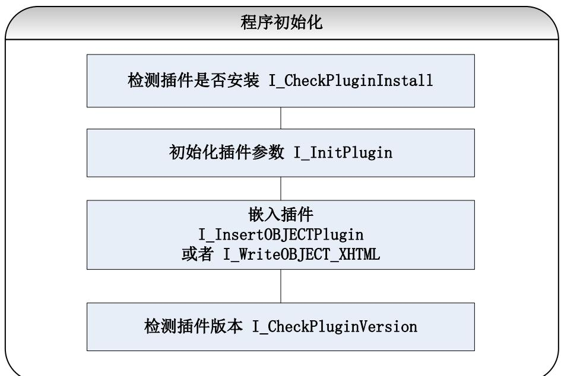
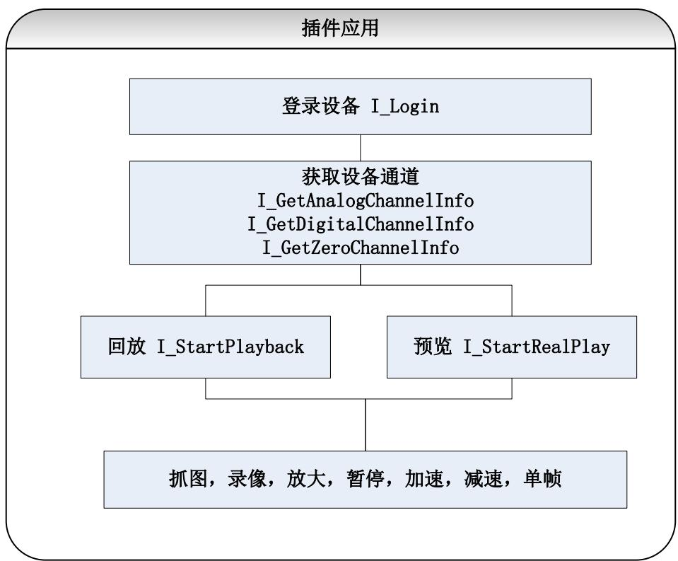

编程指南

## 声 明

非常感谢您购买我公司的产品，如果您有什么疑问或需要请随时联系我们。

我们已尽量保证手册内容的完整性与准确性，但也不免出现技术上不准确、与产品功能及操作不相符或印刷错误等情况，如有任何疑问或争议，请以我司最终解释为准。

产品和手册将实时进行更新，恕不另行通知。

本手册中内容仅为用户提供参考指导作用，请以开发包实际内容为准。

## 目 录

声 明 ....... .................................................................................................................................................................. I  
目 录 ......................................................................................................................................................................... II  
1 简介.. ................................................................................................................................. ..... 1  
1.1 内容简介 ................................................................................................................................................. 1  
1.2 支持设备 ................................................................................................................................................. 1  
1.3 运行环境 ........ ......................................................................................................................................... 1  
2 版本更新 ......... .............................................................................................................................................. 2  
3 错误码及说明 ..................................................................................................................................................... 4  
3.1 异常事件代码 ......................................................................................................................................... 4  
3.2 错误码 ...... ............................................................................................................................................. 4  
4 函数调用顺序 .. ..................................................................................................................................... 6  
5 函数说明 ..... .......................................................................................................................................... 7  
5.1 插件初始化 ............................................................................................................................................. 7  
5.1.1 检查插件是否已安装 ........................... .................................................................................. 7  
5.1.2 Web 插件初始化（包含插件事件注册） ................................................................................. 7  
5.1.3 嵌入播放插件 ............ ......................................................................................... 8  
5.1.4 在网页中写入插件 .... .............................................................................. ...... 8  
5.2 获取设备信息 .... ............................................................................................................ 8  
5.2.1 根据域名获取设备 IP ................................................................................................................. 8  
5.2.2 登录设备 .... ................................................................................................ ..... 9  
5.2.3 登出设备 ..................................................................................................................................... 9  
5.2.4 获取设备基本信息 ................................................................................................................... 10  
5.2.5 获取模拟通道 ...... ........................................................................................................ ....... 10  
5.2.6 获取数字通道 ...... ................................................................................................................... 11  
5.2.7 获取零通道 .. ...................................................................................................................... 11  
5.2.8 录像搜索 ......... ........................................................................................................................ 12  
5.2.9 获取语音对讲通道 . ................................................................................................................ 13  
5.2.10 获取端口 ....... .................................................................................................................... 13  
5.3 播放及播放控制 ........ ........................................................................................................................... 14  
5.3.1 开始预览 ................................................................................................................................... 14  
5.3.2 开始回放 ....... ............................................................................................................................ 14  
5.3.3 开始倒放 ................................................................................................................................... 15  
5.3.4 停止播放 ................................................................................................................................... 16  
5.3.5 单帧 ..... .................................................................................................................... ...... 16  
5.3.6 暂停 ........................................................................................................................................... 16  
5.3.7 恢复播放 ................................................................................................................................... 16  
5.3.8 减速播放 .... ............................................................................................................................. 17  
5.3.9 加速播放 ................................................................................................................................... 17  
5.3.10 获取 OSD 时间 .......................................................................................................................... 17  
5.3.11 打开声音 ................................................................................................................................... 17  
5.3.12 关闭声音 ................................................................................................................................... 18  
5.3.13 设置音量 ... ....................................................................................... ...... 18  
5.3.14 抓图 ........ .............................................................................................................................. 18  
5.3.15 画面分割 ................................................................................................................................... 18  
5.4 录像. ...................................................................................................................................................... 19  
5.4.1 开始录像 ...... ................................................................................................................... ...... 19  
5.4.2 停止录像 ................................................................................................................................... 19  
5.5 录像下载 ............................................................................................................................................... 19  
5.5.1 开始下载 .......... ......................................................................................................................... 19  
5.5.2 获取录像下载状态 ................................................................................................................... 19  
5.5.3 获取录像下载进度 ................................................................................................................... 20  
5.5.4 停止录像下载 ..... .......................................................................................... ....... 20  
5.6 语音对讲 ... ............................................................................................. .... 20  
5.6.1 开始语音对讲 ... ................................................................................................................. 20  
5.6.2 停止语音对讲 .... .......................................................................................................... ...... 20  
5.7 云台控制 ..... ........................................................................................................................ 21  
5.7.1 云台控制 ....... ................................................................................................................ ...... 21  
5.7.2 设置预置点 .. ............................................................................................................ ...... 21  
5.7.3 调用预置点 .. ........................................................................................................... ...... 21  
5.8 图像放大 ............................................................................................................................................... 21  
5.8.1 开启电子放大 ........................................................................................................................... 21  
5.8.2 关闭电子放大 ........................................................................................................................... 22  
5.8.3 开启 3D 放大 ............................................................................................................................. 22  
5.8.4 关闭 3D 放大 ...... ............................................................................................................. ...... 22  
5.8.5 全屏播放 ....... ........................................................................................................ ...... 22  
5.9 设备维护 ............................................................................................................................................... 22  
5.9.1 导出配置参数 ........................................................................................................................... 22  
5.9.2 导入配置参数 .. ...................................................................................................... .... 23  
5.9.3 恢复默认参数 ........................................................................................................................... 23  
5.9.4 设备重启 ................................................................................................................................... 23  
5.9.5 开始升级 ................................................................................................................................... 23  
5.9.6 获取升级状态 ........................................................................................................................... 24  
5.9.7 获取升级进度 ........................................................................................................................... 24  
5.9.8 停止升级 ................................................................................................................................... 24  
5.9.9 重连 ....... ............................................................................................................. ....... 24  
5.9.10 打开远程配置 ........................................................................................................................... 24  
5.10 插件信息维护 ....... ...................................................................................................... ...... 25  
5.10.1 插件版本比较 ...... ..................................................................................................................... 25  
5.10.2 获取插件的本地配置参数 ...... ................................................................................................ 25  
5.10.3 设置插件的本地配置参数 ....................................................................................................... 25  
5.10.4 获取播放窗口信息 .... ............................................................................................................... 26  
5.11 窗口多边形绘图 ................ ................................................................................................................... 26  
5.11.1 设置播放模式 .... ............................................................................................. ..... 26  
5.11.2 设置绘图模式 ....... .................................................................................................................... 26  
5.11.3 设置多边形信息 ....................................................................................................................... 26  
5.11.4 获取多边形信息 . 2 7  
5.11.5 清空多边形信息 . . 27  
5.12 其它 .. 2 7  
5.12.1 选择文件夹或者文件路径 . . 27  
5.12.2 获取上一次的错误码 . . 27  
5.12.3 发送 HTTP 请求... .. 27  
5.12.4 设置封装格式 . . 28  
5.12.5 设备抓图 .. 28

## 1 简介

## 1.1 内容简介

Web 控件 V3.0 基于 ActiveX 和 NPAPI 开发，接口封装于 javascript 脚本，以 javascript 接口形式提供用户集成，支持网页上实现预览、回放、云台控制等功能。该控件开发包仅支持 B/S 网页开发，不适用于 C/S开发。

## 1.2 支持设备

Web 控件 V3.0 支持我司多种设备，包括 DVR、NVR、DVS、网络摄像机、网络球机等，设备需要支持PSIA 或 ISAPI 协议。

## 1.3 运行环境

操作系统：Windows XP、Windows7、Windows8、Windows8.1

IE8\~IE11、Chrome31+、Firefox35+，32 位浏览器

IE8\~IE11、Chrome31\~Chrome44、Firefox35\~Firefox51，64 位浏览器

## 2 版本更新

## V 1.1.0

1. 增加视频窗口叠加绘制多边形接口（I_SetSnapDrawMode、I_SetSnapPolygonInfo、I_GetSnapPolygonInfo、I_ClearSnapInfo）。

2. 增加设备抓图接口（I_DeviceCapturePic）。

3. 插件初始化接口（I_InitPlugin），增加可选参数（iPackageType、cbRemoteConfig、cbDoubleClickWnd、cbInitPluginComplete），其中 cbInitPluginComplete 使用时必须定义。

4. 抓图、录像/剪辑、下载增加可选参数（bDateDir），设置是否创建日期文件夹。

5. 增加接口（I_SetPackageType），设置录像/剪辑、下载文件封装格式。

6. 支持子码流录像文件搜索、回放、下载。

7. 支持开发包被 requirejs、seajs 加载使用。

8. IP Server/HiDDNS 解析接口（I_GetIPInfoByMode）只有 32 位带远程配置库的开发包支持。

9. 遗留缺陷修复：

 修复IE11 浏览器多 tab页关闭网页插件崩溃问题

 修复同步请求获取256路通道信息失败问题

 修复个别 DS-8632N-I8 设备回放失败问题

## V 1.0.9

10. 检查插件是否已安装接口（I_CheckPluginInstall），增加返回值-2。

11. 插件初始化接口（I_InitPlugin），增加属性 bWndFull。

12. 增加 HTTP 请求接口（I_SendHTTPRequest）。

## V 1.0.5

13. 修改远程配置库为非模态调用方式（I_RemoteConfig），避免火狐浏览器下打开远程配置库后卡死。

14. 扩展远程配置接口（I_RemoteConfig），增加语言选择参数，目前支持中文和英文。

15. 增加对摘要认证的支持。

16. 修改 IE11 无法 3D 放大的 BUG

## V 1.0.4

1. 重新设计云台操作接口（I_PTZControl），接口中增加聚焦，变倍，光圈功能。增加参数，用于标志当前操作是开始还是停止。

2. 增加转码码流，支持转码回放。

3. 修改 HTTP 状态为 404 时，可能出现接口无返回值的 BUG。

4. 修改一些老版本PSIA设备预览失败的 BUG

## V 1.0.3

1. 增加私有协议取流（shttp），包括预览，回放和倒放。当本地配置协议为 TCP 时，默认使用私有协议取

流。

## V 1.0.2

1. 修改某些设备无法获取到RTSP端口的BUG

## V 1.0.1

修改HTTP交互过程，解决一些老版本设备无法登录的 BUG

修改NVR 无法调用预置点的 BUG

## V 1.0.0

该版本开发包可支持同步/异步，跨域的CGI命令（PSIA/ISAPI），但支持一些比较基本的命令，设备基本信息，通道获取，云台控制等。

播放模式暂时只支持 rtsp over tcp 和 rtsp over udp

## 3 错误码及说明

## 3.1 异常事件代码

异常事件回调在用户传入的回调函数中处理，第一个参数为事件代码（回放异常，回放停止和硬盘空间不足），第二个参数为事件发生的窗口号。

<table><tr><td rowspan=1 colspan=1>事件名称</td><td rowspan=1 colspan=1>代码</td><td rowspan=1 colspan=1>说明</td></tr><tr><td rowspan=1 colspan=1>PLUGIN_EVENTTYPE_PLAYABNORMAL</td><td rowspan=1 colspan=1>0</td><td rowspan=1 colspan=1>回放异常</td></tr><tr><td rowspan=1 colspan=1>PLUGIN_EVENTTYPE_PLAYBACKSTOP</td><td rowspan=1 colspan=1>2</td><td rowspan=1 colspan=1>回放停止</td></tr><tr><td rowspan=1 colspan=1>PLUGIN_EVENTTYPE_AUDIOTALKFAIL</td><td rowspan=1 colspan=1>3</td><td rowspan=1 colspan=1>语音对讲失败</td></tr><tr><td rowspan=1 colspan=1>PLUGIN_EVENTTYPE_NOFREESPACE</td><td rowspan=1 colspan=1>21</td><td rowspan=1 colspan=1>硬盘空间不足（录像）</td></tr></table>

## 3.2 错误码

错误代码通过调用I_GetLastError 接口获得，属于最底层的错误码，上层逻辑错误没有错误码。

<table><tr><td colspan="1" rowspan="1">错误码宏定义</td><td colspan="1" rowspan="1">错误码</td><td colspan="1" rowspan="1">错误描述</td></tr><tr><td colspan="1" rowspan="1">PLUGIN_ERROR_NOERROR</td><td colspan="1" rowspan="1">0</td><td colspan="1" rowspan="1">无错误</td></tr><tr><td colspan="1" rowspan="1">PLUGIN_ERROR_LOAD_RTSP_FAILED</td><td colspan="1" rowspan="1">1</td><td colspan="1" rowspan="1">加载rtsp库失败</td></tr><tr><td colspan="1" rowspan="1">PLUGIN__ERROR_LOAD_PLAYCTRL_FAILED</td><td colspan="1" rowspan="1">2</td><td colspan="1" rowspan="1">加载播放库失败</td></tr><tr><td colspan="1" rowspan="1">PLUGIN__ERROR_LOAD_SYSTRANSFORM_FAILED</td><td colspan="1" rowspan="1">3</td><td colspan="1" rowspan="1">加载转封装库失败</td></tr><tr><td colspan="1" rowspan="1">PLUGIN__ERROR_LOAD_HTTPCLIENT_FAILED</td><td colspan="1" rowspan="1">4</td><td colspan="1" rowspan="1">加载 http库失败</td></tr><tr><td colspan="1" rowspan="1">PLUGIN__ERROR_PARAMETER_ERROR</td><td colspan="1" rowspan="1">5</td><td colspan="1" rowspan="1">参数错误</td></tr><tr><td colspan="1" rowspan="1">PLUGIN__ERROR_ORDER_ERROR</td><td colspan="1" rowspan="1">6</td><td colspan="1" rowspan="1">调用顺序错误</td></tr><tr><td colspan="1" rowspan="1">PLUGIN__ERROR_ALLOC_RESOURCE_FAILED</td><td colspan="1" rowspan="1">7</td><td colspan="1" rowspan="1">分配资源失败</td></tr><tr><td colspan="1" rowspan="1">PLUGIN_ERROR__NOT_INITLIB</td><td colspan="1" rowspan="1">8</td><td colspan="1" rowspan="1">没有初始化</td></tr><tr><td colspan="1" rowspan="1">PLUGIN__ERROR_OPERTION_NOSUPPORT</td><td colspan="1" rowspan="1">9</td><td colspan="1" rowspan="1">操作不支持</td></tr><tr><td colspan="1" rowspan="1">PLUGIN_ERROR__OPENFILE_ERROR</td><td colspan="1" rowspan="1">10</td><td colspan="1" rowspan="1">打开文件失败</td></tr><tr><td colspan="1" rowspan="1">PLUGIN_ERROR__WRITEFILE_ERROR</td><td colspan="1" rowspan="1">11</td><td colspan="1" rowspan="1">写文件失败</td></tr><tr><td colspan="1" rowspan="1">PLUGIN_ERROR__READFILE_ERROR</td><td colspan="1" rowspan="1">12</td><td colspan="1" rowspan="1">读文件失败</td></tr><tr><td colspan="1" rowspan="1">PLUGIN_ERROR_R_INIT_HPR_FAILED</td><td colspan="1" rowspan="1">13</td><td colspan="1" rowspan="1">初始化 hpr 库失败</td></tr><tr><td colspan="1" rowspan="1">PLUGIN__ERROR_AUDIO_MONOPOLIZED</td><td colspan="1" rowspan="1">14</td><td colspan="1" rowspan="1">声卡被独占</td></tr><tr><td colspan="1" rowspan="1">PLUGIN__ERROR_CREATE_SOCKET_ERROR</td><td colspan="1" rowspan="1">15</td><td colspan="1" rowspan="1">创建 socket 失败</td></tr><tr><td colspan="1" rowspan="1">PLUGIN__ERROR_NETWORK_CONNECT_FAILED</td><td colspan="1" rowspan="1">16</td><td colspan="1" rowspan="1">连接失败</td></tr><tr><td colspan="1" rowspan="1">PLUGIN__ERROR_NETWORK_SEND_ERROR</td><td colspan="1" rowspan="1">17</td><td colspan="1" rowspan="1">发送失败</td></tr><tr><td colspan="1" rowspan="1">PLUGIN_ERROR_NETWORK__RECV_ERROR</td><td colspan="1" rowspan="1">18</td><td colspan="1" rowspan="1">接收失败</td></tr><tr><td colspan="1" rowspan="1">PLUGIN__ERROR_NETWORK_SEND_TIMEOUT</td><td colspan="1" rowspan="1">19</td><td colspan="1" rowspan="1">发送超时</td></tr><tr><td colspan="1" rowspan="1">PLUGIN__ERROR_NETWORK_RECV_TIMEOUT</td><td colspan="1" rowspan="1">20</td><td colspan="1" rowspan="1">接收超时</td></tr><tr><td colspan="1" rowspan="1">PLUGIN_ERROR_NETWORK_RESOLVE_FAILED</td><td colspan="1" rowspan="1">21</td><td colspan="1" rowspan="1">域名解析错误</td></tr><tr><td colspan="1" rowspan="1">PLUGIN_ERROR_XML_PARSE_ERROR</td><td colspan="1" rowspan="1">22</td><td colspan="1" rowspan="1">xml解析错误</td></tr><tr><td colspan="1" rowspan="1">PLUGIN_ERROR_XML_NODE_ERROR</td><td colspan="1" rowspan="1">23</td><td colspan="1" rowspan="1">xml结点错误</td></tr><tr><td colspan="1" rowspan="1">PLUGIN_ERROR_NO_EXCEL_DRIVER_ERROR</td><td colspan="1" rowspan="1">24</td><td colspan="1" rowspan="1">没有安装 Excel 驱动</td></tr><tr><td colspan="1" rowspan="1">PLUGIN_ERROR_PARSE_URL_FAILED</td><td colspan="1" rowspan="1">25</td><td colspan="1" rowspan="1">URL解析失败</td></tr><tr><td colspan="1" rowspan="1">PLUGIN_ERROR_LOADRTSPSDKPROC_ERROR</td><td colspan="1" rowspan="1">26</td><td colspan="1" rowspan="1">找不到 rtsp 接口地址</td></tr><tr><td colspan="1" rowspan="1">PLUGIN_ERROR_LOADPLAYERSDKPROC_ERROR</td><td colspan="1" rowspan="1">27</td><td colspan="1" rowspan="1">找不到播放库接口地址</td></tr><tr><td colspan="1" rowspan="1">PLUGIN_ERROR_LOADSYSTRANSFORMPROC_ERROR</td><td colspan="1" rowspan="1">28</td><td colspan="1" rowspan="1">找不到转封装库接口地址</td></tr><tr><td colspan="1" rowspan="1">PLUGIN_ERROR_LOADHTTPSDKPROC_ERROR</td><td colspan="1" rowspan="1">29</td><td colspan="1" rowspan="1">找不到 http 库接口地址</td></tr><tr><td colspan="1" rowspan="1">PLUGIN_ERROR_START_WAVEIN_FAILED</td><td colspan="1" rowspan="1">30</td><td colspan="1" rowspan="1">开始音频采集失败</td></tr><tr><td colspan="1" rowspan="1">PLUGIN_ERROR_START_WAVEOUT_FAILED</td><td colspan="1" rowspan="1">31</td><td colspan="1" rowspan="1">开始音频播放失败</td></tr><tr><td colspan="1" rowspan="1">PLUGIN_ERROR_INIT_G722_CODEC_FAILED</td><td colspan="1" rowspan="1">32</td><td colspan="1" rowspan="1">初始化 G722 编解码失败</td></tr><tr><td colspan="1" rowspan="1">PLUGIN_ERROR_NOT_ENOUGH_DISK_FREESPACE</td><td colspan="1" rowspan="1">33</td><td colspan="1" rowspan="1">磁盘空间不足</td></tr><tr><td colspan="1" rowspan="1">PLUGIN_ERROR_FILE_ALREADY_EXIST</td><td colspan="1" rowspan="1">34</td><td colspan="1" rowspan="1">文件已存在</td></tr></table>

## 4 函数调用顺序





## 5 函数说明

## 5.1 插件初始化

## 5.1.1检查插件是否已安装

函数： I_CheckPluginInstall()

功能： 检查插件是否已安装（包含Chrome版本检查）

参数： 无

返回值：-2: Chrome 浏览器版本过高，不支持 NPAPI -1: 未安装 0: 已安装

## 5.1.2 Web 插件初始化（包含插件事件注册）

函数： I_InitPlugin(szWidth, szHight, options)

功能： 初始化插件的各种属性

参数： szWidth 插件的宽度（单位为”px”， 100%表示撑满插件容器）

szHight 插件的高度（单位为”px”， 100%表示撑满插件容器）

szContainerID 插件的容器（HTML 的 DOM节点）id，可以在初始化的时候传入，也可以在插件嵌入的时候传入。

szColorProperty 插件的背景颜色。表示插件的背景颜色，子窗口的背景颜色，子窗口的边框颜色，子窗框选中的边框颜色。插件中有一套自己的默认颜色。

szOcxClassId ocx 插件的 ID，OEM时可以修改对应 ID 来实现开发包绑定不同的插件，默认为海康 WEB3.0 插件

szMimeTypes 非 IE 插件的 MIMETYPE，OEM时可以修改对应 ID来实现开发包绑定不同的插件，默认为海康 WEB3.0 插件

iWndowType 分屏类型：1- 1\*1，2- 2\*2，3- 3\*3，4- 4\*4，默认值为 1，单画面bWndFull 单窗口双击全屏，默认支持，true(支持)，false(不支持)。

iPlayMode 播放模式，默认值为 2，正常播放模式。暂不支持其它模式。

bDebugMode JS 调试模式，控制台打印调试信息，true(开启)，false(关闭)

cbSelWnd 窗口选中事件回调函数，只包含一个字符串参数，里面的值是 XMLcbEvent 插件事件回调函数，有三个参数，第一个参数是事件类型，第二参数是窗口号

iPackageType 封装格式，2-PS 格式 11-MP4 格式。

cbDoubleClickWnd 窗口双击回调函数，有两个参数，第一个参数是窗口号，第二个参数是是否全屏

cbRemoteConfig 远程配置库关闭回调

cbInitPluginComplete 插件初始化完成回调，必须要定义

返回值：无

说明： szColorProperty 的格式为：

cbSelWnd 是窗口选中事件的回调函数，用户可以传入函数，选中窗口后，开发包会自动调用这个函数，参数是一个XML，格式如下：

<?xml version="1.0"?>   
<RealPlayInfo>   
<SelectWnd>0</SelectWnd> //触发事件的窗口号，从0开始   
</RealPlayInfo>

cbEvent是插件的异常事件回调函数，有三个参数，第一个参数是事件类型(具体值在异常事件回调中有说明)，第二个是触发事件的窗口号。

## 5.1.3嵌入播放插件

函数： I_InsertOBJECTPlugin(szContainerID)

功能： 在 HTML DOM 元素中插入播放插件

参数： szContainerID 插件容器的 ID，HTML 的 DOM 元素

返回值：成功返回 0，失败返回-1

## 5.1.4在网页中写入插件

函数： I_WriteOBJECT_XHTML()

功能： 在网页中直接插入播放插件

参数： 无

返回值：成功返回0，失败返回-1

## 5.2 获取设备信息

## 5.2.1 根据域名获取设备 IP

函数： I_GetIPInfoByMode(iMode, szAddress, iPort, szDeviceInfo)

功能： 根据域名获取设备 IP

参数： iMode DNS 服务器模式，0-IP_Domain 1-IPServer 2-HIDDNS  
szAddress DNS 服务器 IP 地址  
iPort DNS 服务器端口号  
szDeviceInfo 设备标识，设备序列号或者设备名称（或者HiDDNS）

返回值：成功则返回”设备IP地址-设备 SDK 端口号”（以中横杆“-”为 IP和端口的分隔符），失败则返回””（空字符串）。获取到设备 IP 地址和端口后再调用 I_Login 登录设备。

## 5.2.2 登录设备

函数： I_Login(szIP, iPrototocol, iPort, szUserName, szPassword, options)

功能： 登录设备 功能：

参数： szIP 设备的 IP 地址或者普通域名(比如花生壳域名)  
iPrototocol http 协议，1 表示 http 协议 2 表示 https 协议  
iPort 登录设备的 http/https 端口号，根据 iPrototocol 选择传入不同的端口  
szUserName 登录用户名称  
szPassword 用户密码  
options 可选参数对象:  
async http交互方式，true 表示异步，false 表示同步  
cgi CGI 协议选择，1 表示 ISAPI，2 表示 PSIA，如果不传这个参数，会  
自动选择一种设备支持的协议.  
success 成功回调函数，有一个参数，表示返回的 XML 内容。  
error 失败回调函数，有两个参数，第一个是 http 状态码，第二个是设  
备返回的XML(可能为空)

返回值：无

说明： 调用该函数登录设备，如果登录成功，即选定了 http/https协议，以及 PSIA/ISAPI协议，以后都采用选定好的协议和设备进行交互。交互成功，会调用用户成功回调函数，失败则调用失败回调函数。

示例：

```javascript
var iRet = WebVideoCtrl.I_Login(szIP, 1, szPort, szUsername, szPassword, {
success: function(xmlDoc) { //成功的回调函数
showOPInfo(szIP + " 登录成功！");
$("#ip").prepend("<option value='" + szIP + "'>" + szIP + "</option>");
setTimeout(function () {
$("#ip").val(szIP);
getChannelInfo();
}, 10);
},
error: function() { //失败的回调函数
showOPInfo(szIP + " 登录失败!");
}
});
```

## 5.2.3 登出设备

函数： I_Logout(szDeviceIdentify)

功能： 登出设备

参数： szDeviceIdentify 设备标识（IP_Port）

返回值：成功返回0 ，失败返回-1。

## 5.2.4获取设备基本信息

函数： I_GetDeviceInfo(szDeviceIdentify, options)

功能： 获取设备基本信息

参数： szDeviceIdentify 设备标识（IP_Port）options 可选参数对象:async http交互方式，true 表示异步，false 表示同步success 成功回调函数，有一个参数，表示返回的 XML 内容。error 失败回调函数，有两个参数，第一个是 http 状态码，第二个是设备返回的 XML(可能为空)

返回值：无

说明： 交互成功，调用用户成功回调函数，回调函数的第一个参数为设备信息的 XML。失败则调用失败回调函数。

XML 格式如下：

```sgml
<DeviceInfo>
<deviceName></deviceName> //设备名称
<deviceID></deviceID> //设备 ID
<deviceType></deviceType> //设备类型（可能为空）
<model></model> //设备编号
<serialNumber></serialNumber> //设备序列号
<macAddress></macAddress> //设备 MAC 地址
<firmwareVersion></firmwareVersion> //设备主控版本
<firmwareReleasedDate></firmwareReleasedDate> //主控版本编码时间
<encoderVersion></encoderVersion> //设备编码版本
<encoderReleasedDate></encoderReleasedDate> //设备编码版本时间
</DeviceInfo>
```

## 5.2.5获取模拟通道

函数： I_GetAnalogChannelInfo(szDeviceIdentify, options)

功能： 获取模拟通道信息

参数： szDeviceIdentify 设备标识（IP_Port）options 可选参数对象:async http交互方式，true 表示异步，false 表示同步success 成功回调函数，有一个参数，表示返回的 XML 内容。error 失败回调函数，有两个参数，第一个是 http 状态码，第二个是设备返回的 XML(可能为空)

返回值：无

说明： 交互成功，调用用户成功回调函数，回调函数的第一个参数为通道信息的 XML。失败则调用失败回调函数。XML 格式如下：<VideoInputChannelList><VideoInputChannel>

<table><tr><td colspan="2">&lt;id&gt;&lt;/id&gt; //通道ID</td></tr><tr><td>&lt;inputPort&gt;&lt;/inputPort&gt;</td><td>//通道号</td></tr><tr><td>&lt;videolnputEnabled&gt;&lt;/videolnputEnabled&gt;</td><td>//是否使能</td></tr><tr><td>&lt;name&gt;&lt;/name&gt;</td><td>//通道名</td></tr><tr><td>&lt;videoFormat&gt;&lt;/videoFormat&gt;</td><td>//通道制式</td></tr><tr><td>&lt;/VideolnputChannel&gt;</td><td></td></tr><tr><td>&lt;/VideolnputChannelList&gt;</td><td></td></tr></table>

## 5.2.6获取数字通道

函数： I_GetDigitalChannelInfo(szDeviceIdentify, options)

功能： 获取数字通道信息

参数： szDeviceIdentify 设备标识（IP_Port）options 可选参数对象:async http 交互方式，true 表示异步，false 表示同步success 成功回调函数，有一个参数，表示返回的 XML 内容。error 失败回调函数，有两个参数，第一个是 http 状态码，第二个是设备返回的 XML(可能为空)

返回值：无

说明： 交互成功，调用用户成功回调函数，回调函数的第一个参数为通道信息的 XML。失败则调用失败回调函数。

<InputProxyChannelStatusList>  
<InputProxyChannelStatus>  
<id></id> //通道的 ID  
<sourceInputPortDescriptor>  
<proxyProtocol></proxyProtocol> //接入协议  
<addressingFormatType></addressingFormatType> //IP 地址类型  
<ipAddress></ipAddress> //IP 地址  
<managePortNo></managePortNo> //管理端口号  
<srcInputPort></srcInputPort> //IP 通道号  
<userName></userName> //接入的用户名  
<streamType></streamType> //码流类型  
<online></online> //是否在线（true/false）  
</sourceInputPortDescriptor>  
</InputProxyChannelStatus>  
</InputProxyChannelStatusList>

## 5.2.7 获取零通道

函数： I_GetZeroChannelInfo(szDeviceIdentify, options)

功能： 获取零通道信息

参数： szDeviceIdentify 设备标识（IP_Port）

## 返回值：无

说明： 交互成功，调用用户成功回调函数，回调函数的第一个参数为通道信息的 XML。失败则调用失败回调函数。

XML格式如下：

<ZeroVideoChannelList>   
<ZeroVideoChannel>   
<id>1</id> //通道 ID   
<enabled>true</enabled> //是否使能   
<inputPort>1</inputPort> //通道 ID   
</ZeroVideoChannel>   
</ZeroVideoChannelList>

## 5.2.8 录像搜索

函数： I_RecordSearch(szDeviceIdentify, iChannelID, szStartTime, szEndTime, options)

功能： 录像搜索

参数： szDeviceIdentify 设备标识（IP_Port）

options 可选参数对象:

error 失败回调函数，有两个参数，第一个是 http 状态码，第二个是设备返回的 XML(可能为空)

## 返回值：无

说明： 交互成功，调用用户成功回调函数，回调函数的第一个参数为录像信息的 XML。失败则调用失败回调函数。

注意: 录像搜索结果每次最多返回 40 条，如果结果数量超过 40 条，用户需要多次调用该接口，并且设置一个搜索位置。

<CMSearchResult><responseStatus>true</responseStatus><responseStatusStrg>MORE</responseStatusStrg>//根据这个标志来决定是否继续搜索。OK 表示已经搜索完成<numOfMatches>40</numOfMatches> //本次搜索返回的录像条数

```xml
<matchList>
<searchMatchItem>
<trackID>101</trackID> //录像的 ID
<startTime>2013-12-23T03:06:58Z</startTime> //录像开始时间
<endTime>2013-12-23T03:16:57Z</endTime> //录像结束时间
<playbackURI>rtsp://172.9.4.222/Streaming/tracks/101/?starttime=20131223T030658Z
&amp;endtime=20131223T031657Z&amp;name=02000000076000101&amp;size=1156
65012</playbackURI>/*这个节点包含了录像开始时间，结束时间，录像名字，录像
大小等信息，录像下载时，需要传入这个值*/
<metadataDescriptor>motion</metadataDescriptor>/*录像类型: timing-定时录像，
motion-移动侦测录像，motionOrAlarm-动测或报警，motionAndAlarm-报警和动测，
manual-手动录像，smart-智能*/
</searchMatchItem>
</matchList>
</CMSearchResult>
```

## 5.2.9获取语音对讲通道

函数： I_GetAudioInfo(szDeviceIdentify, options)

功能： 获取语音对讲通道信息 功能：

参数： szDeviceIdentify 设备标识（IP_Port）  
options 可选参数对象:  
async http交互方式，true 表示异步，false 表示同步  
success 成功回调函数，有一个参数，表示返回的 XML 内容。  
error 失败回调函数，有两个参数，第一个是 http 状态码，第二个是设  
备返回的XML(可能为空)

返回值：无

说明： 交互成功，调用用户成功回调函数，回调函数的第一个参数为语音对讲通道信息的 XML。失败则调用失败回调函数。

<TwoWayAudioChannelList>   
<TwoWayAudioChannel>   
<id></id> //通道 ID   
<enabled></enabled> //是否启用语音对讲   
<audioCompressionType></audioCompressionType> //音频编码   
</TwoWayAudioChannel>   
</TwoWayAudioChannelList>

## 5.2.10获取端口

函数： I_GetDevicePort (szDeviceIdentify)

功能： 获取端口

参数： szDeviceIdentify 设备标识（IP_Port）

返回值：成功：端口对象 失败：null

## 5.3 播放及播放控制

## 5.3.1 开始预览

函数： I_StartRealPlay(szDeviceIdentify, options)

功能： 开始预览

参数： szDeviceIdentify 设备标识（IP_Port）options 可选参数对象:iWndIndex 播放窗口，如果不传，则默认使用当前选择窗口播放（默认选中窗口0）iStreamType 码流类型1-主码流，2-子码流，默认使用主码流预览iChannelID 播放通道号，默认通道1bZeroChannel 是否播放零通道，默认为 falseiPort RTSP 端口号，可以选择传入，如果不传，开发包会自动判断设备的 RTSP 端口success 成功回调函数error 失败回调函数

返回值：无

说明： 登录设备完成后才可以调用该函数。

## 5.3.2 开始回放

函数： I_StartPlayback(szDeviceIdentify, options)

功能： 开始回放

<table><tr><td rowspan="7">参数：</td><td rowspan="7">szDeviceldentify options 可选参数对象:</td><td colspan="2">设备标识（IP_Port)</td></tr><tr><td>iWndIndex</td><td>播放窗口，如果不传，则默认使用当前选择窗口播放（默认 选中窗口0)</td></tr><tr><td>szStartTime</td><td>开始时间，默认为当天00:00:00，格式如：2013-12-2300:00:00</td></tr><tr><td>szEndTime</td><td>结束时间，默认为当天23:59:59，格式如：2013-12-2323:59:59</td></tr><tr><td>iChannellD</td><td>播放通道号，默认通道1</td></tr><tr><td>iPort</td><td>RTSP端口号，可以选择传入，如果不传，开发包会自动判断</td></tr><tr><td>oTransCodeParam</td><td>设备的 RTSP 端口 转码回放参数对象，传入此参数，将按照此对象中的编码参 数进行转码回放（转码回放需要设备支持，如果不支持，则</td></tr></table>

iStreamType 码流类型 1-主码流，2-子码流，默认主码流  
success 成功回调函数  
error 失败回调函数

## 返回值：无

说明： 该接口为按时间回放接口，开发包目前只支持按时间回放，不支持按文件回放，不过用户可以搜  
索出录像，然后按照录像的开始时间和结束时间来回放。时间必须严格按照说明所示格式输入。  
oTransCodeParam 是一个 javascript 对象：  
{  
TransFrameRate: "16",  
TransResolution: "2",  
TransBitrate: "23"  
}  
TransFrameRate 表示帧率  
取值范围：0-全部， 5-1，6-2，7-4，8-6，9-8，10-10，11-12，12-16，13-20，14-15，15-18，16  
－22， 255-自动（和源一致）

## TransResolution 表示分辨率

取 值 范 围 ： 1-CIF(352\*288/352\*240) ， 2-QCIF(176\*144/176\*120) ， 3-4CIF(704\*576/704\*480) 或D1(720\*576/720\*486)，255-Auto(使用当前码流分辨率)

## TransBitrate 表示码率

取值范围： 2-32K，3-48k，4-64K，5-80K，6-96K，7-128K，8-160k，9-192K，10-224K，11-256K，12-320K，13-384K，14-448K，15-512K，16-640K，17-768K，18-896K，19-1024K，20-1280K，21-1536K，22-1792K，23-2048K，24-3072K，25-4096K，26-8192K，255- 自动（和源一致）

## 5.3.3 开始倒放

函数： I_ReversePlayback(szDeviceIdentify, options)

功能： 开始倒放

参数： szDeviceIdentify 设备标识（IP_Port）options 可选参数对象:iWndIndex 播放窗口，如果不传，则默认使用当前选择窗口播放（默认选中窗口0）szStartTime 开始时间，默认为当天 00:00:00，格式如：2013-12-23 00:00:00szEndTime 结束时间，默认为当天 23:59:59，格式如：2013-12-23 23:59:59iChannelID 播放通道号，默认通道1iPort RTSP 端口号，可以选择传入，如果不传，开发包会自动判断设备的 RTSP端口iStreamType 码流类型1-主码流，2-子码流，默认主码流

返回值：成功返回0，失败返回-1

说明： 倒放是从接口传入的结束时间开始播放。倒放功能很多设备暂时不支持。如果调用倒放接口，会返回失败。

## 5.3.4 停止播放

函数： I_Stop(options)

功能： 停止播放（停止预览和停止回放统一使用该函数）

返回值：无

## 5.3.5 单帧

函数： I_Frame(options)

功能： 单帧播放，每调用一次，播放一帧数据。回放和倒放时可以调用

返回值：无

## 5.3.6 暂停

函数： I_Pause(options)

功能： 暂停播放，回放和倒放时可以调用

参数： options 可选参数对象：

返回值：无

## 5.3.7 恢复播放

函数： I_Resume(options)

功能： 恢复播放，把播放状态从单帧/暂停恢复到正常播放状态

参数： options 可选参数对象：iWndIndex 播放窗口号，可不传，表示操作当前选中窗口success 成功回调函数error 失败回调函数

返回值：无

## 5.3.8 减速播放

函数： I_PlaySlow(options)

功能： 减速播放，每调用一次，播放速度降低一个等级，插件最大支持1/8 倍速到8 倍速，设备自身可能也有限制

参数： options 可选参数对象：iWndIndex 播放窗口号，可不传，表示操作当前选中窗口success 成功回调函数error 失败回调函数

返回值：无

## 5.3.9 加速播放

函数： I_PlayFast(options)

功能： 加速播放，每调用一次，播放速度增加一个等级，插件最大支持 1/8 倍速到 8 倍速，设备自身可能也有限制。

参数： options 可选参数对象：iWndIndex 播放窗口号，可不传，表示操作当前选中窗口success 成功回调函数error 失败回调函数

返回值：无

## 5.3.10获取 OSD 时间

函数： I_GetOSDTime(options)

功能： 获取当前播放的码流的 OSD 时间，可以用于制作回放进度

参数： options 可选参数对象：iWndIndex 播放窗口号，可不传，表示操作当前选中窗口success 成功回调函数，有一个参数，表示OSD时间。error 失败回调函数

返回值：无

## 5.3.11打开声音

函数： I_OpenSound(iWndIndex)

功能： 打开声音

参数： iWndIndex 播放窗口号，可不传，表示操作当前选中窗口

返回值：成功返回0，失败返回-1

## 5.3.12关闭声音

函数： I_CloseSound(iWndIndex)

功能： 关闭声音

参数： iWndIndex

播放窗口号，可不传，表示操作当前选中窗口

返回值：成功返回0，失败返回-1

## 5.3.13设置音量

函数： I_SetVolume(iVolume, iWndIndex)

功能： 设置音量，音量范围：0-100

参数： iVolume 音量大小

iWndIndex 播放窗口号，可不传，表示操作当前选中窗口

返回值：成功返回0，失败返回-1

## 5.3.14抓图

函数： I_CapturePic(szPicName, options)

功能： 抓取预览/回放图片，保存到本地PC 中，路径保存在本地参数中

参数： szPicName 图片文件名options 可选参数对象：iWndIndex 播放窗口号，可不传，表示操作当前选中窗口bDateDir 是否创建日期文件夹（true：创建，false：不创建），默认 true

返回值：成功返回0，失败返回-1

说明： 抓图图片格式与接口调用时传的文件名有关：如果文件名带有.bmp后缀，则抓取 bmp图片；如果不带则是 jpg。图片保存路径通过 I_GetLocalCfg()获取。

## 5.3.15画面分割

函数： I_ChangeWndNum(iWndType)

功能： 修改画面分割类型

参数： iWndType

画面分割类型：1- 1\*1，2- 2\*2，3- 3\*3，4- 4\*4

返回值：成功返回 0，失败返回-1

## 5.4 录像

## 5.4.1 开始录像

函数： I_StartRecord(szFileName, options)

功能： 预览/回放录像，保存录像到 PC 中，路径在本地参数配置中

参数： szFileName 录像文件名称options 可选参数对象：iWndIndex 播放窗口号，可不传，表示操作当前选中窗口bDateDir 是否创建日期文件夹（true：创建，false：不创建），默认 truesuccess 成功回调函数error 失败回调函数

返回值：无

## 5.4.2 停止录像

函数： I_StopRecord(options)

功能： 停止录像

参数： options 可选参数对象：iWndIndex 播放窗口号，可不传，表示操作当前选中窗口success 成功回调函数error 失败回调函数

返回值：无

## 5.5 录像下载

## 5.5.1 开始下载

函数： I_StartDownloadRecord(szDeviceIdentify, szPlaybackURI, szFileName, options)

功能： 调用该接口，可以下载存储在设备中的录像

参数： szDeviceIdentify 设备标识（IP_Port）szPlaybackURI 录像URL，这个URL在录像搜索中可以得到szFileName 要下载录像录像名字options 可选参数对象：bDateDir 是否创建日期文件夹（true：创建，false：不创建），默认 true

返回值：成功返回一个大于等于 0 的下载 ID，失败返回-1

## 5.5.2获取录像下载状态

函数： I_GetDownloadStatus(iDownloadID)

功能： 获取下载的状态，用来确定下载是否正在进行中

参数： iDownloadID 下载ID，开始下载接口返回的值

返回值：成功返回0，表示正在下载，失败返回-1，表示已经下载失败

## 5.5.3 获取录像下载进度

函数： I_GetDownloadProgress(iDownloadID)

功能： 获取录像下载的进度

参数： iDownloadID 下载ID，开始下载接口返回的值

返回值：返回一个大于等于 0的下载进度

## 5.5.4 停止录像下载

函数： I_StopDownloadRecord(iDownloadID)

功能： 停止录像下载

参数： iDownloadID 下载ID，开始下载接口返回的值

返回值：成功返回0，失败返回-1

## 5.6 语音对讲

## 5.6.1 开始语音对讲

函数： I_StartVoiceTalk(szDeviceIdentify, iAudioChannel)

功能： 开始语音对讲

参数： szDeviceIdentify 设备标识（IP_Port）iAudioChannel 语音对讲通道

返回值：成功返回0，失败返回-1

## 5.6.2 停止语音对讲

函数： I_StopVoiceTalk()

功能： 停止语音对讲

参数： 无

返回值：成功返回0，失败返回-1

## 5.7 云台控制

## 5.7.1 云台控制

函数： I_PTZControl(iPTZIndex, bStop, options)

功能： 云台方向控制

参数： iPTZIndex 操作类型（1-上，2-下，3-左，4-右，5-左上，6-左下，7-右上，8-右下，9-自转，10-调焦+， 11-调焦-, 12-F 聚焦+, 13-聚焦-, 14-光圈+, 15-光圈-）bStop 是否停止 iPTZIndex 指定的操作，true|falseoptions 可选参数对象iWndIndex 窗口号，默认为当前选中窗口iPTZSpeed 云台速度，默认为 4

返回值：无

## 5.7.2 设置预置点

函数： I_SetPreset(iPresetID, options)

功能： 设置预置点

参数： iPresetID 预置点 IDoptions 可选参数对象iWndIndex 窗口号，默认为当前选中窗口

返回值：无

## 5.7.3 调用预置点

函数： I_GoPreset(iPresetID, options)

功能： 调用预置点

参数： iPresetID 预置点IDoptions 可选参数对象iWndIndex 窗口号，默认为当前选中窗口

返回值：无

## 5.8 图像放大

## 5.8.1 开启电子放大

函数： I_EnableEZoom(iWndIndex)

功能： 开启电子放大

参数： iWndIndex 播放窗口号，可不传，表示操作当前选中窗口返回值：成功返回 0，失败返回-1

## 5.8.2 关闭电子放大

函数： I_DisableEZoom(iWndIndex)

功能： 关闭电子放大

参数： iWndIndex

播放窗口号，可不传，表示操作当前选中窗口

返回值：成功返回 0，失败返回-1

## 5.8.3 开启 3D 放大

函数： I_Enable3DZoom(iWndIndex)

功能： 开启 3D 放大

参数： iWndIndex

播放窗口号，可不传，表示操作当前选中窗口

返回值：成功返回0，失败返回-1

## 5.8.4 关闭 3D 放大

函数： I_Disable3DZoom(iWndIndex)

功能： 关闭 3D 放大

参数： iWndIndex

播放窗口号，可不传，表示操作当前选中窗口

返回值：成功返回0，失败返回-1

## 5.8.5 全屏播放

函数： I_FullScreen(bFull)

功能： 全屏播放

参数： bFull

返回值：无

是否全屏：true-全屏 false-退出全屏

## 5.9 设备维护

## 5.9.1 导出配置参数

函数： I_ExportDeviceConfig(szDeviceIdentify)

功能： 导出设备的配置参数，该接口会自动弹出路径选择框

参数： szDeviceIdentify 设备标识（IP_Port）

返回值：成功返回0，失败返回-1

## 5.9.2 导入配置参数

函数： I_ImportDeviceConfig(szDeviceIdentify, szFileName)

功能： 导入设备的配置参数，该接口会自动弹出文件选择框。导入配置参数后设备可能会重启。

参数： szDeviceIdentify 设备标识（IP_Port）szFileName 配置文件路径

返回值：成功返回0，失败返回-1

## 5.9.3 恢复默认参数

函数： I_RestoreDefault(szDeviceIdentify, szMode,options)

功能： 恢复设备的默认参数

参数： szDeviceIdentify 设备标识（IP_Port）szMode 恢复类型：basic-简单恢复 full-完全恢复options 可选参数对象success 成功回调函数，有一个参数，表示返回的XML内容。error 失败回调函数，有两个参数，第一个是 http 状态码，第二个是设备返回的 XML(可能为空)

返回值：无

说明： 恢复完默认参数后，设备需要 重启。完全恢复默认参数会将所有的用户信息也恢复到设备的默认值。

## 5.9.4 设备重启

函数： I_Restart(szDeviceIdentify, options)

功能： 设备重启  
参数： szDeviceIdentify 设备标识（IP_Port）options 可选参数对象success 成功回调函数，有一个参数，表示返回的XML内容。error 失败回调函数，有两个参数，第一个是 http 状态码，第二个是设备返回的XML(可能为空)

返回值：无

说明： 成功只表示设备已经开始重启。

## 5.9.5 开始升级

函数： I_StartUpgrade(szDeviceIdentify, szFileName)

功能： 开始升级，升级完成后，设备需要重启

参数： szDeviceIdentify 设备标识（IP_Port）szFileName 升级文件路径

返回值：成功返回 0，失败返回-1

## 5.9.6 获取升级状态

函数： I_UpgradeStatus()

功能： 获取升级的状态，用来确定升级是否正在进行中

参数： 无

返回值：成功返回0，表示正在升级，失败返回-1，表示已经升级失败

## 5.9.7 获取升级进度

函数： I_UpgradeProgress()

功能： 获取升级的进度

参数： 无

返回值：成功返回一个大于等于 0的升级进度，失败返回-1

## 5.9.8 停止升级

函数： I_StopUpgrade()

功能： 停止升级

参数： 无

返回值：成功返回0，失败返回-1

## 5.9.9 重连

函数： I_Reconnect(szDeviceIdentify, options)

功能： 重连

参数： szDeviceIdentify 设备标识（IP_Port）options 可选参数对象success 成功回调函数，有一个参数，表示返回的XML内容。error 失败回调函数，有两个参数，第一个是 http 状态码，第二个是设备返回的 XML(可能为空)

返回值：无

## 5.9.10打开远程配置

函数： I_RemoteConfig(szDeviceIdentify, options)

功能： 打开远程配置库

参数： szDeviceIdentify 设备标识（IP_Port）

options

可选参数对象：

iDevicePort： 设备 SDK 端口号，不传的话，插件会自动向设备获取

iLan： 远程配置库语言，0 表示英文，1 表示中文，默认为英文

返回值：成功返回0，失败返回-1

## 5.10 插件信息维护

## 5.10.1插件版本比较

函数： I_CheckPluginVersion()

功能： 插件版本比较，也可以检测插件是否安装，在插件嵌入之前就要进行检测

参数： 无

返回值：-2：没有安装插件，-1：需要升级，0：不用升级

## 5.10.2获取插件的本地配置参数

函数： I_GetLocalCfg()

功能： 获取插件的本地配置参数

参数： 无

返回值：返回插件的本地配置参数(XML 格式)

说明： 格式如下：

```xml
<LocalConfigInfo>
< ProtocolType</ProtocolType> //协议类型 0-TCP 2-UDP
<PackgeSize></PackgeSize> //录像打包大小 0-256M 1-512M 2-1G
<PlayWndType></PlayWndType> //播放窗口模式 0-充满 1-4:3 2-16:9
<BuffNumberType></BuffNumberType> //播放库缓冲区大小
<RecordPath> </RecordPath> //录像文件保存路径
<CapturePath> </CapturePath> //抓图文件保存路径
<PlaybackFilePath> </PlaybackFilePath> //回放录像文件保存路径
<PlaybackPicPath> </PlaybackPicPath> //回放抓图文件保存路径
<DeviceCapturePath> </DeviceCapturePath>//设备抓图文件保存路径
<DownloadPath> </DownloadPath> //回放下载文件保存路径
<IVSMode></IVSMode> //是否开启规则信息
<CaptureFileFormat></CaptureFileFormat> //抓图格式
</LocalConfigInfo>
```

## 5.10.3设置插件的本地配置参数

函数： I_SetLocalCfg()

功能： 设置插件的本地配置参数

参数： szLocalCofing 本地配置的字符串

返回值：成功返回0 失败返回 -1

## 5.10.4获取播放窗口信息

函数： I_GetWindowStatus(iWndIndex)

功能： 获取当前窗口的信息

参数： iWndIndex 窗口索引

返回值：成功返回窗口信息对象，失败返回 null

说明： 窗口信息对象:

iIndex 窗口索引

szIP 窗口中正在播放的 IP地址

iChannelID 窗口中正在播放的通道号

iPlayStatus 窗口播放状态：0-没有播放，1-预览，2-回放，3-暂停，4-单帧，5-倒放，6-倒放暂停

## 5.11 窗口多边形绘图

## 5.11.1设置播放模式

函数： I_SetPlayModeType (iMode)

功能： 设置播放模式

参数： iMode 播放模式，0-预览模式，6-多边形模式

返回值：成功返回0 失败返回 -1

说明：预览模式表示禁用多边形绘图，多边形模式表示启用多边形绘图

## 5.11.2设置绘图模式

函数： I_SetSnapDrawMode(iWndIndex, iMode)

功能： 设置播放模式

参数： iWndIndex 窗口索引

iMode 绘图模式，-1-停止绘制，2-添加多边形，3-编辑多边形

返回值：成功返回0 失败返回 -1

## 5.11.3设置多边形信息

函数： I_SetSnapPolygonInfo(iWndIndex, szInfo)

功能： 设置多边形信息

参数： iWndIndex 窗口索引

szInfo XML数据，一个或者多个多边形

返回值：成功返回：0 失败返回：-1 参数错误：-2 图形个数达到上限：-3 图形 id 已存在：-4

## 5.11.4获取多边形信息

函数： I_GetSnapPolygonInfo(iWndIndex)

功能： 获取多边形信息

参数： iWndIndex 窗口索引

返回值：成功返回：XML数据 失败返回：空

## 5.11.5清空多边形信息

函数： I_ClearSnapInfo(iWndIndex)

功能： 清空多边形信息

参数： iWndIndex 窗口索引

返回值：成功返回0 失败返回 -1

## 5.12 其它

## 5.12.1选择文件夹或者文件路径

函数： I_OpenFileDlg(iType)

功能： 打开文件夹或者文件路径

参数： iType 打开类型，0表示文件夹，1表示文件

返回值：返回选择的文件夹/文件的路径

## 5.12.2获取上一次的错误码

函数： I_GetLastError()

功能： 获取最近一次的错误码

参数： 无

返回值：返回最近一次的错误码

## 5.12.3发送 HTTP 请求

函数： I_SendHTTPRequest(szDeviceIdentify, szURI, options)

功能： 发送 HTTP 请求

参数： szDeviceIdentify 设备标识（IP_Port）

szURI ISAPI/PSIA 协议

options 可选参数对象

async 是否同步（true:异步方式，false:同步方式），默认异步

type GET、POST、PUT、DELETE，默认 GET

data: xml 数据，默认为空

auth 认证信息，默认当前登录设备的认证信息

success 成功回调函数，有一个参数，表示返回的XML内容。

error 失败回调函数，有两个参数，第一个是 http 状态码，第二个是设备返回的 XML(可能为空)。

返回值：无

说明：接口需要登录成功后才能使用。

## 5.12.4设置封装格式

函数： I_SetPackageType(iPackageType)

功能： 设置封装格式

参数： iPackageType 封装格式，2-PS 格式 11-MP4 格式

返回值：成功返回0 失败返回 -1

说明：录像/剪辑、下载下来的视频文件都会按这个封装格式保存。

## 5.12.5设备抓图

函数： I_DeviceCapturePic(szDeviceIdentify, iChannelID, szPicName, options)

功能： 设备抓图

参数： szDeviceIdentify 设备标识（IP_Port）

iChannelID 通道号

szPicName 图片名

options 可选参数对象

bDateDir 是否创建日期文件夹（true：创建，false：不创建），默认 true

iResolutionWidth 分辨率宽度

iResolutionHeight 分辨率高度

返回值：成功返回0 失败返回 -1